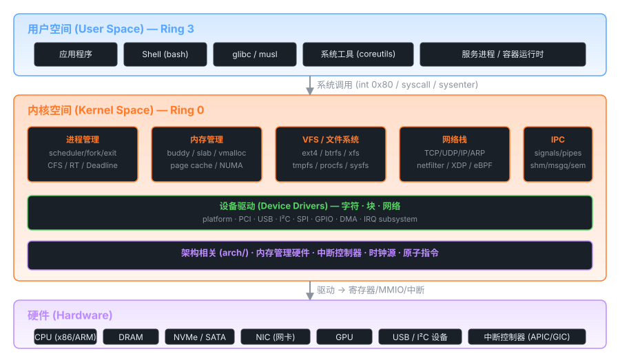

# 01 — 经典 Linux 版本选择

> 本章对比分析各个"里程碑"内核版本，帮助你选择最适合学习的版本，
> 并说明每个版本在现代内核中的"基因"贡献。



---

## 版本演进时间线

```
1991        1994        1996        2001        2003        2011        2015        2024
  │           │           │           │           │           │           │           │
  ▼           ▼           ▼           ▼           ▼           ▼           ▼           ▼
Linux 0.01  Linux 1.0   Linux 2.0   Linux 2.4   Linux 2.6   Linux 3.0   Linux 4.0   Linux 6.x
 ·10K行      ·17万行     ·41万行     ·300万行    ·600万行    ·1500万行   ·2000万行   ·3000万行
 ·386 only   ·多架构     ·SMP        ·完整VM     ·现代框架   ·统一版本号  ·eBPF引入   ·Rust支持
```

---

## 推荐学习版本对比

### 🥇 Linux 0.11（强烈推荐入门）

**发布时间**：1991 年 12 月  
**代码行数**：约 14,000 行  
**下载地址**：`https://github.com/karottc/linux-0.11`

```
优点：
  ✅ 代码极少，可以完整通读
  ✅ 包含操作系统所有核心概念：进程/内存/文件/IO
  ✅ 注释丰富（配合《Linux内核完全注释》）
  ✅ 可在 QEMU 上轻松运行并调试

缺点：
  ❌ x86 16位/32位混合，汇编代码较多
  ❌ 部分设计已被现代内核废弃（如段式内存管理）
  ❌ 不支持 SMP（多处理器）
```

**架构图（0.11 内核整体）**：

```
┌──────────────────────────────────────────────────────────────┐
│                    Linux 0.11 内核                            │
│                                                              │
│  ┌────────────┐    ┌─────────────┐    ┌──────────────────┐   │
│  │  进程管理   │    │   内存管理   │    │    文件系统       │   │
│  │            │    │             │    │                  │   │
│  │ task[64]   │    │ mem_map[]   │    │  Minix FS        │   │
│  │ schedule() │    │ get_free_p()│    │  buffer_head     │   │
│  │ fork()     │    │ copy_page() │    │  inode_table     │   │
│  └─────┬──────┘    └──────┬──────┘    └────────┬─────────┘   │
│        │                  │                    │              │
│  ┌─────▼──────────────────▼────────────────────▼──────────┐  │
│  │              中断与系统调用接口                           │  │
│  │   system_call.s   idt[]   do_divide_error() ...         │  │
│  └──────────────────────────────────────────────────────┘  │
│                                                              │
│  ┌────────────────────────────────────────────────────────┐  │
│  │              设备驱动                                    │  │
│  │   hd.c（硬盘）  floppy.c（软盘）  tty_io.c（终端）       │  │
│  └────────────────────────────────────────────────────────┘  │
└──────────────────────────────────────────────────────────────┘
```

---

### 🥈 Linux 2.6.0（推荐进阶）

**发布时间**：2003 年 12 月  
**代码行数**：约 600 万行  
**下载地址**：`https://mirrors.edge.kernel.org/pub/linux/kernel/v2.6/linux-2.6.0.tar.gz`

```
优点：
  ✅ 现代内核框架的原型（VFS/kobject/workqueue/RCU 均在此成型）
  ✅ 引入 O(1) 调度器 → 理解 CFS 的基础
  ✅ 子系统边界清晰，代码质量高
  ✅ 大量注释和文档

缺点：
  ❌ 代码量大，需要有 0.11 基础
  ❌ 部分 API 已在后续版本修改
```

**2.6.0 源码目录结构**：

```
linux-2.6.0/
├── arch/           # 架构相关（x86, arm, mips...）
│   └── i386/
│       ├── boot/   # 启动代码
│       ├── kernel/ # 架构相关内核代码
│       └── mm/     # 架构相关内存管理
├── block/          # 块设备层（2.6 新增独立块层）
├── drivers/        # 设备驱动（按类型分目录）
├── fs/             # 文件系统
│   ├── ext2/       # ext2 文件系统
│   ├── proc/       # /proc 文件系统
│   └── ...
├── include/        # 头文件
│   └── linux/      # 内核核心头文件
├── init/           # 内核初始化
├── ipc/            # 进程间通信（System V IPC）
├── kernel/         # 核心内核代码
│   ├── fork.c
│   ├── sched.c     # O(1) 调度器
│   ├── signal.c
│   └── ...
├── lib/            # 通用库（红黑树、链表等）
├── mm/             # 内存管理
│   ├── memory.c
│   ├── slab.c      # Slab 分配器
│   ├── vmalloc.c
│   └── ...
├── net/            # 网络子系统
│   └── ipv4/       # TCP/IP 实现
├── scripts/        # 构建脚本
└── Makefile
```

---

### 🔬 Linux 4.x（对比参考）

**发布时间**：2015 年起  
**推荐版本**：Linux 4.4（LTS，长期支持）  

引入的关键新特性（学完 2.6 后对比学习）：

| 特性 | 引入版本 | 说明 |
|------|---------|------|
| CFS 调度器 | 2.6.23 | 完全公平调度，替代 O(1) |
| cgroups | 2.6.24 | 资源隔离，容器基础 |
| 命名空间 | 2.6.24+ | 容器隔离基础 |
| eBPF | 3.18+ | 可编程内核观测 |
| io_uring | 5.1 | 高性能异步 IO |

---

## 学习版本决策树

```
你是否有 OS 理论基础？
├── 否 → 先读《操作系统：精髓与设计原理》再回来
└── 是 ↓

你的目标是什么？
├── 理解 OS 基本原理    → 读 Linux 0.11（完整读完）
├── 实际内核开发         → 读 Linux 0.11 + Linux 2.6.0
├── 容器/云原生内核      → 读 Linux 2.6.0 + Linux 4.x
└── 驱动开发            → 读 Linux 2.6.0（重点 drivers/）
```

---

## 两个版本核心数据结构对比

### 进程描述符（task_struct）

| 字段含义 | Linux 0.11 | Linux 2.6.0 |
|---------|-----------|------------|
| 进程状态 | `state` | `state`（值更多）|
| 进程 ID | `pid` | `pid` + `tgid`（支持线程）|
| 内存信息 | `ldt[2]`（段描述符）| `mm_struct *mm`（纯页式）|
| 调度信息 | `counter`（时间片）| `prio`/`static_prio`/`se`（调度实体）|
| 文件信息 | `filp[20]`（固定数组）| `files_struct *files`（动态）|
| 父进程 | `father`（int）| `parent`（指针）|

```c
/* Linux 0.11: kernel/sched.h */
struct task_struct {
    long state;          /* -1不可运行, 0可运行, >0停止 */
    long counter;        /* 运行时间片 */
    long priority;       /* 静态优先级 */
    long signal;         /* 信号位图 */
    ...
    long pid, father, pgrp, session, leader;
    ...
    struct m_inode *pwd, *root, *executable;
    struct file *filp[NR_OPEN];
    struct desc_struct ldt[3];  /* 局部描述符表 */
    struct tss_struct tss;      /* 任务状态段 */
};

/* Linux 2.6.0: include/linux/sched.h（简化）*/
struct task_struct {
    volatile long state;
    struct thread_info *thread_info;
    unsigned long flags;
    int prio, static_prio;
    struct list_head run_list;
    ...
    pid_t pid, tgid;
    struct task_struct *parent;
    struct mm_struct *mm;          /* 内存描述符 */
    struct files_struct *files;    /* 打开文件表 */
    struct signal_struct *signal;  /* 信号 */
    struct thread_struct thread;   /* CPU 状态 */
};
```

---

## 获取源码

```bash
# 方法一：从 kernel.org 下载
wget https://mirrors.edge.kernel.org/pub/linux/kernel/Historic/linux-0.11.tar.gz
wget https://mirrors.edge.kernel.org/pub/linux/kernel/v2.6/linux-2.6.0.tar.gz

# 方法二：使用 git（0.11 的 git 镜像）
git clone https://github.com/karottc/linux-0.11

# 在线阅读（推荐，支持跳转）
# https://elixir.bootlin.com/linux/0.11/source
# https://elixir.bootlin.com/linux/2.6.0/source
```

> **建议**：学习时两个版本都下载，在阅读 0.11 的同时
> 偶尔对照 2.6.0 的相同机制，理解演进方向。

---

## 内核版本横向对比详表

> 下表从发布年份、代码规模、架构支持和里程碑特性四个维度，
> 系统梳理各学习版本的"基因贡献"，帮助你建立版本演进的整体认知。

| 版本 | 发布年份 | 代码行数（约）| 架构支持 | 里程碑特性 |
|------|---------|-------------|---------|-----------|
| **0.11** | 1991 年 12 月 | 14,000 行 | x86 only | 完整 OS 最小实现：进程/内存/文件/驱动 |
| **1.0** | 1994 年 3 月 | 170,000 行 | x86, Alpha, SPARC | 首个"正式版"；引入 TCP/IP 网络栈、NFS |
| **2.4** | 2001 年 1 月 | 3,000,000 行 | 多架构 + SMP | LVM、ext3、netfilter/iptables、USB、完整 SMP |
| **2.6.0** | 2003 年 12 月 | 6,000,000 行 | 多架构 | O(1) 调度器、kobject/sysfs、NPTL 线程、inotify、RCU 成熟 |
| **3.10 LTS** | 2013 年 6 月 | 15,000,000 行 | 多架构 + ARM64 | cgroups v1 成熟、KVM 优化、TCP 快速打开（TFO） |
| **4.19 LTS** | 2018 年 10 月 | 20,000,000 行 | 多架构 | XDP/eBPF 成熟、WireGuard 前身、多队列块层（blk-mq）稳定 |
| **5.15 LTS** | 2021 年 10 月 | 28,000,000 行 | 多架构 + RISC-V | NTFS3 驱动、io_uring 成熟、Rust 基础设施（编译支持）、PREEMPT_RT 合并 |
| **6.1 LTS** | 2022 年 12 月 | 30,000,000 行 | 多架构 | **Rust 语言正式支持**（首批 Rust 驱动）、AMD/Intel GPU 大幅更新、KVM arm64 增强 |

### 关键里程碑特性说明

```
调度器演进：
  2.4.x  → O(n) 调度器（遍历所有进程，规模差）
  2.6.0  → O(1) 调度器（两个优先级数组 + 位图，固定开销）
  2.6.23 → CFS（完全公平调度器，红黑树 + vruntime）[至今使用]
  5.14   → Core Scheduling（防侧信道攻击的 CPU 核心调度）

内存管理演进：
  0.11   → 段页式，mem_map[] 字节数组
  2.6.0  → 伙伴系统 + Slab + NUMA 基础框架
  2.6.32 → KSM（内核相同页合并）
  2.6.38 → THP（透明大页）
  3.10   → zswap（压缩交换缓存）
  5.x    → maple tree 替代 VMA 红黑树（6.1 正式）

文件 I/O 演进：
  2.2    → sendfile（零拷贝）
  2.6.17 → splice
  4.14   → io_uring 雏形（异步 AIO 改进）
  5.1    → io_uring 正式引入（SQE/CQE 环形队列）
  5.6    → io_uring 支持网络操作（send/recv）
```
