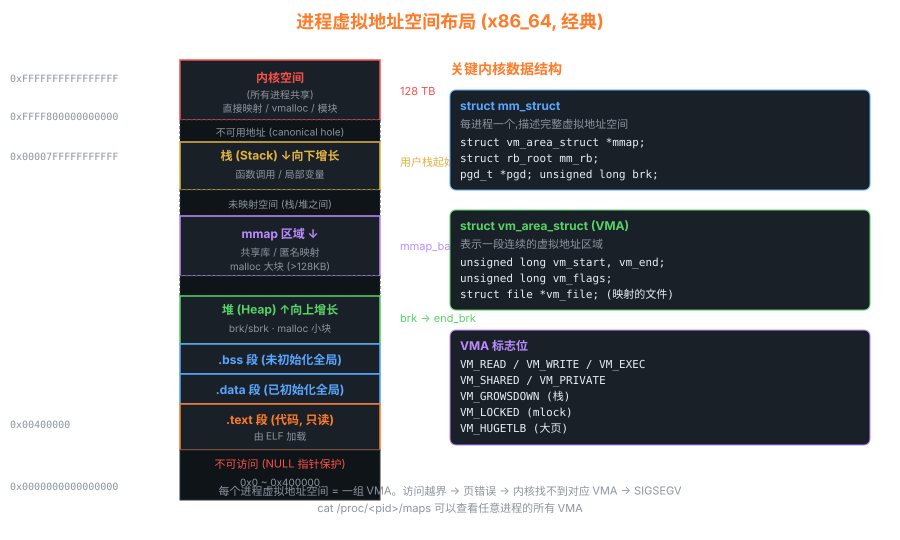

# 03 — 进程管理

> Linux 的进程管理是内核最核心的子系统之一。
> 本章从**数据结构 → 生命周期 → 调度算法 → 上下文切换**四个维度，
> 对照 Linux 0.11 与 Linux 2.6.0 源码逐步拆解。

---

## 1. 进程的本质：task_struct



一个进程在内核中就是一个 `task_struct` 结构体。

### Linux 0.11 的 task_struct

```
┌────────────────────────────────────────────┐
│               task_struct (0.11)            │
├────────────────┬───────────────────────────┤
│ state          │ 进程状态（运行/就绪/等待）   │
│ counter        │ 剩余时间片（动态优先级）     │
│ priority       │ 静态优先级（调度基值）       │
│ signal         │ 待处理信号位图              │
│ pid / father   │ 进程 ID / 父进程 ID         │
│ ldt[3]         │ 局部段描述符（代码段/数据段）│
│ tss            │ 任务状态段（保存 CPU 状态）  │
│ filp[NR_OPEN]  │ 打开文件指针数组            │
│ pwd / root     │ 当前目录 / 根目录 inode      │
│ *mm_seg        │ 内存段信息                  │
└────────────────┴───────────────────────────┘
大小：约 1KB，直接存储 TSS（很快但不灵活）
```

### Linux 2.6.0 的 task_struct（精简）

```
┌─────────────────────────────────────────────────────┐
│                  task_struct (2.6.0)                 │
├──────────────────┬──────────────────────────────────┤
│ state            │ 进程状态                           │
│ pid / tgid       │ 进程ID / 线程组ID（支持线程）       │
│ *mm              │ → mm_struct（虚拟内存描述符）       │
│ *active_mm       │ → 内核线程借用的 mm                │
│ *files           │ → files_struct（打开文件表）        │
│ *fs              │ → fs_struct（文件系统信息）         │
│ *signal          │ → signal_struct（信号）            │
│ prio/static_prio │ 动态/静态优先级                    │
│ run_list         │ 调度队列链表节点                   │
│ *parent          │ → 父进程 task_struct               │
│ children         │ 子进程链表头                       │
│ thread           │ CPU 架构相关状态（寄存器等）        │
└──────────────────┴──────────────────────────────────┘
大小：约 1.7KB，用指针间接引用（模块化）
```

**演进对比**：

```
0.11: task_struct 直接包含 TSS（任务状态段）
       → CPU 用硬件 TSS 切换，简单但 overhead 大

2.6:  task_struct 包含 thread_struct
       → 软件保存/恢复寄存器（switch_to 宏），更灵活
```

---

## 2. 进程状态机

### Linux 0.11 状态

```
         fork()
           │
           ▼
        TASK_RUNNING ◄────────────────────────────┐
        (就绪/运行)                               │
           │                                     │
    等待资源│                              schedule()
           ▼                                     │
     TASK_UNINTERRUPTIBLE ──► 资源到来 ──► TASK_RUNNING
     TASK_INTERRUPTIBLE   ──► 信号/资源 ──► TASK_RUNNING
           │
           │ exit()
           ▼
        TASK_ZOMBIE  ──► 父进程 wait() ──► 进程表项清除
```

### Linux 2.6.0 新增状态

```
TASK_RUNNING          = 0   就绪或正在 CPU 上运行
TASK_INTERRUPTIBLE    = 1   可中断睡眠
TASK_UNINTERRUPTIBLE  = 2   不可中断睡眠（等待 IO）
TASK_STOPPED          = 4   被信号暂停（如 SIGSTOP）
TASK_ZOMBIE           = 8   已退出，等待父进程回收
TASK_DEAD             = 16  完全死亡（2.6 新增）
```

---

## 3. 进程创建：fork() 源码解析

### 3.1 Linux 0.11 的 fork

```
用户程序调用 fork()
      │
      ▼
int 0x80（系统调用中断）
      │
      ▼
kernel/system_call.s: system_call
  → call sys_call_table(,%eax,4)   ; eax = __NR_fork = 2
      │
      ▼
kernel/fork.c: sys_fork()
  → find_empty_process()           ; 找空闲 task 槽位
  → copy_process(nr, ...)          ; 复制父进程
      │
      ▼
copy_process() 做了什么？
  1. 申请新 task_struct 内存页
  2. *p = *current                 ; 整体拷贝父进程
  3. 修改 pid、state、counter 等
  4. 复制文件描述符引用计数
  5. 设置 tss.eax = 0             ; 子进程 fork() 返回 0
  6. copy_mem()                    ; 设置新的 LDT（写时复制用段限长）
  7. 将新进程加入 task[] 数组
  8. state = TASK_RUNNING         ; 加入就绪队列
```

**关键代码（kernel/fork.c）**：

```c
/* Linux 0.11: kernel/fork.c */
int copy_process(int nr, long ebp, long edi, long esi, long gs,
                 long none, long ebx, long ecx, long edx,
                 long fs, long es, long ds,
                 long eip, long cs, long eflags, long esp, long ss)
{
    struct task_struct *p;
    
    /* 1. 分配新 task_struct 所在的内存页 */
    p = (struct task_struct *) get_free_page();
    if (!p)
        return -EAGAIN;
    
    task[nr] = p;
    
    /* 2. 完整拷贝父进程（写时复制的基础） */
    *p = *current;
    
    /* 3. 修改子进程特有字段 */
    p->state = TASK_UNINTERRUPTIBLE;  /* 先不就绪 */
    p->pid = last_pid;
    p->father = current->pid;
    p->counter = p->priority;
    
    /* 4. 设置子进程的 TSS（CPU 状态） */
    p->tss.eax = 0;          /* 子进程 fork() 返回 0 */
    p->tss.esp = esp;        /* 继承父进程栈指针 */
    p->tss.eip = eip;        /* 继承父进程指令指针 */
    
    /* 5. 复制内存映射（设置 LDT，写时复制） */
    if (copy_mem(nr, p)) {
        task[nr] = NULL;
        free_page((long)p);
        return -EAGAIN;
    }
    
    /* 6. 复制文件引用 */
    for (int i = 0; i < NR_OPEN; i++)
        if (f = p->filp[i])
            f->f_count++;
    
    /* 7. 就绪 */
    p->state = TASK_RUNNING;
    return last_pid;
}
```

### 3.2 Linux 2.6.0 的 fork/clone

```
用户调用 fork() / vfork() / clone()
      │
      ▼  (glibc → int 0x80 / sysenter)
kernel/fork.c: do_fork(clone_flags, ...)
      │
      ├─ copy_process()
      │     ├─ dup_task_struct()       ; 分配新 task_struct + 内核栈
      │     ├─ copy_flags()
      │     ├─ copy_mm()               ; 复制/共享地址空间
      │     ├─ copy_files()            ; 复制/共享文件表
      │     ├─ copy_sighand()          ; 复制/共享信号处理
      │     ├─ copy_thread()           ; 设置 CPU 寄存器（子进程返回 0）
      │     └─ pid = alloc_pid()       ; 分配新 PID
      │
      └─ wake_up_new_task()            ; 将子进程加入运行队列
```

**clone_flags 控制共享粒度**（线程 vs 进程的本质区别）：

```
clone_flags 标志          共享的资源
─────────────────────────────────────────
CLONE_VM                  虚拟地址空间（线程关键！）
CLONE_FS                  文件系统信息（根目录等）
CLONE_FILES               文件描述符表
CLONE_SIGHAND             信号处理函数
CLONE_THREAD              同一线程组（共享 tgid）

fork()  = clone(SIGCHLD)
vfork() = clone(CLONE_VM | CLONE_VFORK | SIGCHLD)
pthread = clone(CLONE_VM | CLONE_FS | CLONE_FILES | CLONE_SIGHAND | CLONE_THREAD | ...)
```

---

## 4. 调度器：从简单轮转到 O(1)

### 4.1 Linux 0.11 调度器

```c
/* kernel/sched.c — schedule() */
void schedule(void)
{
    int i, next, c;
    struct task_struct *p;
    
    /* 处理定时器与睡眠 */
    ...
    
    /* 找 counter 最大的就绪进程 */
    while (1) {
        c = -1;
        next = 0;
        i = NR_TASKS;
        p = &task[NR_TASKS];
        while (--i) {
            if (!*--p)
                continue;
            if ((*p)->state == TASK_RUNNING && (*p)->counter > c)
                c = (*p)->counter, next = i;
        }
        
        if (c)      /* 找到时间片非零的进程 */
            break;
        
        /* 所有进程时间片耗尽，重新分配 */
        for (p = &LAST_TASK; p > &FIRST_TASK; --p)
            if (*p)
                (*p)->counter = ((*p)->counter >> 1) + (*p)->priority;
    }
    
    switch_to(next);   /* 切换到 next 号进程 */
}
```

**时间复杂度**：O(n)，n 为进程数  
**问题**：进程多时性能下降；无法保证实时性

### 4.2 Linux 2.6.0 O(1) 调度器

```
核心思想：用两个优先级位图（runqueue）替代遍历

每个 CPU 维护一个 runqueue：
┌─────────────────────────────────────────────┐
│  runqueue (per-CPU)                          │
│                                             │
│  active   ──► prio_array（140 个优先级队列）  │
│  expired  ──► prio_array（时间片耗尽的进程）  │
│                                             │
│  bitmap[5]：140位，标记哪些优先级有进程      │
└─────────────────────────────────────────────┘

调度时：
  1. sched_find_first_bit(active->bitmap) → 找最高优先级
  2. list_entry(queue->next, ...)          → 取队列头进程
  时间复杂度：O(1)（位操作）

时间片耗尽时：移入 expired
所有 active 为空时：swap(active, expired) → O(1) 更新
```

### 4.3 调度时机

```
触发 schedule() 的时机：

1. 主动让出：
   sleep_on() / interruptible_sleep_on()
   wait_event() / msleep()

2. 时钟中断（timer tick）：
   do_timer() → current->counter--
   if counter == 0: need_resched = 1
   中断返回时检查 need_resched → schedule()

3. 系统调用返回：
   检查 TIF_NEED_RESCHED 标志

4. 中断/异常返回用户态：
   检查 TIF_NEED_RESCHED 标志
```

---

## 5. 上下文切换：switch_to 源码解析

### 5.1 Linux 0.11 的 switch_to（汇编宏）

```c
/* include/linux/sched.h */
/* 利用 CPU 硬件 TSS 切换 */
#define switch_to(n) {                      \
    struct {long a,b;} __tmp;               \
    __asm__("cmpl %%ecx,current\n\t"        \
        "je 1f\n\t"                         \
        "movw %%dx,%1\n\t"                  \
        "xchgl %%ecx,current\n\t"           \
        "ljmp *%0\n\t"   /* 远跳转触发 TSS 切换 */ \
        "cmpl %%ecx,last_task_used_math\n\t"\
        "jne 1f\n\t"                        \
        "clts\n"                            \
        "1:"                                \
        ::"m" (*&__tmp.a), "m" (*&__tmp.b), \
        "d" (_TSS(n)), "c" ((long) task[n]));\
}
```

**流程**：
```
1. ljmp 到新进程的 TSS 选择子
2. CPU 硬件自动保存当前 TSS（所有寄存器）
3. CPU 硬件自动加载新进程 TSS（恢复所有寄存器）
4. 跳到新进程上次被打断的 EIP 处继续执行
```

### 5.2 Linux 2.6.0 的 switch_to（软件保存）

```c
/* arch/i386/kernel/process.c */
void __switch_to(struct task_struct *prev, struct task_struct *next)
{
    struct thread_struct *prev_t = &prev->thread;
    struct thread_struct *next_t = &next->thread;
    
    /* 1. 保存/恢复 FPU 状态 */
    ...
    
    /* 2. 更新 TSS 中的 esp0（内核栈指针）*/
    load_esp0(tss, next_t->esp0);
    
    /* 3. 加载新进程的 LDT */
    load_LDT_nolock(&next->mm->context);
    
    /* 4. 保存/恢复调试寄存器 */
    ...
    
    /* 5. 切换 TLS（线程本地存储）段描述符 */
    ...
}

/* 关键宏：保存/恢复通用寄存器（include/asm-i386/system.h） */
#define switch_to(prev, next, last)                             \
    asm volatile(                                               \
        "pushfl\n\t"          /* 保存 eflags */                 \
        "pushl %%ebp\n\t"     /* 保存 ebp */                    \
        "movl %%esp,%0\n\t"   /* 保存 esp → prev->thread.esp */ \
        "movl %3,%%esp\n\t"   /* 恢复 esp ← next->thread.esp */ \
        "movl $1f,%1\n\t"     /* 保存返回地址 → prev->thread.eip */\
        "pushl %4\n\t"        /* 压入新进程返回地址 */           \
        "jmp __switch_to\n"   /* 跳转（完成 FPU/TLS 等切换）*/  \
        "1:\t"                /* 新进程在这里开始执行 */         \
        "popl %%ebp\n\t"      /* 恢复 ebp */                    \
        "popfl\n"             /* 恢复 eflags */                  \
        ...)
```

**软件切换 vs 硬件 TSS 切换**：

```
               Linux 0.11           Linux 2.6.0
切换方式       硬件 TSS（ljmp）      软件（push/pop）
保存内容       全部寄存器（CPU）     仅 esp/eip/ebp/eflags
速度           较慢（TSS 加载慢）   较快
灵活性         低（依赖 CPU 架构）  高（可移植）
```

---

## 6. 内核栈布局

理解上下文切换必须理解内核栈：

```
进程内核栈（一页，4KB）：

高地址 ┌──────────────────┐ ← esp0（ring 0 栈顶，存于 TSS）
       │  pt_regs         │  ← 进程从用户态陷入时保存的寄存器
       │  (中断帧)        │
       ├──────────────────┤
       │                  │
       │  内核函数调用栈   │
       │  (向下增长)      │
       │                  │
       │                  │
低地址 └──────────────────┘ ← thread_info（2.6.0: 存于栈底）
                              task_struct（0.11: 存于栈所在页）
```

> **关键洞察**：Linux 2.6.0 在内核栈**底部**存放 `thread_info`，
> 通过 `current_thread_info()` = `esp & ~(THREAD_SIZE-1)` 可
> 在 O(1) 时间内找到当前进程的 `thread_info`，进而找到 `task_struct`。

---

## 7. 实验：在 GDB 中观察进程切换

```bash
# 在 schedule() 中设断点，观察 current 的变化
(gdb) break schedule
(gdb) commands
> printf "schedule: current pid=%d, name=%s\n", current->pid, current->comm
> p current->state
> continue
> end

# 在 switch_to 后观察寄存器
(gdb) break __switch_to
(gdb) commands
> printf "switching from pid=%d to pid=%d\n", prev->pid, next->pid
> continue
> end
```

---

## 8. thread_info 与内核栈深度解析

### 8.1 thread_info 的关键字段

`thread_info` 存放于内核栈底部，包含几个对调度和安全至关重要的字段：

```c
/* include/asm-i386/thread_info.h — Linux 2.6.0 */
struct thread_info {
    struct task_struct  *task;       /* 指向 task_struct */
    struct exec_domain  *exec_domain;
    unsigned long        flags;      /* 低级标志位（TIF_NEED_RESCHED 等）*/
    unsigned long        status;     /* 线程同步标志 */
    __u32                cpu;        /* 当前所在 CPU */
    int                  preempt_count; /* 抢占计数器 */
    mm_segment_t         addr_limit;    /* 地址空间限制（用户/内核）*/
    struct restart_block restart_block; /* 信号打断后重启 */
};

/* 关键标志位（flags 字段）*/
#define TIF_SIGPENDING     0   /* 有待处理信号 */
#define TIF_NEED_RESCHED   1   /* 需要重新调度（设此位→下次调度点切换）*/
#define TIF_SINGLESTEP     2   /* 单步调试中 */
#define TIF_IRET           3   /* 强制 iret 而非 sysexit 返回 */
#define TIF_SYSCALL_AUDIT  4   /* 系统调用审计中 */
#define TIF_POLLING_NRFLAG 5   /* 轮询 TIF_NEED_RESCHED（减少 IPI）*/

/* preempt_count 编码：
   bits 0..7:  抢占计数（非0 = 不可抢占）
   bits 8..15: softirq 嵌套深度
   bits 16..27: hardirq 嵌套深度
   bit 28:     NMI 中 */
#define in_interrupt()    (preempt_count() & (HARDIRQ_MASK | SOFTIRQ_MASK))
#define in_atomic()       (preempt_count() != 0)
```

### 8.2 内核栈布局（ASCII 图）

```
一个进程的内核栈（THREAD_SIZE = 8KB on x86，16KB on x86_64）：

高地址 (栈顶)
┌──────────────────────────────────┐ ← esp0 = task->thread.esp0 (TSS 中)
│                                  │
│  pt_regs（系统调用/中断陷入时）  │  ← sizeof(pt_regs) = 15 × 4 = 60 bytes
│  (用户态寄存器快照)               │
│  ss / esp / eflags               │  ← CPU 自动压入
│  cs / eip                        │  ← CPU 自动压入
│  orig_eax / ds / es              │  ← SAVE_ALL 压入
│  eax / ebp / edi / esi / ...     │  ← SAVE_ALL 压入
├──────────────────────────────────┤ ← 系统调用入口后的 esp
│                                  │
│  内核函数调用栈（向下增长）       │
│  ...                             │
│  local variables                 │
│  saved ebp                       │
│  return address                  │
│  ...                             │
│                                  │
│  (未使用区域)                     │
│                                  │
├──────────────────────────────────┤
│  thread_info                     │  ← 栈底：通过 esp & ~(THREAD_SIZE-1) 定位
│  .task ──────────────────────────┼──► task_struct（可能在其他页）
│  .flags                          │
│  .preempt_count                  │
│  .addr_limit                     │
└──────────────────────────────────┘ ← 低地址（栈溢出警戒区）
```

**栈溢出检测**：内核在栈底放置 `STACK_END_MAGIC = 0x57AC6E9D`，
`schedule()` 中检查该值是否被覆盖（`CONFIG_DEBUG_STACKOVERFLOW`）。

### 8.3 do_fork() → copy_process() → wake_up_new_task()（5.x 路径）

现代内核（5.x）的进程创建路径较 2.6 更完善：

```
用户调用 fork() / clone3()
      │
      ▼ kernel/fork.c
kernel_clone(struct kernel_clone_args *args)     ← 5.x 统一入口
      │
      ├─ copy_process(NULL, 0, NUMA_NO_NODE, args)
      │     │
      │     ├─ dup_task_struct(current, node)
      │     │     ├─ alloc_task_struct_node()    ← slab 分配
      │     │     ├─ alloc_thread_stack_node()   ← 分配内核栈
      │     │     └─ arch_dup_task_struct()      ← 拷贝 FPU 状态
      │     │
      │     ├─ cgroup_fork()                     ← cgroup 继承
      │     ├─ copy_mm()                         ← 地址空间（写时复制）
      │     ├─ copy_files()
      │     ├─ copy_fs()
      │     ├─ copy_sighand()
      │     ├─ copy_signal()
      │     ├─ copy_thread()                     ← 架构相关寄存器
      │     │     └─ 设置子进程返回值 = 0（pt_regs->ax = 0）
      │     ├─ alloc_pid(task->nsproxy->pid_ns_for_children)
      │     ├─ perf_event_fork()                 ← perf 继承
      │     └─ 返回新的 task_struct *p
      │
      ├─ wake_up_new_task(p)
      │     ├─ p->state = TASK_RUNNING
      │     ├─ __set_task_cpu(p, select_task_rq(p, ...))  ← 选择 CPU
      │     └─ activate_task() → enqueue_task()  ← 加入运行队列
      │
      └─ 返回新进程 PID 给父进程
```

### 8.4 __switch_to_asm：x86_64 寄存器保存/恢复

```asm
/* arch/x86/entry/entry_64.S — Linux 5.x */
SYM_FUNC_START(__switch_to_asm)
    /*
     * 保存被调用者保存寄存器（callee-saved）
     * 调用者保存寄存器（caller-saved）由编译器在调用前保存
     */
    pushq   %rbp
    pushq   %rbx
    pushq   %r12
    pushq   %r13
    pushq   %r14
    pushq   %r15

    /* 保存当前进程的内核栈指针 */
    movq    %rsp, TASK_threadsp(%rdi)    /* prev->thread.sp = rsp */

    /* 切换到新进程的内核栈 */
    movq    TASK_threadsp(%rsi), %rsp    /* rsp = next->thread.sp */

    /* 恢复新进程的被调用者保存寄存器 */
    popq    %r15
    popq    %r14
    popq    %r13
    popq    %r12
    popq    %rbx
    popq    %rbp

    /*
     * 跳转到 __switch_to（C 函数）完成：
     * - FPU/SSE 状态延迟切换
     * - TLS（FS/GS 段）切换
     * - 调试寄存器切换
     * - CR4 特性位切换（PKRU）
     */
    jmp     __switch_to
SYM_FUNC_END(__switch_to_asm)

/* 新进程第一次被调度时，从 ret_from_fork 开始执行 */
SYM_CODE_START(ret_from_fork)
    UNWIND_HINT_EMPTY
    movq    %rax, %rdi          /* prev 任务 */
    call    schedule_tail       /* 完成调度尾工作（释放 prev 的 rq 锁）*/

    testq   $0x1, PTREGS_FLAGS(%rsp)   /* 判断是内核线程还是用户进程 */
    jnz     1f
    movq    PTREGS_RBP(%rsp), %rbx
    call    *%rbx               /* 内核线程：调用注册的回调函数 */
    ...
1:
    jmp     ret_from_sys_call   /* 用户进程：返回用户态 */
SYM_CODE_END(ret_from_fork)
```

### 8.5 僵尸进程与孤儿进程

```
僵尸进程（Zombie）生命周期：

  进程调用 exit()
       │
       ▼
  do_exit() in kernel/exit.c
       ├─ 释放大部分资源（内存、文件描述符、信号处理等）
       ├─ 设置 exit_code（退出状态）
       ├─ task->exit_state = EXIT_ZOMBIE
       └─ do_notify_parent()   ← 向父进程发 SIGCHLD

  task_struct 保留（僵尸状态），等待父进程收集退出状态
       │
       ▼
  父进程调用 wait4(pid, &status, ...)
       ├─ 在 children 链表中找到 EXIT_ZOMBIE 的子进程
       ├─ 从 task_struct 取出 exit_code
       ├─ release_task() → 释放 task_struct，从 task 列表移除
       └─ 返回子进程 PID 和退出状态

  如果父进程未调用 wait() 而先退出 → 子进程成为"孤儿":
       ├─ kernel/exit.c: forget_original_parent()
       ├─ 寻找收养者（同进程组的其他进程，或 subreaper）
       └─ 最终由 PID 1 (init/systemd) 收养
          init 会调用 waitid(P_ALL, ...) 自动收割僵尸子进程

wait4() 与 waitpid() 的内核路径：
  sys_wait4() → do_wait()
    → 遍历 current->children 链表
    → 对 EXIT_ZOMBIE 子进程：收集状态 → release_task()
    → 若无符合条件子进程：将父进程加入 wait_queue，休眠
    → 子进程退出时 do_notify_parent() 唤醒父进程
```
