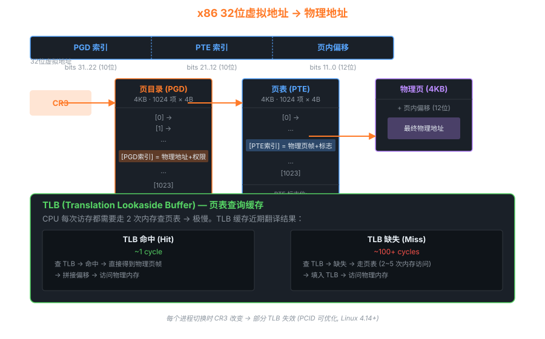

# 04 — 内存管理

> 内存管理是内核中最复杂的子系统之一。
> 本章从**物理内存 → 虚拟地址空间 → 页表 → 缺页处理 → 内存分配器**
> 五个层次，对照 Linux 0.11 与 2.6.0 源码拆解。

---

## 1. 内存管理全局视图

```
┌──────────────────────────────────────────────────────────────┐
│                    虚拟地址空间（每进程 4GB）                  │
│                                                              │
│  0xFFFFFFFF ┌───────────────────────────────────────────┐   │
│             │  内核空间（1GB, 所有进程共享）              │   │
│             │  内核代码/数据/堆/vmalloc 区域             │   │
│  0xC0000000 ├───────────────────────────────────────────┤   │
│             │  用户空间（3GB, 每进程独立）                │   │
│             │  ┌─────────────────────────────────────┐  │   │
│             │  │ 栈（向下增长）  [0xBFFF_FFFF 附近]   │  │   │
│             │  │      ↓                              │  │   │
│             │  │  ...（空洞）                        │  │   │
│             │  │      ↑                              │  │   │
│             │  │ 堆（向上增长）                       │  │   │
│             │  │ BSS 段（未初始化全局变量）           │  │   │
│             │  │ 数据段（已初始化全局变量）           │  │   │
│             │  │ 代码段（只读）     [0x08048000 起]  │  │   │
│  0x00000000 └─────────────────────────────────────────┘  │   │
└──────────────────────────────────────────────────────────────┘
```

---

## 2. Linux 0.11：段页式内存管理

### 2.1 为什么用"段页式"？

Linux 0.11 运行在 x86 保护模式，**必须使用段机制**（CPU 强制），
但同时用页机制实现写时复制（Copy-on-Write）。

```
                  段机制                    页机制
逻辑地址 ────────────────► 线性地址 ────────────────► 物理地址
(段选择子 + 偏移)    GDT/LDT             页目录 + 页表
```

### 2.2 进程内存布局（0.11）

```
每个进程有自己的 LDT（局部描述符表），包含：
  LDT[0]: 空
  LDT[1]: 代码段  BASE = 进程号 × 64MB, LIMIT = 640KB
  LDT[2]: 数据段  BASE = 进程号 × 64MB, LIMIT = 640KB（含堆栈）

因此：
  进程 0 的线性地址范围：0x00000000 ~ 0x03FFFFFF（0~64MB）
  进程 1 的线性地址范围：0x04000000 ~ 0x07FFFFFF（64~128MB）
  进程 2 的线性地址范围：0x08000000 ~ 0x0BFFFFFF（128~192MB）
  ...
  最多 64 个进程 × 64MB = 4GB（恰好用满 32 位线性地址）
```

### 2.3 物理内存管理（mem_map）

```c
/* mm/memory.c */

/* 全局内存位图：每个字节对应一个 4KB 物理页 */
/* 值 = 0: 空闲；值 > 0: 引用计数 */
unsigned char mem_map[PAGING_PAGES] = {0,};

/* 分配一个物理页 */
unsigned long get_free_page(void)
{
    register unsigned long __res asm("ax");
    __asm__(
        "std ; repne ; scasb\n\t"   /* 从末尾往前搜索 mem_map 中值为0的字节 */
        "jne 1f\n\t"
        "movb $1,1(%%edi)\n\t"      /* 标记为已用（引用计数=1）*/
        "sall $12,%%ecx\n\t"        /* ecx = 页号 × 4096 = 物理地址 */
        "addl %2,%%ecx\n\t"
        "movl %%ecx,%%edx\n\t"
        "movl $1024,%%ecx\n\t"
        "leal 4092(%%edx),%%edi\n\t"
        "rep ; stosl\n\t"           /* 将页面清零 */
        "movl %%edx,%%eax\n"
        "1:"
        :"=a" (__res)
        :"0" (0),"i" (LOW_MEM),"c" (PAGING_PAGES),
         "D" (mem_map+PAGING_PAGES-1)
        );
    return __res;
}
```

### 2.4 写时复制（Copy-on-Write）

```
fork() 时：
  父子进程共享同一物理页
  但将页表项设为"只读"
  同时 mem_map[页号]++ （引用计数+1）

任一进程写该页时：
  CPU 触发写保护异常（Page Fault, error_code 有写保护位）

do_wp_page() 处理：
  1. 如果 mem_map[页号] == 1（只有自己引用）：
     直接将页表项改回可写，不复制
  2. 如果 mem_map[页号] > 1（有多个引用）：
     get_free_page() 分配新物理页
     复制原页内容到新页
     将自己的页表项指向新页
     mem_map[原页号]--
     新页设为可写
```

**对应源码**（`mm/memory.c`）：

```c
void do_wp_page(unsigned long error_code, unsigned long address)
{
    un_wp_page((unsigned long *)
        (((address>>10) & 0xffc) + (0xfffff000 &
        *((unsigned long *) ((address>>20) &0xffc)))));
}

void un_wp_page(unsigned long *table_entry)
{
    unsigned long old_page, new_page;
    old_page = 0xfffff000 & *table_entry;
    
    /* 只有自己引用该页，直接改可写 */
    if (old_page >= LOW_MEM && mem_map[MAP_NR(old_page)] == 1) {
        *table_entry |= 2;          /* 设置 R/W 位 */
        invalidate();               /* 刷新 TLB */
        return;
    }
    
    /* 多个引用，需要复制 */
    if (!(new_page = get_free_page()))
        oom();
    if (old_page >= LOW_MEM)
        mem_map[MAP_NR(old_page)]--;  /* 减少引用计数 */
    copy_page(old_page, new_page);    /* 复制内容 */
    *table_entry = new_page | 7;      /* 新页：P/R/W/U */
    invalidate();
}
```

---

## 3. Linux 2.6.0：纯页式管理 + 三级页表

### 3.1 x86 两级页表结构



```
32位地址: [31..22][21..12][11..0]
           页目录索引  页表索引   页内偏移
           (10 bits)  (10 bits)  (12 bits)

虚拟地址 → 物理地址转换过程：
                                        物理内存
CR3 ──► 页目录（4KB）                      │
         [PGD 索引] ──► 页表（4KB）         │
                         [PTE 索引] ──►  物理页（4KB）+ 偏移
```

### 3.2 mm_struct：进程虚拟内存描述符

```c
/* include/linux/mm.h */
struct mm_struct {
    struct vm_area_struct *mmap;    /* VMA 链表（所有虚拟内存区域）*/
    struct rb_root mm_rb;           /* VMA 红黑树（快速查找）*/
    
    pgd_t *pgd;                     /* 页目录（物理地址）*/
    
    unsigned long start_code, end_code;   /* 代码段范围 */
    unsigned long start_data, end_data;   /* 数据段范围 */
    unsigned long start_brk, brk;         /* 堆范围 */
    unsigned long start_stack;            /* 栈起始地址 */
    
    unsigned long mmap_base;              /* mmap 区域起始 */
    unsigned long total_vm;               /* 总虚拟页数 */
    unsigned long rss;                    /* 驻留物理页数 */
    ...
};
```

### 3.3 vm_area_struct：虚拟内存区域（VMA）

```
mm->mmap 链表：

┌─────────────┐    ┌─────────────┐    ┌─────────────┐
│ vma: 代码段  │───►│ vma: 数据段  │───►│ vma: 堆     │ ···
│ vm_start    │    │ vm_start    │    │ vm_start    │
│ vm_end      │    │ vm_end      │    │ vm_end      │
│ vm_flags    │    │ vm_flags    │    │ vm_flags    │
│ (VM_READ    │    │ (VM_READ|   │    │ (VM_READ|   │
│  VM_EXEC)   │    │  VM_WRITE)  │    │  VM_WRITE)  │
│ vm_file ────┼──► │ 对应文件     │    │ NULL        │
└─────────────┘    └─────────────┘    └─────────────┘
```

### 3.4 缺页中断处理流程

```
CPU 访问虚拟地址 addr
      │
      │ 页表项 P=0（页不在物理内存）
      ▼
do_page_fault(regs, error_code)
      │
      ├─ find_vma(mm, addr)       → 找到对应 VMA
      │
      ├─ 分析错误类型：
      │   error_code & 1 == 0：页不存在（handle_mm_fault）
      │   error_code & 2 != 0：写保护违规（写时复制）
      │
      └─ handle_mm_fault(mm, vma, addr, write)
              │
              ├─ 文件映射（vma->vm_file != NULL）：
              │     → 从磁盘读入页面（page cache）
              │
              ├─ 匿名映射（堆/栈）：
              │     → alloc_page() 分配物理页
              │     → 清零
              │
              └─ 写时复制：
                    → 如果 page->_count > 1：复制页面
                    → 修改页表项为可写
```

---

## 4. 物理内存分配器

### 4.1 伙伴系统（Buddy System）

Linux 2.6.0 用伙伴系统管理物理页，解决外部碎片问题：

```
free_area[0]: 链表，每个块大小 = 2^0 = 1 页（4KB）
free_area[1]: 链表，每个块大小 = 2^1 = 2 页（8KB）
free_area[2]: 链表，每个块大小 = 2^2 = 4 页（16KB）
...
free_area[10]: 链表，每个块大小 = 2^10 = 1024 页（4MB）

分配 N 页：
  找最小的 2^k ≥ N 的 free_area[k]
  如果 free_area[k] 为空，向上借：
    从 free_area[k+1] 取一块，分成两个 2^k 块（"伙伴"）
    一块用，一块加入 free_area[k]

释放时：
  检查"伙伴"是否空闲
  如果是：合并为 2^(k+1) 块，递归向上合并
```

### 4.2 Slab 分配器（小对象分配）

伙伴系统以 4KB 页为单位，但内核大量分配小对象（如 task_struct, inode）。
Slab 解决**内部碎片**问题：

```
kmem_cache（task_struct 的缓存）：
┌─────────────────────────────────────────────────────┐
│  name: "task_struct"                                │
│  obj_size: 1712 bytes                               │
│                                                     │
│  slab_full:   [slab1] → [slab2] → ...               │
│  slab_partial:[slab3] → [slab4] → ...               │
│  slab_free:   [slab5] → ...                         │
└─────────────────────────────────────────────────────┘

每个 slab = 若干连续物理页，切分为固定大小的对象：

┌──────────────────────────────────────┐
│ slab 控制头                           │
│ 空闲对象链表                          │
├──────────────────────────────────────┤
│ [obj1] [obj2] [obj3] ... [obj_N]     │
└──────────────────────────────────────┘

优点：
  · 避免每次 alloc/free 都走伙伴系统（快）
  · 对象有构造/析构函数（减少初始化开销）
  · 着色（coloring）避免 cache 行冲突
```

**关键 API**：

```c
/* 创建 slab 缓存 */
struct kmem_cache *kmem_cache_create(
    const char *name,
    size_t size,
    size_t align,
    unsigned long flags,
    void (*ctor)(void *, struct kmem_cache *, unsigned long),
    void (*dtor)(void *, struct kmem_cache *, unsigned long));

/* 从 slab 缓存分配对象 */
void *kmem_cache_alloc(struct kmem_cache *cachep, int flags);

/* 释放对象回 slab 缓存 */
void kmem_cache_free(struct kmem_cache *cachep, void *objp);

/* 通用小内存分配（内部使用 slab）*/
void *kmalloc(size_t size, int flags);
void kfree(const void *objp);
```

---

## 5. 内存管理演进对比

| 特性 | Linux 0.11 | Linux 2.6.0 |
|------|-----------|------------|
| 地址转换 | 段 → 线性 → 物理（段页式）| 段基址=0，实质纯页式 |
| 页表级数 | 2 级（10+10+12）| 2 级（x86）/ 3 级支持（PAE）|
| 物理内存管理 | mem_map[] 字节数组 | 伙伴系统（zones）|
| 小对象分配 | 无（直接 get_free_page）| Slab 分配器 |
| 写时复制 | do_wp_page() | do_wp_page()（更完善）|
| 虚拟内存区域 | 无 VMA 概念 | vm_area_struct + 红黑树 |
| 内存映射 | 无 mmap | mmap（文件映射/匿名映射）|
| 交换（Swap）| 基本支持 | 完整交换子系统 |

---

## 6. 实验：观察内存管理

```bash
# 查看进程的虚拟内存区域（Linux 系统）
cat /proc/self/maps
# 输出示例：
# 08048000-0804f000 r-xp 00000000 08:01 1234567  /bin/bash  ← 代码段
# 0804f000-08050000 r--p 00006000 08:01 1234567  /bin/bash  ← 只读数据
# 08050000-08051000 rw-p 00007000 08:01 1234567  /bin/bash  ← 可写数据
# 0805f000-08080000 rw-p 00000000 00:00 0        [heap]     ← 堆

# 查看物理内存使用
cat /proc/buddyinfo    # 伙伴系统各 order 空闲页数
cat /proc/slabinfo     # Slab 缓存信息

# GDB 中查看页表（Linux 0.11）
(gdb) break do_no_page
(gdb) commands
> printf "page fault at 0x%lx\n", address
> continue
> end
```

---

## 7. NUMA 架构与内存分区

### 7.1 NUMA 拓扑：Node / Zone / Page

```
NUMA (Non-Uniform Memory Access) 架构：

  ┌─────────────────────┐    ┌─────────────────────┐
  │      Node 0          │    │      Node 1          │
  │  ┌──────────────┐   │    │  ┌──────────────┐   │
  │  │  CPU 0,1,2,3  │   │    │  │  CPU 4,5,6,7  │   │
  │  └──────────────┘   │    │  └──────────────┘   │
  │                      │    │                      │
  │  本地内存（快速访问） │    │  本地内存（快速访问） │
  │  16 GB               │◄──►│  16 GB               │
  └─────────────────────┘    └─────────────────────┘
        ↑ 跨节点访问（慢 ~2x）

内核数据结构：
  pg_data_t (node)
   └── struct zone zones[] (区域)
        └── struct page *  (页描述符数组)
```

### 7.2 内存区域（Zone）

```
x86_64 系统的内存区域（zone）划分：

Zone 名称          物理地址范围              用途
──────────────────────────────────────────────────────────
ZONE_DMA           0 ~ 16MB                  旧式 ISA DMA 设备
ZONE_DMA32         0 ~ 4GB                   只能访问 32 位地址的 DMA
ZONE_NORMAL        16MB ~ 内存上限（通常全部）普通内核页面
ZONE_HIGHMEM       仅 32 位系统 896MB 以上    32 位内核不能直接映射的高端内存
ZONE_MOVABLE       高端内存子集               专用于可迁移页（内存热插拔）
ZONE_DEVICE        设备内存（pmem 等）         持久内存/GPU 显存

每个 zone 维护：
  struct zone {
      unsigned long free_pages;     /* 空闲页数 */
      struct free_area free_area[MAX_ORDER]; /* 伙伴系统 */
      struct per_cpu_pages pageset; /* per-CPU 页面缓存（快速分配）*/
      unsigned long watermark[NR_WMARK]; /* 水位线：MIN/LOW/HIGH */
      ...
  };
```

### 7.3 水位线与 kswapd

```
Zone 水位线（watermark）控制内存回收行为：

  free_pages
  ┌─────────────────────────────────────────────┐
  │                                             │ HIGH watermark
  │   正常区域：内存充裕，无需回收              │
  ├─────────────────────────────────────────────┤ LOW watermark
  │   轻度压力：唤醒 kswapd 后台回收            │
  ├─────────────────────────────────────────────┤ MIN watermark
  │   严重压力：同步直接回收（影响业务延迟）    │
  └─────────────────────────────────────────────┘
  (0)

kswapd（内核交换守护进程）：
  - 每个 NUMA 节点一个 kswapd 内核线程
  - 在 LOW 水位以下被唤醒，回收页面直到达到 HIGH 水位
  - 回收对象：LRU 链表中的 inactive 页

LRU 链表（active/inactive 双链表）：
  ACTIVE_ANON    → 最近访问的匿名页（堆/栈）
  INACTIVE_ANON  → 不活跃匿名页（候选交换到 swap）
  ACTIVE_FILE    → 最近访问的文件映射页
  INACTIVE_FILE  → 不活跃文件页（候选丢弃或写回磁盘）
  UNEVICTABLE    → 不可回收页（mlock 锁定）

页面从 active 到 inactive 的迁移：
  每次 kswapd 扫描时，将 active 链表尾部页面移至 inactive
  若 inactive 页面再次被访问（page fault 时 mark_page_accessed）→ 移回 active
  若长期不访问 → 最终被 swap out 或丢弃
```

---

## 8. OOM Killer：内存耗尽时的"牺牲者选择"

```bash
# 查看进程的 OOM 评分
cat /proc/1234/oom_score       # OOM 杀手优先打分（越高越容易被杀）
cat /proc/1234/oom_score_adj   # 调整值（-1000 ~ 1000，-1000 = 永不杀）
cat /proc/1234/oom_adj         # 旧接口（-17 ~ 15，-17 = 永不杀）

# 保护重要进程（如数据库）
echo -1000 > /proc/$(pidof mysqld)/oom_score_adj

# 手动触发 OOM（测试用）
echo f > /proc/sysrq-trigger
```

**OOM 评分计算原理**：

```c
/* mm/oom_kill.c — oom_badness() */
long oom_badness(struct task_struct *p, unsigned long totalpages)
{
    /* 基础分 = 进程占用的物理内存页数 */
    long points = get_mm_rss(p->mm);
    points += get_mm_counter(p->mm, MM_SWAPENTS);  /* + swap 使用 */
    points += mm_pgtables_bytes(p->mm) / PAGE_SIZE; /* + 页表内存 */

    /* 归一化到 0~1000 */
    points = points * 1000 / totalpages;

    /* 加上 oom_score_adj 调整值（-1000 ~ 1000 映射到 -1000 ~ 1000）*/
    points += p->signal->oom_score_adj;

    return points;  /* 分数最高的进程被杀死 */
}

/* OOM 触发后的流程 */
out_of_memory()
  → select_bad_process()      /* 遍历所有进程，找最高分 */
  → oom_kill_process()        /* 发送 SIGKILL */
  → 打印 "Out of memory: Kill process PID (name) score N or sacrifice child"
```

---

## 9. 透明大页（THP）与 KSM

### 9.1 透明大页（Transparent Huge Pages）

```bash
# 查看/设置 THP 模式
cat /sys/kernel/mm/transparent_hugepage/enabled
# 输出: [always] madvise never
#   always  = 尽可能使用大页（2MB on x86）
#   madvise = 只对 madvise(MADV_HUGEPAGE) 的区域使用
#   never   = 禁用 THP

# 切换模式
echo madvise > /sys/kernel/mm/transparent_hugepage/enabled

# 查看 THP 统计
cat /proc/meminfo | grep -i huge
# HugePages_Total: 0       ← 静态大页（需要预分配）
# AnonHugePages: 24576 kB  ← THP 使用量（动态）

# THP 碎片整理策略
cat /sys/kernel/mm/transparent_hugepage/defrag
# [always] defer defer+madvise madvise never
echo defer+madvise > /sys/kernel/mm/transparent_hugepage/defrag
```

**THP 内核机制**：

```
当进程的匿名 VMA 满足条件时（大小 >= 2MB, 对齐）：
  缺页中断 → do_anonymous_page()
    → khugepaged 后台线程扫描，将相邻 512 个 4KB 页合并为一个 2MB 大页
    → 直接分配：alloc_pages(GFP_HIGHUSER_MOVABLE, HPAGE_PMD_ORDER)

好处：减少 TLB miss（1个 TLB 条目覆盖 2MB vs 4KB）
坏处：内存碎片、合并/分裂开销；对 fork() 写时复制代价更高（2MB 一次复制）
```

### 9.2 KSM（内核相同页合并）

```bash
# KSM 将内容相同的匿名页合并为一个只读物理页（写时复制）
# 常用于虚拟化（多个相同的 guest OS 页面）

# 开启 KSM
echo 1 > /sys/kernel/mm/ksm/run       # 1=运行, 0=停止, 2=停止+解除合并
echo 1000 > /sys/kernel/mm/ksm/pages_to_scan  # 每次扫描的页数

# 查看 KSM 状态
cat /sys/kernel/mm/ksm/pages_shared    # 物理共享页数
cat /sys/kernel/mm/ksm/pages_sharing   # 被合并（逻辑上使用）的页数
cat /sys/kernel/mm/ksm/pages_unshared  # 扫描但未能合并的页数
# 节省内存 = (pages_sharing - pages_shared) × PAGE_SIZE

# 应用程序主动参与 KSM：
madvise(addr, length, MADV_MERGEABLE);   /* 标记此区域供 KSM 扫描 */
madvise(addr, length, MADV_UNMERGEABLE); /* 取消 */
```

**KSM 工作原理**：

```
ksmd 内核线程定期扫描标记为 MADV_MERGEABLE 的页：
  1. 对每页计算 hash（基于内容）
  2. 插入两棵红黑树：
     unstable_tree（未经验证的候选）
     stable_tree（已确认可共享的页）
  3. 内容相同的页：
     → 保留一个只读物理页（stable_tree 中）
     → 其他进程的页表项指向同一物理页
     → 设为写保护，触发写时复制时分裂
```
