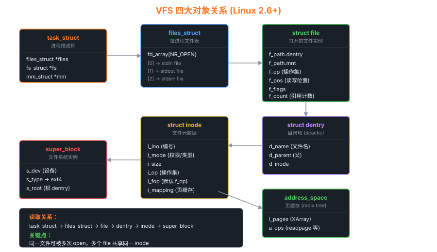

# 05 — 文件系统

> 文件系统是操作系统中"持久化"的核心。
> 本章从 **VFS 抽象层 → inode/dentry 数据结构 → 磁盘布局 → 文件读写路径**
> 对照 Linux 0.11（Minix FS）与 Linux 2.6.0（ext2 + VFS）展开。

---

## 1. 文件系统层次模型

```
用户程序
  open("/etc/passwd", O_RDONLY)
          │
          ▼
   系统调用接口
  sys_open → sys_read → sys_write → sys_close
          │
          ▼
┌─────────────────────────────────────────────┐
│             VFS（虚拟文件系统）               │   ← Linux 2.6 新增
│  file → dentry → inode → super_block        │
│  统一接口：inode_operations / file_operations│
└─────┬─────────────────────────────────────┘
      │
  ┌───┴────────────────────────────────┐
  │         具体文件系统实现             │
  │  ext2   ext4   btrfs   tmpfs   ...  │
  └───┬──────────────────────┬─────────┘
      │                      │
      ▼                      ▼
   磁盘 I/O              内存（页缓存）
   块设备层              page cache
```

---

## 2. Linux 0.11：Minix FS（直接实现，无 VFS）

### 2.1 Minix FS 磁盘布局

```
磁盘布局（以 360KB 软盘为例）：

Block 0:   引导块（Boot Block）       [1 个 1KB 块]
Block 1:   超级块（Super Block）      [1 个 1KB 块]
Block 2~:  inode 位图（imap）         [1~8 个块]
块 ~:      块位图（zmap）             [1~8 个块]
块 ~:      inode 表（inode table）    [inode数/块大小 个块]
块 ~:      数据区（data zone）        [剩余所有块]

超级块内容：
  s_ninodes    = inode 总数
  s_nzones     = 数据块总数
  s_imap_blocks= inode 位图块数
  s_zmap_blocks= 数据块位图块数
  s_firstdatazone = 第一个数据块号
  s_max_size   = 最大文件大小
```

### 2.2 inode 结构（0.11）

```c
/* include/linux/fs.h — 磁盘上的 inode（16 字节）*/
struct d_inode {
    unsigned short i_mode;      /* 文件类型和权限 */
    unsigned short i_uid;       /* 用户 ID */
    unsigned long  i_size;      /* 文件大小（字节）*/
    unsigned long  i_time;      /* 修改时间 */
    unsigned char  i_gid;       /* 组 ID */
    unsigned char  i_nlinks;    /* 硬链接数 */
    unsigned short i_zone[9];   /* 数据块号：
                                   i_zone[0..6]: 直接块
                                   i_zone[7]:    一级间接块
                                   i_zone[8]:    二级间接块 */
};

/* 内存中的 inode（含额外状态信息）*/
struct m_inode {
    /* 与磁盘 inode 相同的字段 */
    unsigned short i_mode;
    ...
    unsigned short i_zone[9];
    /* 内存特有字段 */
    struct task_struct *i_wait;  /* 等待该 inode 的进程队列 */
    unsigned long i_atime;       /* 访问时间（仅内存中）*/
    unsigned long i_ctime;       /* 创建时间（仅内存中）*/
    unsigned short i_dev;        /* 所在设备 */
    unsigned short i_num;        /* inode 编号 */
    unsigned short i_count;      /* 引用计数 */
    unsigned char  i_lock;       /* 锁定标志 */
    unsigned char  i_dirt;       /* 已修改标志（需要写回磁盘）*/
    unsigned char  i_pipe;       /* 是否为管道 */
    unsigned char  i_mount;      /* 是否为挂载点 */
    unsigned char  i_seek;       /* seek 操作中 */
    unsigned char  i_update;     /* 需要更新 */
};
```

### 2.3 文件数据块访问（0.11 bmap）

```
文件大小 ≤ 7 × 1KB = 7KB：使用直接块 i_zone[0..6]
文件大小 ≤ 7 + 512 = 519KB：使用一级间接块 i_zone[7]
文件大小 ≤ 519 + 512×512 = 262KB：使用二级间接块 i_zone[8]

  inode.i_zone[0] ──► 数据块（直接）
  inode.i_zone[7] ──► 间接块 ──► [指针0, 指针1, ..., 指针511]
                                        │
                                        ▼
                                      数据块

bmap(inode, block_nr):
  if block_nr < 7:
    return i_zone[block_nr]
  elif block_nr < 7 + 512:
    读 i_zone[7] 所指的间接块
    返回间接块[block_nr - 7]
  else:
    读 i_zone[8] 所指的二级间接块
    i = (block_nr - 7 - 512) / 512
    j = (block_nr - 7 - 512) % 512
    读二级间接块[i]所指的一级间接块
    返回一级间接块[j]
```

### 2.4 文件读写路径（0.11）

```
read() 系统调用
      │
      ▼
sys_read(fd, buf, count)
      │
      ├─ 根据 fd 取 file 结构（current->filp[fd]）
      ├─ 取 inode（file->f_inode）
      └─ file_read(inode, file, buf, count)
              │
              ▼
        按文件偏移计算数据块号
        bmap(inode, block) → 物理块号
              │
              ▼
        breads() → buffer_head（读取并缓存磁盘块）
              │
              ▼
        copy_to_user(buf, buffer->b_data + offset, len)
```

### 2.5 目录查找（路径解析）

```c
/* fs/namei.c */
/* 在指定目录 dir 中查找名为 name 的目录项 */
struct m_inode *dir_namei(const char *pathname,
                           int *namelen,
                           const char **name,
                           struct m_inode *base)
{
    /* 如果路径以 '/' 开头，从根目录开始 */
    if (c == '/')
        inode = current->root;
    else
        inode = current->pwd;    /* 否则从当前目录开始 */
    
    /* 逐段解析路径 */
    while (1) {
        取下一个路径分量（/分隔）
        if (最后一个分量) break;
        follow_link(inode) → 处理符号链接
        find_entry(inode, name, len) → 在目录中找条目
        inode = 目录条目的 inode
    }
    return inode;
}
```

---

## 3. Linux 2.6.0：VFS + ext2



### 3.1 VFS 核心数据结构

#### super_block — 文件系统元信息

```c
struct super_block {
    dev_t s_dev;                    /* 所在设备 */
    unsigned long s_blocksize;       /* 块大小 */
    unsigned long long s_maxbytes;   /* 最大文件大小 */
    struct file_system_type *s_type; /* 文件系统类型 */
    struct super_operations *s_op;   /* 超级块操作函数 */
    struct dentry *s_root;           /* 根目录 dentry */
    struct list_head s_inodes;       /* 所有 inode 链表 */
    void *s_fs_info;                 /* 具体 FS 的私有数据 */
    ...
};
```

#### inode — 文件/目录的元数据

```c
struct inode {
    umode_t i_mode;               /* 文件类型和权限 */
    uid_t i_uid;                  /* 用户 ID */
    gid_t i_gid;                  /* 组 ID */
    loff_t i_size;                /* 文件大小 */
    struct timespec i_atime, i_mtime, i_ctime;
    
    unsigned long i_ino;          /* inode 编号 */
    unsigned int i_nlink;         /* 硬链接数 */
    dev_t i_rdev;                 /* 设备文件的设备号 */
    
    struct inode_operations *i_op; /* inode 操作（lookup/create/...）*/
    struct file_operations *i_fop; /* 默认文件操作 */
    struct address_space *i_mapping; /* 页缓存映射 */
    
    struct super_block *i_sb;     /* 所属超级块 */
    struct list_head i_hash;      /* inode hash 链表 */
    struct list_head i_list;      /* inode LRU 链表 */
    
    void *i_private;              /* 具体 FS 的私有数据 */
};
```

#### dentry — 目录项缓存（路径解析缓存）

```c
struct dentry {
    unsigned int d_flags;
    struct inode *d_inode;         /* 对应的 inode */
    struct dentry *d_parent;       /* 父目录 dentry */
    struct qstr d_name;            /* 文件名（含 hash）*/
    
    struct list_head d_child;      /* 兄弟节点链表 */
    struct list_head d_subdirs;    /* 子目录链表 */
    struct list_head d_hash;       /* dcache hash 链表 */
    struct list_head d_lru;        /* LRU 链表 */
    
    struct dentry_operations *d_op;
    struct super_block *d_sb;
    void *d_fsdata;                /* FS 私有数据 */
};
```

#### file — 打开文件的实例

```c
struct file {
    struct dentry *f_dentry;       /* 对应的 dentry */
    struct vfsmount *f_vfsmnt;     /* 挂载点 */
    struct file_operations *f_op;  /* 文件操作函数 */
    loff_t f_pos;                  /* 当前读写位置 */
    unsigned int f_flags;          /* O_RDONLY/O_WRONLY/... */
    mode_t f_mode;                 /* 访问模式 */
    atomic_t f_count;              /* 引用计数 */
    ...
};
```

### 3.2 VFS 四大对象关系图

```
task_struct
  └── files_struct
        └── fd_array[] → file ──────────────────────────┐
                                                         │
                                              f_dentry ──▼──── dentry
                                                         │       │
                                              f_op ──────┤       │ d_inode
                                                         │       ▼
                                                         │     inode ───── super_block
                                                         │       │               │
                                                         │       │ i_mapping      │ s_op
                                                         │       ▼               │
                                                         └──► address_space     ext2_sb_info
                                                               (页缓存)
```

### 3.3 路径解析（path_lookup）

```
open("/home/user/file.txt", O_RDONLY)
      │
      ▼
sys_open → filp_open → open_namei → path_lookup
      │
      ▼
path_lookup("/home/user/file.txt", ...)
  1. 从 '/' 开始（current->fs->root）
  2. 查 dcache：hash(parent_dentry, "home") → 找 dentry("home")
     · 命中：直接用（快！）
     · 未命中：调用 inode->i_op->lookup() 从磁盘读
  3. 继续：hash(dentry("home"), "user") → dentry("user")
  4. 继续：hash(dentry("user"), "file.txt") → dentry("file.txt")
  5. 返回最终 dentry
```

**dcache 是 VFS 性能的关键**：大多数路径查找在内存中完成（O(1) hash）。

### 3.4 ext2 磁盘布局

```
ext2 磁盘布局（分区）：

[Block 0] 引导扇区（可选）
[Block Group 0]
  ├── 超级块（Super Block）          1 块
  ├── 块组描述符表（Group Descriptor）若干块
  ├── 块位图（Block Bitmap）         1 块
  ├── inode 位图（Inode Bitmap）     1 块
  ├── inode 表（Inode Table）        若干块
  └── 数据块（Data Blocks）          剩余块
[Block Group 1]
  ├── 超级块备份
  └── ...（同 Group 0 结构）
...
[Block Group N]
```

### 3.5 文件读取路径（2.6.0）

```
read(fd, buf, count)
      │
      ▼
sys_read → vfs_read → file->f_op->read
                            │
                   ┌────────┴─────────────┐
                   │  generic_file_read() │
                   └────────┬─────────────┘
                            │
              ┌─────────────▼──────────────┐
              │       页缓存查找            │
              │  find_get_page(mapping, pg)│
              └──────┬──────────────┬──────┘
                     │命中          │未命中
                     │             ▼
                     │      alloc_page()
                     │      → readpage()  ← 具体 FS 实现
                     │         │ (ext2_readpage)
                     │         ▼ 提交 bio 到块设备层
                     │      等待 IO 完成
                     │
                     ▼
              copy_to_user(buf, page_data + offset, len)
```

---

## 4. 挂载机制（Mount）

### 4.1 概念

```
挂载 = 将一个文件系统的根目录"覆盖"在另一个目录上

挂载前：
  /
  ├── etc/
  ├── home/
  └── mnt/         ← 空目录（挂载点）

挂载后（mount /dev/sdb1 /mnt）：
  /
  ├── etc/
  ├── home/
  └── mnt/         ← /dev/sdb1 的根目录
       ├── data/
       └── logs/
```

### 4.2 vfsmount 结构（2.6.0）

```c
struct vfsmount {
    struct list_head mnt_hash;
    struct vfsmount *mnt_parent;     /* 父挂载点 */
    struct dentry *mnt_mountpoint;   /* 挂载在父 FS 中的 dentry */
    struct dentry *mnt_root;         /* 本 FS 的根 dentry */
    struct super_block *mnt_sb;      /* 超级块 */
    struct list_head mnt_mounts;     /* 子挂载点列表 */
    ...
};
```

---

## 5. 文件系统核心机制对比

| 特性 | Linux 0.11 (Minix FS) | Linux 2.6.0 (ext2 + VFS) |
|------|----------------------|--------------------------|
| 抽象层 | 无 VFS，直接调用 FS 函数 | VFS 统一接口 |
| 路径缓存 | 无（每次都读磁盘）| dcache（内存中目录树）|
| 页缓存 | buffer_head（块缓存）| address_space + page cache |
| 最大文件 | ~34MB（两级间接块）| ~2TB（ext2 三级间接块）|
| 最大分区 | ~64MB | ~4TB |
| inode 大小 | 16 字节（磁盘）| 128 字节（ext2 默认）|
| 链接 | 硬链接 | 硬链接 + 符号链接（完整）|
| 挂载 | 基本支持 | 完整挂载命名空间 |

---

## 6. 实验

```bash
# 查看进程打开的文件
ls -la /proc/$$/fd

# 查看 dentry 缓存统计
cat /proc/sys/fs/dentry-state

# 查看 inode 缓存
cat /proc/sys/fs/inode-state

# 在 GDB 中跟踪文件打开（Linux 0.11）
(gdb) break sys_open
(gdb) commands
> printf "open: %s\n", filename
> bt
> continue
> end

# 查看 ext2 超级块（Linux 系统）
tune2fs -l /dev/sda1
```

---

## 7. 页缓存回写机制（Page Cache Writeback）

### 7.1 脏页（Dirty Page）与回写时机

```
应用程序写文件流程：

write() → copy_from_user → 修改页缓存中的 page → 标记为 dirty

"脏页"：内存中内容比磁盘更新的页面
内核需要周期性将脏页写回磁盘（writeback）

触发 writeback 的条件：
  1. 定期触发：pdflush / writeback 内核线程，默认每 5 秒
  2. 脏页比例过高：超过 dirty_ratio（默认 20%）→ 同步回写（阻塞写操作）
  3. 脏页绝对量大：超过 dirty_bytes
  4. 脏页滞留太久：超过 dirty_expire_centisecs（默认 3000 = 30 秒）
  5. sync() / fsync() 系统调用
```

```bash
# 重要的脏页控制参数
cat /proc/sys/vm/dirty_ratio          # 脏页占总内存百分比上限（默认 20）
                                       # 超过此值 → 写操作被阻塞，强制回写
cat /proc/sys/vm/dirty_background_ratio # 后台回写触发阈值（默认 10）
                                       # 超过此值 → 唤醒 writeback 线程
cat /proc/sys/vm/dirty_expire_centisecs # 脏页最长存活时间（默认 3000 = 30s）
cat /proc/sys/vm/dirty_writeback_centisecs # writeback 线程唤醒周期（默认 500 = 5s）

# 手动触发全系统同步
sync

# 查看脏页数量
cat /proc/meminfo | grep Dirty
# Dirty: 1024 kB

# 监控回写活动
iostat -x 1    # 观察磁盘写 I/O
```

### 7.2 fsync / fdatasync / msync 比较

```
┌──────────────────────────────────────────────────────────────────┐
│  函数            │  写回数据  │  写回元数据（mtime/size）│  开销  │
├──────────────────┼───────────┼─────────────────────────┼────────┤
│  write()         │  仅修改缓存│  否（lazy update）       │  最小  │
│  fdatasync(fd)   │  是        │  仅大小变化时（必要元数据）│  中   │
│  fsync(fd)       │  是        │  是（全部元数据）         │  最大  │
│  msync(addr,len) │  是（mmap）│  否                      │  中    │
│  sync()          │  全系统    │  是                      │  最大  │
└──────────────────┴───────────┴─────────────────────────┴────────┘

实践建议：
  · 数据库 WAL 日志：fdatasync()（只需确保数据落盘，不需要元数据）
  · 关键配置文件保存：fsync()（需要 mtime 也正确）
  · 高性能场景：O_DIRECT + fdatasync（绕过页缓存）

内核路径（ext4）：
  fsync() → vfs_fsync → file->f_op->fsync → ext4_sync_file
    → filemap_write_and_wait_range()  ← 将脏页提交给块设备
    → ext4_flush_completed_IO()
    → jbd2_complete_transaction()    ← 等待 journal commit
```

---

## 8. io_uring：高性能异步 I/O

### 8.1 核心概念

```
传统异步 I/O 的问题：
  aio_read() → 系统调用开销 + 需要多次进内核
  epoll + nonblocking → 多次 read/write 系统调用

io_uring 的解决方案：
  共享内存环形队列（ring buffer），最小化系统调用次数

  用户空间                         内核空间
  ┌──────────────────────┐         ┌────────────────────────┐
  │  SQE Ring（提交队列）│ ──────►  │  io_uring_sqe 处理      │
  │  sqe[0] sqe[1] ...  │         │  （内核消费提交条目）    │
  └──────────────────────┘         └────────────┬───────────┘
                                                │ 完成后
  ┌──────────────────────┐         ┌────────────▼───────────┐
  │  CQE Ring（完成队列）│ ◄────────  │  io_uring_cqe 填充      │
  │  cqe[0] cqe[1] ...  │         │  （内核生产完成条目）    │
  └──────────────────────┘         └────────────────────────┘

  用户程序轮询 CQE Ring → 不需要额外系统调用！
```

### 8.2 基本使用

```c
#include <liburing.h>

struct io_uring ring;

/* 初始化：队列深度 = 32 */
io_uring_queue_init(32, &ring, 0);

/* 提交读请求 */
struct io_uring_sqe *sqe = io_uring_get_sqe(&ring);
io_uring_prep_read(sqe, fd, buf, sizeof(buf), offset);
sqe->user_data = 42;  /* 用于标识请求 */
io_uring_submit(&ring);  /* 批量提交（一次系统调用）*/

/* 等待完成 */
struct io_uring_cqe *cqe;
io_uring_wait_cqe(&ring, &cqe);  /* 或 io_uring_peek_cqe（非阻塞）*/
printf("read %d bytes, user_data=%llu\n", cqe->res, cqe->user_data);
io_uring_cqe_seen(&ring, cqe);

/* 清理 */
io_uring_queue_exit(&ring);
```

### 8.3 io_uring_setup() 系统调用

```c
/* SQE（提交队列条目）— 描述一个 I/O 操作 */
struct io_uring_sqe {
    __u8    opcode;       /* IORING_OP_READ / WRITE / ACCEPT / SEND / ... */
    __u8    flags;        /* IOSQE_FIXED_FILE / IOSQE_IO_LINK / ... */
    __u16   ioprio;
    __s32   fd;           /* 文件描述符（或 fixed fd index）*/
    __u64   off;          /* 文件偏移 */
    __u64   addr;         /* 缓冲区地址 */
    __u32   len;          /* 长度 */
    __u64   user_data;    /* 用户自定义标识（在 CQE 中原样返回）*/
};

/* CQE（完成队列条目）— 描述完成结果 */
struct io_uring_cqe {
    __u64   user_data;    /* 与 SQE 的 user_data 对应 */
    __s32   res;          /* 系统调用返回值（< 0 = 错误码）*/
    __u32   flags;
};

/* 零拷贝（Fixed Buffers）：预先注册缓冲区 */
io_uring_register(ring_fd, IORING_REGISTER_BUFFERS, iovecs, nr_bufs);
/* 之后用 IORING_OP_READ_FIXED 直接 DMA 到注册的缓冲区 */
```

---

## 9. ext4 Journal 模式详解

```
ext4 支持三种 journal 模式，在性能与数据安全之间权衡：

┌────────────────────────────────────────────────────────────────────┐
│  模式        │  journal 内容          │  崩溃恢复          │  性能  │
├──────────────┼────────────────────────┼────────────────────┼────────┤
│  journal     │  数据块 + 元数据都写   │  最安全（完整回滚）│  最慢  │
│              │  journal               │                    │        │
├──────────────┼────────────────────────┼────────────────────┼────────┤
│  ordered     │  仅元数据写 journal    │  安全（数据先写，  │  中等  │
│  （默认）    │  但数据先于元数据落盘  │  元数据后提交）    │        │
├──────────────┼────────────────────────┼────────────────────┼────────┤
│  writeback   │  仅元数据写 journal    │  可能数据/元数据   │  最快  │
│              │  数据随时写            │  不一致（需 fsck） │        │
└──────────────┴────────────────────────┴────────────────────┴────────┘

挂载时指定模式：
  mount -o data=journal  /dev/sda1 /mnt   # journal 模式
  mount -o data=ordered  /dev/sda1 /mnt   # ordered 模式（默认）
  mount -o data=writeback /dev/sda1 /mnt  # writeback 模式

推荐场景：
  · 数据库文件目录：writeback + 应用层 fsync()（数据库自己管 journal）
  · 普通文件系统：ordered（默认，平衡性能与安全）
  · 最高安全性：journal（NFS 服务器、关键日志文件系统）

journal commit 触发条件：
  · 每 5 秒定期提交（commit_interval）
  · fsync() / fdatasync() 调用
  · journal 空间不足（jbd2 写满 → 触发 checkpoint）
```
