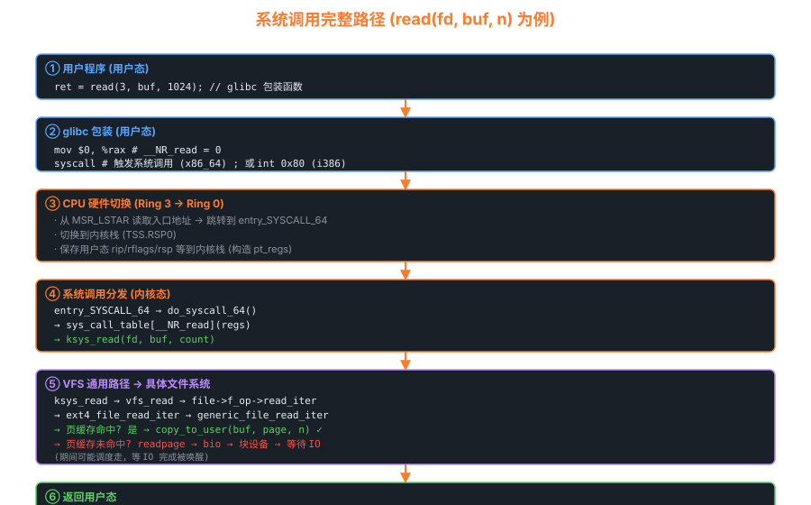

# 06 — 系统调用

> 系统调用是用户程序进入内核的唯一合法通道。
> 本章从**硬件机制 → 内核入口 → 分发 → 返回**完整拆解这条路径，
> 对照 Linux 0.11 与 Linux 2.6.0 源码说明其演进。

---

## 1. 为什么需要系统调用？

```
用户态（Ring 3）         内核态（Ring 0）
──────────────           ────────────────
只能访问用户内存    ◄──  操作系统内核
无法直接操作硬件         控制所有硬件
无法直接调用内核函数      管理所有进程

系统调用 = 受控的"大门"
用户程序通过约定好的"门"进入内核，
内核验证参数后执行操作，再返回结果。
```

---



## 2. Linux 0.11：int 0x80 中断方式

### 2.1 整体流程

```
用户程序（C 代码）
  ↓  write(1, "hello", 5);
  ↓  （glibc 展开为汇编）

      movl $4, %eax    ; __NR_write = 4
      movl $1, %ebx    ; fd = 1
      movl $buf, %ecx  ; buffer 地址
      movl $5, %edx    ; count = 5
      int  $0x80        ; 触发系统调用中断

  ↓  CPU 自动：
      保存 cs:eip, ss:esp, eflags 到内核栈
      查 IDT[0x80]：指向 system_call 处理函数
      切换到内核态（Ring 0）
      切换到该进程的内核栈

kernel/system_call.s: system_call
  ↓  保存所有寄存器（push 系列指令）
  ↓  call sys_call_table(,%eax,4)  ; 按 eax 索引函数表
  ↓  sys_write(1, "hello", 5)      ; 执行实际函数
  ↓  将返回值存入 eax（栈上的 pt_regs.eax）
  ↓  检查信号、是否需要调度
  ↓  iret                          ; 返回用户态

用户程序继续执行（write 返回值在 eax 中）
```

### 2.2 IDT 初始化

```c
/* kernel/traps.c — Linux 0.11 */
void trap_init(void)
{
    set_trap_gate(0, &divide_error);
    set_trap_gate(1, &debug);
    ...
    set_system_gate(0x80, &system_call); /* 0x80 号中断 = 系统调用 */
}

/* 区别：
   set_trap_gate:   DPL=0（只有内核可触发，用于异常）
   set_system_gate: DPL=3（用户态也可以 int 触发，用于系统调用）
*/
```

### 2.3 system_call 汇编代码

```asm
# kernel/system_call.s — Linux 0.11（精简版）
.globl system_call
system_call:
    cmpl $nr_system_calls-1,%eax   # 检查系统调用号合法性
    ja bad_sys_call                 # 越界则报错
    
    push %ds                        # 保存段寄存器
    push %es
    push %fs
    pushl %edx                      # 保存参数寄存器
    pushl %ecx
    pushl %ebx
    
    # 将 ds/es 指向内核数据段
    movl $0x10,%edx
    mov %dx,%ds
    mov %dx,%es
    movl $0x17,%edx                 # fs 指向用户数据段
    mov %dx,%fs
    
    # 通过系统调用号查表并调用
    call sys_call_table(,%eax,4)    # sys_call_table[eax]()
    pushl %eax                      # 保存返回值
    
    # 检查当前进程是否需要处理信号或重新调度
    movl current,%eax
    cmpl $0,state(%eax)             # state != TASK_RUNNING?
    jne reschedule
    cmpl $0,counter(%eax)           # counter == 0?
    je reschedule
    
ret_from_sys_call:
    # 检查信号
    movl signal(%ecx),%ebx
    movl blocked(%ecx),%ecx
    notl %ecx
    andl %ebx,%ecx
    bsfl %ecx,%ecx
    je 3f
    btrl %ecx,%ebx
    movl %ebx,signal(%eax)
    ...
    
3:  popl %eax                       # 恢复返回值
    popl %ebx
    popl %ecx
    popl %edx
    pop %fs
    pop %es
    pop %ds
    iret                            # 返回用户态
```

### 2.4 系统调用表

```c
/* include/linux/sys.h — Linux 0.11 */
fn_ptr sys_call_table[] = {
    sys_setup,     /* 0 */
    sys_exit,      /* 1 */
    sys_fork,      /* 2 */
    sys_read,      /* 3 */
    sys_write,     /* 4 */
    sys_open,      /* 5 */
    sys_close,     /* 6 */
    sys_waitpid,   /* 7 */
    sys_creat,     /* 8 */
    sys_link,      /* 9 */
    sys_unlink,    /* 10 */
    ...            /* 共 72 个 */
};
```

---

## 3. Linux 2.6.0：int 0x80 + sysenter/sysexit

### 3.1 sysenter（快速系统调用）

`int 0x80` 需要保存/恢复 TSS，开销较大。
Pentium II 引入了 `sysenter/sysexit` 指令，专为系统调用优化：

```
对比：
              int 0x80          sysenter
保存的状态    cs/eip/ss/esp      仅 esp/eip（存入 MSR）
特权切换      通过 IDT           通过 MSR 寄存器（SYSENTER_EIP_MSR）
开销          ~100 ns           ~20 ns

sysenter 使用 MSR（Model Specific Register）：
  SYSENTER_CS_MSR  = 目标代码段（内核段）
  SYSENTER_EIP_MSR = 目标 EIP（内核入口 sysenter_entry）
  SYSENTER_ESP_MSR = 目标 ESP（内核栈）
```

### 3.2 两种方式的统一处理

```
用户态调用约定（2.6.0）：
  · 系统调用号放入 eax
  · 参数：ebx, ecx, edx, esi, edi, ebp（最多 6 个）
  · 通过 vsyscall 页面（glibc 自动选择 int 0x80 或 sysenter）

内核入口（arch/i386/kernel/entry.S）：

sysenter_entry:                 # sysenter 路径
    movl TSS_sysenter_esp0(%esp),%esp   # 切换到内核栈
    sti
    pushl $(__USER_DS)
    ...
    # 之后与 int 0x80 路径合流

system_call:                    # int 0x80 路径
    pushl %eax                  # 保存系统调用号
    SAVE_ALL                    # 保存所有寄存器（宏）
    ...
    call *sys_call_table(,%eax,4)
    movl %eax,EAX(%esp)        # 返回值写回
    ...
    RESTORE_INT_REGS
    iret / sysexit
```

### 3.3 参数传递与验证

```c
/* 用户空间指针必须验证！*/
asmlinkage ssize_t sys_read(unsigned int fd, char __user *buf, size_t count)
{
    struct file *file;
    ssize_t ret = -EBADF;
    
    /* 1. 验证 fd 合法性 */
    file = fget(fd);
    if (file) {
        /* 2. 调用 VFS 读取（buf 是用户空间指针）*/
        ret = vfs_read(file, buf, count, &file->f_pos);
        fput(file);
    }
    return ret;
}

/* vfs_read 最终调用 copy_to_user 安全复制数据 */
static inline unsigned long
copy_to_user(void __user *to, const void *from, unsigned long n)
{
    /* 检查 to 地址是否在用户空间范围内 */
    if (access_ok(VERIFY_WRITE, to, n))
        n = __copy_to_user(to, from, n);  /* 实际复制 */
    return n;
}
```

---

## 4. pt_regs：内核栈上的寄存器快照

当用户程序陷入内核时，内核栈顶部存放一个 `pt_regs` 结构体，
保存了用户态的所有寄存器状态：

```c
/* arch/i386/kernel/entry.S / include/asm-i386/ptrace.h */
struct pt_regs {
    long ebx;         /* 系统调用参数 1 */
    long ecx;         /* 系统调用参数 2 */
    long edx;         /* 系统调用参数 3 */
    long esi;         /* 系统调用参数 4 */
    long edi;         /* 系统调用参数 5 */
    long ebp;         /* 系统调用参数 6 */
    long eax;         /* 系统调用号（入）/ 返回值（出）*/
    int  xds;
    int  xes;
    long orig_eax;    /* 原始系统调用号（用于重启）*/
    long eip;         /* 用户态返回地址 */
    int  xcs;         /* 用户态代码段 */
    long eflags;      /* 标志寄存器 */
    long esp;         /* 用户态栈指针 */
    int  xss;         /* 用户态栈段 */
};
```

**内核栈布局（系统调用时）**：

```
内核栈高地址（esp0 = 内核栈页顶）：
┌──────────────────────┐
│  ss（用户态栈段）     │  ← CPU 自动压入
│  esp（用户态栈指针）  │  ← CPU 自动压入
│  eflags              │  ← CPU 自动压入
│  cs（用户态代码段）   │  ← CPU 自动压入
│  eip（用户态返回地址）│  ← CPU 自动压入
├──────────────────────┤
│  orig_eax            │  ← SAVE_ALL 压入
│  ds / es             │  ← SAVE_ALL 压入
│  eax / ebp / edi ... │  ← SAVE_ALL 压入（pt_regs）
└──────────────────────┘ ← 此时的 esp（内核栈指针）
```

---

## 5. 系统调用的完整生命周期

```
┌─────────────────────────────────────────────────────────────┐
│                    系统调用完整流程                           │
│                                                             │
│  ① 用户调用 write(1,"hi",2)                                 │
│          ↓                                                   │
│  ② glibc: mov $4,%eax; int $0x80                           │
│          ↓                                                   │
│  ③ CPU:  保存寄存器 → 查 IDT[0x80] → 跳 system_call        │
│          ↓                                                   │
│  ④ SAVE_ALL → 调用 sys_call_table[4] = sys_write()         │
│          ↓                                                   │
│  ⑤ sys_write → vfs_write → ext2_write → 写页缓存 → bio     │
│          ↓                                                   │
│  ⑥ 返回值写入 pt_regs.eax                                   │
│          ↓                                                   │
│  ⑦ 检查信号（do_signal）/ 调度（schedule）                   │
│          ↓                                                   │
│  ⑧ RESTORE_ALL → iret → 回到用户态                         │
│          ↓                                                   │
│  ⑨ glibc 从 eax 取返回值，返回给 write()                    │
└─────────────────────────────────────────────────────────────┘
```

---

## 6. 添加一个自定义系统调用（实验）

在 Linux 0.11 中添加 `sys_myhello`：

```c
/* 第一步：在 kernel/sys.c 中添加实现 */
int sys_myhello(void)
{
    printk("Hello from kernel syscall!\n");
    return 42;
}

/* 第二步：在 include/linux/sys.h 中注册 */
extern int sys_myhello(void);
// 在 sys_call_table[] 末尾添加：
// sys_myhello,   /* 73 */

/* 第三步：在 include/unistd.h 中添加号码 */
#define __NR_myhello 73

/* 第四步：重新编译内核 */

/* 第五步：用户程序测试 */
#include <unistd.h>
int main() {
    int ret = syscall(73);
    printf("syscall returned: %d\n", ret);
    return 0;
}
```

---

## 7. 系统调用性能分析

```bash
# 用 strace 跟踪系统调用
strace -c ls /tmp     # 统计各系统调用次数和耗时
strace -e trace=open,read,write ls

# 用 perf 分析系统调用开销
perf stat -e 'syscalls:sys_enter_*' ls

# 查看系统调用表
ausyscall --dump       # 打印所有系统调用号
```

| 系统调用 | 典型耗时（现代 x86）|
|---------|-----------------|
| getpid  | ~100 ns（可 vDSO 优化到 ~10 ns）|
| read    | ~500 ns（命中页缓存）|
| write   | ~500 ns（写页缓存）|
| open    | ~3 µs（含路径解析）|
| fork    | ~30 µs（进程创建）|
| execve  | ~1 ms（加载程序）|

---

## 8. vDSO（虚拟动态共享对象）

### 8.1 vDSO 原理

```
问题：某些系统调用极高频率被调用（如 gettimeofday 每毫秒调用多次）
     每次都要 ring3 → ring0 → ring3 切换，约 100~200 ns 的开销

解决：vDSO（Virtual Dynamic Shared Object）
  内核在每个进程的地址空间映射一段特殊共享内存（约 8KB），
  包含部分系统调用的用户态实现（直接读 VVAR 页中的内核数据）

                 用户地址空间
  ┌──────────────────────────────────┐
  │  ...                             │
  │  [vvar] (只读，内核写入时间数据) │ ← 内核定期更新
  │  [vdso] (可执行，用户态代码)     │ ← gettimeofday 实现
  │  ...                             │
  └──────────────────────────────────┘

glibc 的 gettimeofday() 会自动调用 vDSO 版本：
  → 直接读取 vvar 页中的 tk_core（时间核心数据）
  → 无需进入内核！耗时约 10~20 ns
```

### 8.2 vDSO 加速的系统调用

```bash
# 查看 vDSO 加速的函数
cat /proc/self/maps | grep vdso
# 7fff12345000-7fff12346000 r-xp 00000000 00:00 0  [vdso]

# 解析 vDSO 导出符号
objdump -T /proc/self/exe 2>/dev/null || \
    dd if=/proc/self/mem bs=4096 skip=$((0x7fff12345)) count=1 2>/dev/null | \
    objdump -T /dev/stdin 2>/dev/null

# 在现代 x86_64 系统，vDSO 通常加速以下调用：
#  clock_gettime(CLOCK_REALTIME / CLOCK_MONOTONIC)
#  gettimeofday()
#  getcpu()         (返回当前 CPU 和 NUMA 节点号)
#  time()
```

```c
/* 用户程序通常无需关心 vDSO，glibc 自动使用 */
/* 但可以验证：使用 strace 观察是否有系统调用被发出 */
/* strace -e gettimeofday ./my_program */
/* 如果使用了 vDSO，strace 看不到该系统调用！ */

/* 手动查找和调用 vDSO（不推荐，仅用于了解机制）*/
#include <sys/auxv.h>
unsigned long vdso_addr = getauxval(AT_SYSINFO_EHDR);
/* 然后解析 ELF，找到函数符号 */
```

---

## 9. seccomp BPF：系统调用过滤

### 9.1 seccomp 机制

```
seccomp（SECure COMPuting mode）允许进程为自己设置系统调用白名单/黑名单，
用于沙箱化（Chrome、Docker、systemd 等均使用）。

模式：
  SECCOMP_MODE_STRICT   仅允许 read/write/exit/sigreturn（极简模式）
  SECCOMP_MODE_FILTER   BPF 程序决定每个系统调用的处理方式（灵活）
```

### 9.2 seccomp BPF 示例

```c
#include <linux/seccomp.h>
#include <linux/filter.h>
#include <linux/audit.h>
#include <sys/syscall.h>
#include <sys/prctl.h>

/* 简单的 seccomp 过滤器：只允许 read/write/exit_group */
struct sock_filter filter[] = {
    /* 加载系统调用号到累加器 */
    BPF_STMT(BPF_LD | BPF_W | BPF_ABS,
             offsetof(struct seccomp_data, nr)),

    /* 允许 read */
    BPF_JUMP(BPF_JMP | BPF_JEQ | BPF_K, __NR_read, 0, 1),
    BPF_STMT(BPF_RET | BPF_K, SECCOMP_RET_ALLOW),

    /* 允许 write */
    BPF_JUMP(BPF_JMP | BPF_JEQ | BPF_K, __NR_write, 0, 1),
    BPF_STMT(BPF_RET | BPF_K, SECCOMP_RET_ALLOW),

    /* 允许 exit_group */
    BPF_JUMP(BPF_JMP | BPF_JEQ | BPF_K, __NR_exit_group, 0, 1),
    BPF_STMT(BPF_RET | BPF_K, SECCOMP_RET_ALLOW),

    /* 其他所有系统调用：返回 ERRNO(EPERM) 或 KILL */
    BPF_STMT(BPF_RET | BPF_K, SECCOMP_RET_ERRNO | EPERM),
};

struct sock_fprog prog = {
    .len = sizeof(filter) / sizeof(filter[0]),
    .filter = filter,
};

/* 启用 seccomp BPF */
prctl(PR_SET_NO_NEW_PRIVS, 1, 0, 0, 0);  /* 必须先设置 */
prctl(PR_SET_SECCOMP, SECCOMP_MODE_FILTER, &prog);

/* 或使用 seccomp() 系统调用（Linux 3.17+）*/
syscall(__NR_seccomp, SECCOMP_SET_MODE_FILTER, 0, &prog);
```

```bash
# 查看进程的 seccomp 状态
cat /proc/self/status | grep Seccomp
# Seccomp: 0   (0=未启用, 1=STRICT, 2=FILTER)

# Docker 默认 seccomp profile（阻止约 50 个危险调用）
docker run --security-opt seccomp=unconfined ubuntu  # 禁用 seccomp
docker run --security-opt seccomp=/path/to/profile.json ubuntu
```

---

## 10. 在 Linux 5.x 中添加新系统调用

以添加 `sys_mygetpid` 为例（仅返回当前进程 PID）：

### 步骤一：定义系统调用实现

```c
/* kernel/myhello.c （新建文件）*/
#include <linux/kernel.h>
#include <linux/syscalls.h>
#include <linux/pid.h>

/* SYSCALL_DEFINE 宏会展开为 __x64_sys_mygetpid 等平台特定函数 */
SYSCALL_DEFINE0(mygetpid)
{
    return task_tgid_vnr(current);  /* 返回进程 ID（虚拟命名空间中的 PID）*/
}
```

### 步骤二：注册系统调用号

```
# arch/x86/entry/syscalls/syscall_64.tbl
# 在末尾添加（假设下一个号是 548）：
548  common  mygetpid     sys_mygetpid
```

### 步骤三：声明原型

```c
/* include/linux/syscalls.h — 在末尾添加 */
asmlinkage long sys_mygetpid(void);
```

### 步骤四：加入编译

```makefile
# kernel/Makefile — 添加新文件
obj-y += myhello.o
```

### 步骤五：重新编译并测试

```c
/* 用户态测试程序 */
#include <unistd.h>
#include <sys/syscall.h>
#include <stdio.h>

#define __NR_mygetpid 548

int main(void)
{
    long pid = syscall(__NR_mygetpid);
    printf("mygetpid returned: %ld (getpid: %d)\n", pid, getpid());
    return 0;
}
```

---

## 11. 系统调用号表演进（32 位 vs 64 位）

```
历史上系统调用号不统一，x86 平台有多套表：

  arch/x86/entry/syscalls/syscall_32.tbl  — x86（32 位）
  arch/x86/entry/syscalls/syscall_64.tbl  — x86_64（64 位）
  arch/x86/entry/syscalls/syscall_x32.tbl — x32 ABI（64 位内核+32 位指针）

部分关键差异（32 位 vs 64 位）：
  调用    32 位号   64 位号
  ───────────────────────────
  read       3        0
  write      4        1
  open       5        2
  close      6        3
  fork       2       57
  execve    11       59
  exit       1       60
  wait4    114      61 (wait4)
  getpid    20       39
  socket   359      41

32 位程序在 64 位内核上运行（ia32 兼容模式）：
  使用 int 0x80 或 sysenter → 进入 entry_INT80_compat()
  内核根据 32 位调用号，查 syscall_32.tbl 分发

64 位程序：
  使用 syscall 指令 → 进入 entry_SYSCALL_64()
  内核查 syscall_64.tbl

# 在系统上查看当前系统调用数量
ausyscall --dump | wc -l   # x86_64 目前约 330+ 个
```
