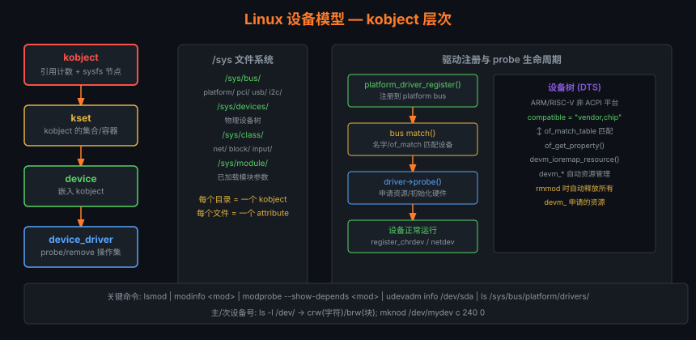

# 07 — 设备驱动

> 驱动程序是内核与硬件之间的桥梁。
> 本章从**设备模型 → 字符设备 → 块设备 → 驱动开发流程**，
> 对照 Linux 0.11（直接操作）与 Linux 2.6.0（统一设备模型）拆解。

---

## 1. 设备分类

```
Linux 设备分为三类：

┌──────────────────────────────────────────────────────────┐
│  字符设备（Character Device）                             │
│  · 以字节流方式访问                                       │
│  · 无缓冲（或少缓冲）                                     │
│  · 例：键盘(/dev/tty)、串口(/dev/ttyS0)、鼠标            │
│  · 设备文件: /dev/xxx  主设备号:次设备号                  │
├──────────────────────────────────────────────────────────┤
│  块设备（Block Device）                                   │
│  · 以固定大小的块（通常 512B 或 4KB）随机访问             │
│  · 有内核缓冲（页缓存）                                   │
│  · 例：硬盘(/dev/sda)、U盘、SSD                          │
├──────────────────────────────────────────────────────────┤
│  网络设备（Network Device）                               │
│  · 通过 socket 接口访问，不在 /dev 中出现                 │
│  · 例：eth0、lo、wlan0                                    │
└──────────────────────────────────────────────────────────┘
```

---

## 2. Linux 0.11：直接操作方式

### 2.1 终端（TTY）驱动结构

```c
/* kernel/chr_drv/tty_io.c */

/* 每个终端对应一个 tty_struct */
struct tty_struct {
    struct termios termios;       /* 终端参数（波特率、回显等）*/
    int pgrp;                     /* 前台进程组 */
    int stopped;                  /* 是否停止输出 */
    void (*write)(struct tty_struct *tty);  /* 输出函数指针 */
    struct tty_queue read_q;      /* 读缓冲队列 */
    struct tty_queue write_q;     /* 写缓冲队列 */
    struct tty_queue secondary;   /* 经行规处理后的队列 */
};

/* 终端读写（tty_read/tty_write 调用此）*/
void con_write(struct tty_struct *tty)   /* 控制台写 */
void rs_write(struct tty_struct *tty)    /* 串口写 */
```

### 2.2 硬盘驱动（HD）

```c
/* kernel/blk_drv/hd.c — Linux 0.11 硬盘驱动 */

/* 请求队列（I/O 请求）*/
static struct request request[NR_REQUEST];

/* 提交 I/O 请求 */
void add_request(struct blk_dev_struct *dev, struct request *req)
{
    /* 将请求插入电梯排序队列 */
    /* 电梯算法：按磁道号排序，减少磁头移动距离 */
    ...
    if (!(tmp = dev->current_request)) {
        dev->current_request = req;
        (dev->request_fn)();     /* 立即执行 */
    } else {
        /* 插入合适位置（按磁道号） */
        for (; tmp->next; tmp = tmp->next)
            if ((IN_ORDER(tmp, req) || !IN_ORDER(tmp, tmp->next))
                && IN_ORDER(req, tmp->next))
                break;
        req->next = tmp->next;
        tmp->next = req;
    }
}

/* 硬盘中断处理 */
void hd_interrupt(void)
{
    void (*handler)(void) = do_hd;
    do_hd = NULL;
    if (!handler)
        handler = unexpected_hd_interrupt;
    handler();                    /* 调用当前操作的完成处理函数 */
    enable_hd_dma();
}
```

---

## 3. Linux 2.6.0：统一设备模型



### 3.1 设备模型的核心对象

```
kobject（内核对象基类）
  ├── kset（kobject 的集合）
  ├── ktype（kobject 的操作集合）
  └── sysfs 文件系统节点

所有设备都通过 kobject 嵌入：

struct device {
    struct kobject kobj;          /* ← 内嵌 kobject */
    struct device *parent;        /* 父设备 */
    struct bus_type *bus;         /* 所在总线 */
    struct device_driver *driver; /* 对应驱动 */
    void *driver_data;            /* 驱动私有数据 */
    ...
};

struct device_driver {
    const char *name;
    struct bus_type *bus;
    int (*probe)(struct device *dev);   /* 探测设备 */
    int (*remove)(struct device *dev);  /* 移除设备 */
    ...
};
```

### 3.2 总线 - 驱动 - 设备 匹配机制

```
总线（bus_type）
  ├── 设备链表：USB 键盘、USB 鼠标、USB 网卡 ...
  └── 驱动链表：usbhid 驱动、usb-storage 驱动 ...

当设备插入时：
  1. 设备注册到总线设备链表
  2. 遍历总线驱动链表
  3. 调用 bus->match(device, driver) 尝试匹配
  4. 匹配成功 → driver->probe(device) → 驱动初始化硬件

当驱动加载时（insmod）：
  1. 驱动注册到总线驱动链表
  2. 遍历总线设备链表，尝试 match
  3. 找到匹配设备 → probe()
```

### 3.3 sysfs — 设备模型的可视化

```bash
# sysfs 将设备树暴露到文件系统
ls /sys/bus/pci/devices/
ls /sys/class/block/
ls /sys/class/net/

# 每个设备目录包含：
ls /sys/class/block/sda/
# driver    → 链接到 sata_sil 驱动
# power/    → 电源管理
# queue/    → 请求队列参数
# size      → 设备大小（512B 扇区数）
```

---

## 4. 字符设备驱动开发（2.6.0）

### 4.1 完整驱动模板

```c
#include <linux/module.h>
#include <linux/fs.h>
#include <linux/cdev.h>
#include <linux/uaccess.h>

#define MYDEV_NAME "mychardev"
#define MYDEV_MAJOR 240           /* 主设备号（或动态分配）*/
#define MYDEV_MINOR 0

/* 驱动私有数据 */
static struct {
    struct cdev cdev;
    char buf[256];
    int buf_len;
} mydev_data;

/* 1. open：打开设备 */
static int mydev_open(struct inode *inode, struct file *filp)
{
    /* 将驱动私有数据关联到 file */
    filp->private_data = &mydev_data;
    printk(KERN_INFO "%s: opened\n", MYDEV_NAME);
    return 0;
}

/* 2. release：关闭设备 */
static int mydev_release(struct inode *inode, struct file *filp)
{
    printk(KERN_INFO "%s: closed\n", MYDEV_NAME);
    return 0;
}

/* 3. read：从设备读数据（内核 → 用户）*/
static ssize_t mydev_read(struct file *filp, char __user *buf,
                           size_t count, loff_t *ppos)
{
    int len = min(count, (size_t)mydev_data.buf_len);
    
    if (copy_to_user(buf, mydev_data.buf, len))
        return -EFAULT;
    
    *ppos += len;
    return len;
}

/* 4. write：向设备写数据（用户 → 内核）*/
static ssize_t mydev_write(struct file *filp, const char __user *buf,
                            size_t count, loff_t *ppos)
{
    int len = min(count, sizeof(mydev_data.buf) - 1);
    
    if (copy_from_user(mydev_data.buf, buf, len))
        return -EFAULT;
    
    mydev_data.buf[len] = '\0';
    mydev_data.buf_len = len;
    return len;
}

/* 5. ioctl：设备控制命令 */
static int mydev_ioctl(struct inode *inode, struct file *filp,
                        unsigned int cmd, unsigned long arg)
{
    switch (cmd) {
    case 0:  /* 自定义命令 0：清空缓冲 */
        mydev_data.buf_len = 0;
        break;
    default:
        return -EINVAL;
    }
    return 0;
}

/* file_operations：VFS 与驱动的接口 */
static struct file_operations mydev_fops = {
    .owner   = THIS_MODULE,
    .open    = mydev_open,
    .release = mydev_release,
    .read    = mydev_read,
    .write   = mydev_write,
    .ioctl   = mydev_ioctl,
};

/* 模块加载：注册设备 */
static int __init mydev_init(void)
{
    dev_t devno = MKDEV(MYDEV_MAJOR, MYDEV_MINOR);
    
    /* 注册设备号 */
    if (register_chrdev_region(devno, 1, MYDEV_NAME) < 0)
        return -ENODEV;
    
    /* 初始化并注册 cdev */
    cdev_init(&mydev_data.cdev, &mydev_fops);
    mydev_data.cdev.owner = THIS_MODULE;
    if (cdev_add(&mydev_data.cdev, devno, 1) < 0) {
        unregister_chrdev_region(devno, 1);
        return -ENODEV;
    }
    
    printk(KERN_INFO "%s: registered (major=%d)\n", MYDEV_NAME, MYDEV_MAJOR);
    return 0;
}

/* 模块卸载：注销设备 */
static void __exit mydev_exit(void)
{
    cdev_del(&mydev_data.cdev);
    unregister_chrdev_region(MKDEV(MYDEV_MAJOR, MYDEV_MINOR), 1);
    printk(KERN_INFO "%s: unregistered\n", MYDEV_NAME);
}

module_init(mydev_init);
module_exit(mydev_exit);
MODULE_LICENSE("GPL");
MODULE_AUTHOR("Your Name");
MODULE_DESCRIPTION("My simple character device");
```

### 4.2 编译与测试

```bash
# Makefile
obj-m += mychardev.o

all:
    make -C /lib/modules/$(shell uname -r)/build M=$(PWD) modules

clean:
    make -C /lib/modules/$(shell uname -r)/build M=$(PWD) clean

# 编译
make

# 加载模块
sudo insmod mychardev.ko

# 创建设备节点
sudo mknod /dev/mychardev c 240 0
sudo chmod 666 /dev/mychardev

# 测试
echo "Hello, Driver!" > /dev/mychardev
cat /dev/mychardev
# 输出：Hello, Driver!

# 查看内核日志
dmesg | tail

# 卸载模块
sudo rmmod mychardev
```

---

## 5. 驱动与内核交互机制

### 5.1 中断处理

```
硬件触发中断
    │
    ▼
CPU 查 IDT → 跳转到 request_irq() 注册的处理函数
    │
    ├─ 上半部（interrupt handler）：快速、不可休眠
    │     关键操作：清除中断状态、读写硬件寄存器
    │     保存数据到 tasklet/workqueue
    │
    └─ 下半部（bottom half）：可以稍微慢一些
          tasklet：软中断上下文，不可休眠
          workqueue：进程上下文，可以休眠

/* 注册中断处理函数 */
int request_irq(unsigned int irq,
                irqreturn_t (*handler)(int, void *, struct pt_regs *),
                unsigned long flags,
                const char *devname,
                void *dev_id);

/* 处理函数示例 */
irqreturn_t my_irq_handler(int irq, void *dev_id, struct pt_regs *regs)
{
    /* 读取硬件状态 */
    int status = inb(MY_STATUS_PORT);
    
    /* 调度 tasklet 处理数据 */
    tasklet_schedule(&my_tasklet);
    
    return IRQ_HANDLED;
}
```

### 5.2 DMA（直接内存访问）

```
不用 DMA：
  CPU 逐字节从硬件读数据到内存 → CPU 占用率高

用 DMA：
  1. CPU 设置 DMA 控制器（源、目标、长度）
  2. DMA 硬件自主搬运数据（CPU 可做其他事）
  3. DMA 完成后触发中断通知 CPU

/* 申请 DMA 缓冲区（需要物理连续内存）*/
dma_addr_t dma_handle;
void *cpu_addr = dma_alloc_coherent(dev, size, &dma_handle, GFP_KERNEL);
/* cpu_addr: 内核虚拟地址，dma_handle: DMA 总线地址 */

/* 启动 DMA 传输 */
writel(dma_handle, dev_base + DMA_ADDR_REG);
writel(size, dev_base + DMA_SIZE_REG);
writel(DMA_START, dev_base + DMA_CTRL_REG);
```

---

## 6. 驱动调试技巧

```c
/* 内核打印（比 printf 更丰富）*/
printk(KERN_EMERG   "系统即将崩溃\n");  /* 0: 最高优先级 */
printk(KERN_ALERT   "需要立即处理\n");  /* 1 */
printk(KERN_CRIT    "严重错误\n");      /* 2 */
printk(KERN_ERR     "错误\n");          /* 3 */
printk(KERN_WARNING "警告\n");          /* 4 */
printk(KERN_NOTICE  "注意\n");          /* 5 */
printk(KERN_INFO    "信息\n");          /* 6 */
printk(KERN_DEBUG   "调试\n");          /* 7 */

/* /proc 接口（暴露驱动内部状态）*/
static int mydev_proc_show(struct seq_file *m, void *v)
{
    seq_printf(m, "buffer: %s\n", mydev_data.buf);
    seq_printf(m, "length: %d\n", mydev_data.buf_len);
    return 0;
}
/* 注册：proc_create("mychardev", 0, NULL, &mydev_proc_fops) */
```

```bash
# 动态调试（Linux 2.6.30+）
echo "module mychardev +p" > /sys/kernel/debug/dynamic_debug/control

# 用 oops 分析崩溃
dmesg | grep "Oops"
# 使用 addr2line 或 gdb 定位崩溃位置
addr2line -e vmlinux 0xc01234ab
```

---

## 7. MSI / MSI-X 中断 vs 传统 INTx

### 7.1 中断方式对比

```
传统 INTx（引脚中断）：
  · PCI 设备拉低 INTA# 引脚
  · 所有共享该引脚的设备共用一个中断号
  · 问题：中断共享（需要轮询判断是哪个设备触发）
          不支持多处理器亲和性（只能给一个 CPU）

MSI（Message Signaled Interrupts）：
  · 设备写一条特定内存地址（x86: 0xFEExxxxx）触发中断
  · 每个设备独立中断号（无共享问题）
  · 可以精确指定目标 CPU（affinity）
  · PCIe 标准支持，每设备最多 32 个 MSI 向量

MSI-X（MSI eXtended）：
  · 每设备最多 2048 个独立中断向量
  · 每个向量独立配置目标 CPU
  · 高性能网卡/SSD 必用（多队列，队列绑定不同 CPU）
```

```c
/* 在驱动中申请 MSI-X 中断 */
int nvecs = pci_msix_vec_count(pdev);  /* 硬件支持的最大向量数 */
struct msix_entry entries[4] = {
    { .entry = 0 }, { .entry = 1 },
    { .entry = 2 }, { .entry = 3 },
};

/* 分配 4 个 MSI-X 向量 */
int ret = pci_enable_msix_exact(pdev, entries, 4);

/* 为每个向量注册处理函数 */
for (i = 0; i < 4; i++) {
    ret = request_irq(entries[i].vector, my_msix_handler,
                      0, "my_device", &my_queues[i]);
    /* 设置 CPU 亲和性（队列 i 绑定 CPU i）*/
    irq_set_affinity_hint(entries[i].vector, cpumask_of(i));
}

/* 清理 */
pci_disable_msix(pdev);
```

---

## 8. DMA API 与 IOMMU

### 8.1 DMA 一致性内存 vs 流式 DMA

```c
/* ① dma_alloc_coherent：分配一致性 DMA 内存
   适用：设备频繁读写的控制数据（描述符环、状态寄存器映射）
   特点：CPU 和设备看到的内容始终一致（不需要显式 cache 刷新）
         通常是非缓存映射（Uncached），访问速度较慢 */
void *cpu_addr;
dma_addr_t dma_handle;
cpu_addr = dma_alloc_coherent(dev, 4096, &dma_handle, GFP_KERNEL);
/* cpu_addr: 驱动用来读写的内核虚拟地址 */
/* dma_handle: 写入设备寄存器的总线地址 */
writel(dma_handle, dev_base + TX_DESC_REG);
/* 释放 */
dma_free_coherent(dev, 4096, cpu_addr, dma_handle);

/* ② dma_map_single：流式 DMA 映射
   适用：单次数据传输（网络包、磁盘块）
   特点：对已有内存建立映射，速度快
         需要显式 sync 保持 CPU/设备视图一致 */
dma_addr_t dma_addr = dma_map_single(dev, buf, len, DMA_TO_DEVICE);
if (dma_mapping_error(dev, dma_addr))
    return -ENOMEM;
/* ... 触发 DMA 传输 ... */
dma_unmap_single(dev, dma_addr, len, DMA_TO_DEVICE);  /* 传输完后解除映射 */

/* ③ dma_map_sg：散列/聚集（Scatter-Gather）DMA
   适用：物理上不连续的缓冲区（如文件系统的 page cache） */
int nents = dma_map_sg(dev, sgl, nsegs, DMA_FROM_DEVICE);
struct scatterlist *sg;
for_each_sg(sgl, sg, nents, i) {
    /* sg_dma_address(sg): DMA 地址 */
    /* sg_dma_len(sg):     长度 */
}
dma_unmap_sg(dev, sgl, nsegs, DMA_FROM_DEVICE);
```

### 8.2 IOMMU 作用

```
没有 IOMMU：设备可以 DMA 到任意物理地址 → 安全风险（DMA 攻击）
有 IOMMU（Intel VT-d / AMD-Vi）：
  · 设备只能访问 IOMMU 映射表中允许的内存范围
  · dma_map_* API 在 IOMMU 中建立映射（类似进程页表）
  · 设备隔离：虚拟机的设备无法访问宿主机内存（PCIe 直通安全基础）

查看 IOMMU 状态：
  dmesg | grep -i iommu
  cat /sys/kernel/debug/iommu/iommu_groups/0/reserved_regions
```

---

## 9. devm_* 资源管理函数

`devm_*` 系列函数（device-managed）与设备生命周期绑定，
设备移除时自动释放，避免驱动忘记清理资源：

```c
/* 传统方式：需要手动在 remove() 中配对释放 */
void *buf = kmalloc(size, GFP_KERNEL);
/* ...使用 buf ... */
kfree(buf);  /* 必须记得调用！ */

/* devm 方式：设备移除时自动 kfree */
void *buf = devm_kmalloc(dev, size, GFP_KERNEL);
/* 设备 remove 时自动释放，无需手动 kfree */

/* 常用 devm_* 函数 */
devm_kmalloc(dev, size, gfp)         /* 内存分配 */
devm_kzalloc(dev, size, gfp)         /* 清零内存分配 */
devm_ioremap(dev, offset, size)      /* I/O 内存映射 */
devm_ioremap_resource(dev, res)      /* 从 platform_resource 映射 */
devm_request_irq(dev, irq, handler, flags, name, data) /* 中断注册 */
devm_request_mem_region(dev, start, n, name)  /* 申请 I/O 内存区域 */
devm_gpio_request(dev, gpio, label)  /* GPIO 申请 */
devm_clk_get(dev, id)               /* 时钟获取 */
devm_regulator_get(dev, id)         /* 电源调节器 */
devm_pinctrl_get(dev)               /* 引脚控制 */
devm_iio_device_alloc(dev, priv_size) /* IIO 设备 */

/* 自定义清理函数 */
static void my_cleanup(void *data)
{
    struct my_device *mydev = data;
    my_hardware_reset(mydev);
}
devm_add_action(dev, my_cleanup, mydev);  /* 设备移除时调用 */
```

---

## 10. Platform 驱动完整示例（含设备树绑定）

### 10.1 设备树绑定（DTS）

```dts
/* arch/arm64/boot/dts/vendor/board.dts */
/ {
    myled: myled@12340000 {
        compatible = "vendor,myled";    /* 与驱动 of_match_table 对应 */
        reg = <0x0 0x12340000 0x0 0x100>; /* 寄存器基地址和大小 */
        interrupts = <GIC_SPI 42 IRQ_TYPE_LEVEL_HIGH>;
        clocks = <&ccu CLK_LED>;
        clock-names = "core";
        reset-gpios = <&gpio 5 GPIO_ACTIVE_LOW>;
        label = "power-led";
        linux,default-trigger = "heartbeat";
        status = "okay";
    };
};
```

### 10.2 Platform 驱动实现

```c
/* drivers/leds/leds-myled.c */
#include <linux/module.h>
#include <linux/platform_device.h>
#include <linux/of.h>
#include <linux/of_device.h>
#include <linux/io.h>
#include <linux/clk.h>
#include <linux/gpio/consumer.h>
#include <linux/leds.h>

#define LED_CTRL_REG    0x00
#define LED_STATUS_REG  0x04
#define LED_ENABLE_BIT  BIT(0)

struct myled_priv {
    struct led_classdev cdev;     /* LED 类设备（必须是第一个字段）*/
    void __iomem *base;           /* 寄存器基地址 */
    struct clk *clk;              /* 时钟 */
    struct gpio_desc *reset_gpio; /* 复位 GPIO */
    int irq;
};

static void myled_set_brightness(struct led_classdev *cdev,
                                  enum led_brightness brightness)
{
    struct myled_priv *priv = container_of(cdev, struct myled_priv, cdev);
    u32 val = readl(priv->base + LED_CTRL_REG);

    if (brightness)
        val |= LED_ENABLE_BIT;
    else
        val &= ~LED_ENABLE_BIT;

    writel(val, priv->base + LED_CTRL_REG);
}

static irqreturn_t myled_irq_handler(int irq, void *dev_id)
{
    struct myled_priv *priv = dev_id;
    u32 status = readl(priv->base + LED_STATUS_REG);
    dev_dbg(priv->cdev.dev, "LED IRQ: status=0x%x\n", status);
    /* 清除中断 */
    writel(status, priv->base + LED_STATUS_REG);
    return IRQ_HANDLED;
}

static int myled_probe(struct platform_device *pdev)
{
    struct device *dev = &pdev->dev;
    struct myled_priv *priv;
    struct resource *res;
    int ret;

    /* devm_kzalloc：设备移除时自动释放 */
    priv = devm_kzalloc(dev, sizeof(*priv), GFP_KERNEL);
    if (!priv)
        return -ENOMEM;

    /* 从设备树获取寄存器地址并映射（devm 方式）*/
    priv->base = devm_platform_ioremap_resource(pdev, 0);
    if (IS_ERR(priv->base))
        return PTR_ERR(priv->base);

    /* 获取时钟 */
    priv->clk = devm_clk_get(dev, "core");
    if (IS_ERR(priv->clk))
        return dev_err_probe(dev, PTR_ERR(priv->clk), "Failed to get clk\n");

    ret = clk_prepare_enable(priv->clk);
    if (ret)
        return ret;

    /* 获取 reset GPIO */
    priv->reset_gpio = devm_gpiod_get_optional(dev, "reset", GPIOD_OUT_HIGH);
    if (IS_ERR(priv->reset_gpio))
        return PTR_ERR(priv->reset_gpio);

    /* 注册中断 */
    priv->irq = platform_get_irq(pdev, 0);
    if (priv->irq < 0)
        return priv->irq;

    ret = devm_request_irq(dev, priv->irq, myled_irq_handler,
                           0, dev_name(dev), priv);
    if (ret)
        return ret;

    /* 配置 LED 类设备 */
    priv->cdev.name = of_get_property(dev->of_node, "label", NULL) ?: "myled";
    priv->cdev.brightness_set = myled_set_brightness;
    priv->cdev.max_brightness = 1;
    priv->cdev.default_trigger =
        of_get_property(dev->of_node, "linux,default-trigger", NULL);

    /* 注册 LED 类设备（创建 /sys/class/leds/myled/）*/
    ret = devm_led_classdev_register(dev, &priv->cdev);
    if (ret)
        return ret;

    platform_set_drvdata(pdev, priv);
    dev_info(dev, "myled: registered at 0x%p, irq=%d\n", priv->base, priv->irq);
    return 0;
}

/* 设备树匹配表 */
static const struct of_device_id myled_of_match[] = {
    { .compatible = "vendor,myled" },
    { /* sentinel */ }
};
MODULE_DEVICE_TABLE(of, myled_of_match);

static struct platform_driver myled_driver = {
    .probe  = myled_probe,
    /* remove 无需实现：devm_* 会自动清理所有资源 */
    .driver = {
        .name           = "myled",
        .of_match_table = myled_of_match,
        .pm             = &myled_pm_ops,  /* 可选：电源管理 */
    },
};

module_platform_driver(myled_driver);  /* 替代 module_init/module_exit */
MODULE_LICENSE("GPL");
MODULE_AUTHOR("Your Name");
MODULE_DESCRIPTION("My LED platform driver example");
```
