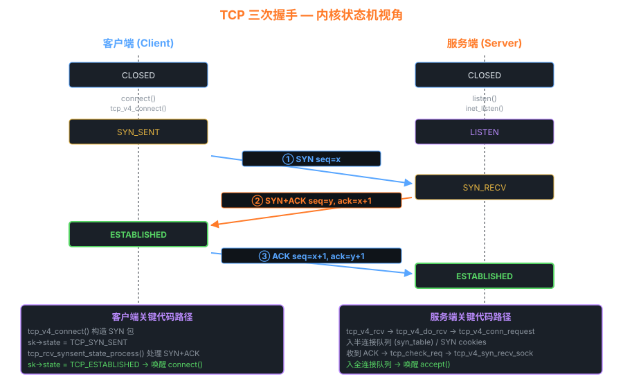

# 08 — 网络子系统

> Linux 网络子系统实现了完整的 TCP/IP 协议栈，是现代互联网的基石。
> 本章从 **Socket 接口 → 协议栈层次 → 数据包接收/发送路径 → 关键数据结构**
> 逐层解析，并对照 Linux 2.6.0 源码（0.11 网络功能不完整，跳过）。

---

## 1. 网络子系统层次架构

```
┌─────────────────────────────────────────────────────────────┐
│                    用户空间                                   │
│    socket() bind() listen() accept() send() recv()          │
└──────────────────────┬──────────────────────────────────────┘
                       │ 系统调用
┌──────────────────────▼──────────────────────────────────────┐
│                  Socket 层（BSD Socket API）                  │
│   sock_create → inet_create → tcp_v4_connect ...            │
└──────────────────────┬──────────────────────────────────────┘
                       │
┌──────────────────────▼──────────────────────────────────────┐
│                 传输层（Transport Layer）                     │
│   TCP（tcp.c）          UDP（udp.c）                         │
│   可靠/有序/流式        不可靠/无序/报文                      │
└──────────────────────┬──────────────────────────────────────┘
                       │
┌──────────────────────▼──────────────────────────────────────┐
│                 网络层（Network Layer）                       │
│   IP（ip_input.c, ip_output.c）                             │
│   路由（route.c）    ARP（arp.c）    ICMP（icmp.c）          │
└──────────────────────┬──────────────────────────────────────┘
                       │
┌──────────────────────▼──────────────────────────────────────┐
│                 链路层（Link Layer）                          │
│   以太网帧（eth.c）   网络设备接口（dev.c）                   │
└──────────────────────┬──────────────────────────────────────┘
                       │
┌──────────────────────▼──────────────────────────────────────┐
│                     网卡驱动                                  │
│   e100 / e1000 / virtio_net ...                             │
└──────────────────────┬──────────────────────────────────────┘
                       │ DMA
                    物理网线
```

---

## 2. 核心数据结构

### 2.1 sk_buff（套接字缓冲区）

`sk_buff` 是 Linux 网络子系统中最重要的数据结构，
代表**网络中的一个数据包**（从用户数据到最终的以太网帧）：

```
sk_buff 内存布局：

  head ──► ┌────────────────────────────────────────┐
           │      headroom（为协议头预留空间）         │
  data ──► ├────────────────────────────────────────┤
           │  以太网头（14字节）  ← 由驱动填充         │
           │  IP 头（20字节）    ← 由 IP 层填充        │
           │  TCP 头（20字节）   ← 由 TCP 层填充       │
           │  用户数据            ← 应用程序提供        │
  tail ──► ├────────────────────────────────────────┤
           │      tailroom（为尾部预留空间）           │
  end  ──► └────────────────────────────────────────┘

关键指针：
  skb->head: 缓冲区起始
  skb->data: 当前数据起始（随协议处理向上移动）
  skb->tail: 数据结束
  skb->end:  缓冲区结束
  skb->len:  data 到 tail 的长度（当前数据长度）
```

```c
/* include/linux/skbuff.h（精简）*/
struct sk_buff {
    struct sk_buff *next, *prev;    /* 链表 */
    struct sock *sk;                /* 关联的 socket */
    struct net_device *dev;         /* 网络设备 */
    
    unsigned char *head, *data, *tail, *end;
    unsigned int len;               /* 数据长度 */
    unsigned int data_len;          /* 分散/聚集 IO 的额外数据 */
    
    __u16 protocol;                 /* 协议类型（ETH_P_IP/ETH_P_ARP...）*/
    __u8  pkt_type;                 /* 包类型（PACKET_HOST/BROADCAST/...）*/
    
    /* 协议头指针（在 skb->data 移动时保存各层头部位置）*/
    union { ... } h;    /* 传输层头（tcp_header/udp_header）*/
    union { ... } nh;   /* 网络层头（iphdr）*/
    union { ... } mac;  /* 链路层头（ethhdr）*/
    
    struct dst_entry *dst;          /* 路由信息 */
};

/* sk_buff 操作 API */
skb_push(skb, len)   /* 在 data 前添加 len 字节（添加协议头）*/
skb_pull(skb, len)   /* 从 data 移除 len 字节（去掉协议头）*/
skb_put(skb, len)    /* 在 tail 后添加 len 字节（添加数据）*/
skb_reserve(skb, len)/* 在 head 处预留 len 字节（为头部预留空间）*/
```

### 2.2 sock / socket 结构

```
用户空间 fd    内核空间
──────────     ─────────────────────────────────────
    fd  ──►  file ──► socket（VFS 文件）
                         │
                         └─► sock（协议相关，如 tcp_sock）

struct socket {             /* BSD socket（VFS 层）*/
    socket_state state;     /* SS_UNCONNECTED/SS_CONNECTED/... */
    struct proto_ops *ops;  /* inet_stream_ops / inet_dgram_ops */
    struct sock *sk;        /* → 协议实现层 */
    struct file *file;      /* → VFS 文件 */
};

struct sock {               /* 协议无关的 sock 基类 */
    __u32 rcv_saddr;        /* 本地 IP */
    __u16 num;              /* 本地端口 */
    __u32 daddr;            /* 对端 IP */
    __u16 dport;            /* 对端端口 */
    struct sk_buff_head sk_receive_queue;  /* 接收队列 */
    struct sk_buff_head sk_write_queue;    /* 发送队列 */
    struct proto *prot;     /* → TCP/UDP 协议操作 */
    ...
};

struct tcp_sock {           /* TCP 专有状态 */
    struct sock sk;         /* ← 必须是第一个字段 */
    __u32 snd_nxt;          /* 下一个要发送的序号 */
    __u32 rcv_nxt;          /* 期望收到的下一个序号 */
    __u32 snd_una;          /* 最后一个未确认的序号 */
    __u16 mss_cache;        /* 最大段大小（MSS）*/
    struct tcp_options_received rx_opt;
    ...
};
```

---

## 3. 数据包接收路径（RX Path）

```
网卡收到数据帧
      │
      │ （DMA 将数据写入 ring buffer）
      ▼
网卡中断（netif_rx() 或 NAPI: netif_receive_skb()）
      │
      ▼
net/core/dev.c: netif_receive_skb(skb)
      │
      ├─ 根据 skb->protocol 分发：
      │   ETH_P_IP  → ip_rcv()
      │   ETH_P_ARP → arp_rcv()
      │   ...
      ▼
net/ipv4/ip_input.c: ip_rcv(skb, ...)
      │
      ├─ IP 校验和检查
      ├─ 路由决策（ip_route_input）：
      │   · 本机目标 → ip_local_deliver()
      │   · 转发     → ip_forward()
      ▼
ip_local_deliver → ip_local_deliver_finish
      │
      ├─ 根据 IP 头的 protocol 字段分发：
      │   IPPROTO_TCP → tcp_v4_rcv()
      │   IPPROTO_UDP → udp_rcv()
      │   IPPROTO_ICMP→ icmp_rcv()
      ▼
net/ipv4/tcp_ipv4.c: tcp_v4_rcv(skb)
      │
      ├─ 查找 socket（根据 src_ip:src_port:dst_ip:dst_port）
      ├─ 调用 TCP 状态机处理（tcp_rcv_state_process）
      ├─ 将数据放入 socket 接收队列（sk_receive_queue）
      └─ 唤醒等待数据的进程（sk->sk_data_ready）
              │
              ▼
用户进程从 recv() 系统调用中醒来，读取数据
```

---

## 4. 数据包发送路径（TX Path）

```
用户程序调用 send(fd, buf, len, 0)
      │
      ▼
sys_send → sys_sendto → sock_sendmsg
      │
      ▼
inet_sendmsg → tcp_sendmsg
      │
      ├─ 将用户数据拷贝到 sk_buff（sk_stream_alloc_skb）
      ├─ 更新 TCP 序号（snd_nxt）
      ├─ 放入发送队列（sk->sk_write_queue）
      └─ 调用 tcp_push_one() 或 tcp_write_xmit()
              │
              ▼
tcp_transmit_skb(sk, skb, ...)
      │
      ├─ 构建 TCP 头（填充序号/确认号/标志）
      └─ 调用 ip_queue_xmit()
              │
              ▼
net/ipv4/ip_output.c: ip_queue_xmit
      │
      ├─ 路由查找（ip_route_output）
      ├─ 构建 IP 头（填充 src_ip/dst_ip/ttl）
      └─ ip_output → ip_finish_output
              │
              ▼
dev_queue_xmit(skb)
      │
      ├─ 流量控制（qdisc）
      └─ dev->hard_start_xmit()  ← 调用网卡驱动发送
              │
              ▼
网卡硬件发送数据帧（DMA → 物理网线）
```

---



## 5. TCP 三次握手（内核视角）

```
客户端                                    服务端（已 listen）
─────                                     ─────────────────
connect()                                 已调用 listen()

tcp_v4_connect()                          (等待中)
  sk->state = TCP_SYN_SENT
  发送 SYN 包 ──────────────────────────►
                                          tcp_v4_rcv()
                                          tcp_rcv_state_process()
                                            SYN: sk->state = TCP_SYN_RECV
                                          ◄────────────── 发送 SYN+ACK

tcp_rcv_state_process()
  SYN+ACK: sk->state = TCP_ESTABLISHED
  发送 ACK ──────────────────────────────►
                                          tcp_rcv_state_process()
                                            ACK: sk->state = TCP_ESTABLISHED
                                            将连接移到 accept 队列
                                            唤醒 accept() 中的进程

连接建立完成！
send() / recv() 可以开始工作
```

---

## 6. Socket 编程与内核对应关系

```c
/* 用户程序                           内核函数 */
socket(AF_INET, SOCK_STREAM, 0)  → sock_create → inet_create → tcp_v4_init_sock
bind(sockfd, &addr, ...)         → inet_bind
listen(sockfd, backlog)          → inet_listen → tcp_listen_start
accept(sockfd, ...)              → inet_accept → inet_csk_accept（阻塞等待）
connect(sockfd, &server_addr, .) → tcp_v4_connect → 发送 SYN

send(sockfd, buf, len, 0)        → tcp_sendmsg
recv(sockfd, buf, len, 0)        → tcp_recvmsg（阻塞等待数据）

close(sockfd)                    → tcp_close → 发送 FIN
```

---

## 7. 实验

```bash
# 跟踪 TCP 连接建立（使用 ss）
ss -tn state established

# 查看路由表
ip route show
cat /proc/net/route

# 查看 socket 统计
cat /proc/net/sockstat
cat /proc/net/tcp    # 所有 TCP 连接

# 用 tcpdump 抓包（同时观察内核行为）
sudo tcpdump -i eth0 -n tcp port 80

# GDB 跟踪 TCP 状态机（在 2.6.0 内核）
(gdb) break tcp_rcv_state_process
(gdb) commands
> printf "TCP state: %d\n", sk->sk_state
> continue
> end
```

---

## 8. 网络性能优化关键点

| 优化技术 | 引入版本 | 说明 |
|---------|---------|------|
| NAPI | 2.4.20+ | 轮询 + 中断混合，减少中断开销 |
| TCP Offload (TSO/GSO) | 2.6.18+ | 大包分片由硬件完成 |
| Zero Copy (sendfile) | 2.2 | 跳过用户空间拷贝 |
| epoll | 2.5.44 | O(1) IO 多路复用 |
| RSS/RPS | 2.6.35+ | 多队列网卡，多核并行接收 |
| XDP/eBPF | 4.8+ | 在驱动层直接处理包，旁路协议栈 |

---

## 9. sk_buff 完整结构（ASCII 图）

```
sk_buff 内存布局详解（包含所有字段）：

        skb（指向描述符）
         │
         ▼
┌────────────────────────────────────────────────────────┐
│  struct sk_buff（描述符，约 240 bytes）                  │
│                                                        │
│  next ──► 链表                prev ──► 链表            │
│  sk   ──► 所属 socket         dev ──► 网络设备         │
│                                                        │
│  head ─────────────────────────────────────────────┐  │
│  data ──────────────────────────────────────────┐  │  │
│  tail ──────────────────────────────────────┐   │  │  │
│  end  ──────────────────────────────────┐   │   │  │  │
│                                         │   │   │  │  │
│  len = tail - data                      │   │   │  │  │
│  protocol / pkt_type / ip_summed        │   │   │  │  │
│  h.th ──► TCP 头（数据内偏移量）         │   │   │  │  │
│  nh.iph ──► IP 头（数据内偏移量）        │   │   │  │  │
│  mac.ethernet ──► 以太网头              │   │   │  │  │
│  dst ──► 路由缓存                       │   │   │  │  │
└─────────────────────────────────────────│───│───│──│──┘
                                          │   │   │  │
数据缓冲区（连续内存）：                  │   │   │  │
                                          ▼   │   │  ▼
  [low]  head ──────────────────────────────► │   │  end [high]
         │ headroom                       ▼   │   │
         │ （发送时为以太头/IP头预留空间） data │   │
         │                                │   │   │
         │                   以太网头(14B) │   │   │
         │                   IP 头  (20B) │   │   │
         │                   TCP 头 (20B) │   │   │
         │                   用户数据      │   │   │
         │                                ▼   │   │
         │                               tail │   │
         │ tailroom                           ▼   │
         └────────────────────────────────── end ─┘

操作函数：
  skb_push(skb, n)   data -= n   （向 head 方向扩展，添加协议头）
  skb_pull(skb, n)   data += n   （去掉协议头，上层解析）
  skb_put(skb, n)    tail += n   （向 end 方向扩展，添加数据）
  skb_reserve(skb,n) head..data 预留 n 字节（初始化时调用）
```

---

## 10. 完整接收路径：NIC → 用户进程

```
硬件层：
  网卡 DMA → 填充 RX ring buffer 中的 sk_buff
  发送中断（或 NAPI poll）通知内核

软中断层（NET_RX_SOFTIRQ）：
  net_rx_action()
  └─► driver->napi_poll()              ← e.g., e1000_clean_rx_irq()
       └─► netif_receive_skb(skb)      ← 提交给网络栈

协议分发层（net/core/dev.c）：
  netif_receive_skb()
  └─► __netif_receive_skb_core()
       ├─► deliver_skb(skb, ptype)     ← 按 skb->protocol 分发
       │    ETH_P_IP  → ip_rcv()
       │    ETH_P_ARP → arp_rcv()
       │    ETH_P_IPV6 → ipv6_rcv()
       └─► netfilter hook: NF_INET_PRE_ROUTING

IP 层（net/ipv4/ip_input.c）：
  ip_rcv()
  └─► ip_rcv_finish()
       ├─► ip_route_input()            ← 路由决策
       │    本机目标 → ip_local_deliver()
       │    转发     → ip_forward() → ip_output()
       └─► NF_INET_LOCAL_IN hook（iptables INPUT 链）

传输层（net/ipv4/tcp_ipv4.c）：
  tcp_v4_rcv()
  ├─► __inet_lookup_skb()             ← 根据 4 元组查找 sock
  ├─► tcp_v4_do_rcv()
  │    ├─► tcp_rcv_established()      ← 已建立连接的快速路径
  │    │    └─► tcp_data_queue()      ← 放入接收队列（有序重组）
  │    └─► tcp_rcv_state_process()    ← 状态机（握手/挥手）
  └─► sk->sk_data_ready(sk)          ← 唤醒 recv() 中阻塞的进程

用户层：
  recv() / read() 从 sk->sk_receive_queue 取数据
  copy_to_user() → 返回用户进程
```

---

## 11. netfilter 钩子与 iptables

```
netfilter 定义了 5 个钩子点，覆盖数据包的完整生命周期：

                      本机进程
                         ▲ │
                  INPUT  │ │ OUTPUT
                         │ ▼
              ┌──────────┴──────────────────────┐
              │          本机网络栈               │
              └──────────┬──────────────────────┘
                         │
  ─────────────────────────────────────────────────── 网络接口
  进入                    │                    离开
  ─────────────────────►  │  ────────────────────►
                          │
  PREROUTING              │              POSTROUTING
  （入站，路由前）         │              （出站，路由后）
                          │
                     FORWARD
                  （转发，穿越本机）

钩子与 iptables 表的对应：
  钩子名              iptables 链         用途示例
  ─────────────────────────────────────────────────────
  NF_INET_PRE_ROUTING    PREROUTING        DNAT（改目标地址）
  NF_INET_LOCAL_IN       INPUT             过滤入站包
  NF_INET_FORWARD        FORWARD           过滤转发包
  NF_INET_LOCAL_OUT      OUTPUT            过滤/修改出站包
  NF_INET_POST_ROUTING   POSTROUTING       SNAT/MASQUERADE

iptables 表优先级（高→低）：
  raw → mangle → nat → filter → security

常用 iptables 规则示例：
  # 查看规则
  iptables -L -n -v --line-numbers

  # 拒绝来自特定 IP 的连接
  iptables -A INPUT -s 10.0.0.5 -j DROP

  # DNAT：将到 80 端口的流量转发到内部 8080
  iptables -t nat -A PREROUTING -p tcp --dport 80 -j DNAT --to :8080

  # MASQUERADE：出站 NAT（替换源 IP 为网卡 IP）
  iptables -t nat -A POSTROUTING -o eth0 -j MASQUERADE
```

---

## 12. conntrack（连接跟踪）

```bash
# 连接跟踪表
cat /proc/net/nf_conntrack
# 输出示例：
# ipv4 2 tcp 6 431999 ESTABLISHED src=192.168.1.10 dst=8.8.8.8 sport=54321 dport=53
# 字段：协议族 协议 超时 状态 src/dst/port

# 连接状态：
#   NEW          第一个包，连接尚未建立
#   ESTABLISHED  已建立双向连接
#   RELATED      关联连接（如 FTP 数据连接）
#   INVALID      无法识别的包
#   UNTRACKED    被 notrack 规则跳过的包

# 查看 conntrack 统计
conntrack -S
cat /proc/net/stat/nf_conntrack

# 修改 conntrack 表大小（默认约 65536）
echo 524288 > /proc/sys/net/netfilter/nf_conntrack_max
# 或（持久）：net.netfilter.nf_conntrack_max = 524288

# 手动删除特定条目
conntrack -D -s 192.168.1.10 --sport 54321

# 连接跟踪内核路径
# netfilter PRE_ROUTING hook → nf_conntrack_in()
#   → 查 nf_conntrack hash 表（4 元组 hash）
#   → 新连接：分配 nf_conn，加入 hash 表
#   → 已有连接：找到 nf_conn，更新状态和超时
```

---

## 13. XDP（eXpress Data Path）

```
XDP 允许在驱动层（网卡收包后立即）运行 eBPF 程序，
完全旁路内核网络栈，实现极低延迟的包处理：

  网卡 DMA → NIC driver → XDP eBPF program → (决策)
                                │
                    ┌───────────┼───────────┐
                    ▼           ▼           ▼
               XDP_DROP    XDP_PASS    XDP_TX / XDP_REDIRECT
               （丢弃）  （继续走      （重发回  （转发到
                          内核协议栈）  同网卡）  其他网卡/socket）

XDP 返回码及典型性能（10GbE 网卡）：
  XDP_DROP     ≈ 20 Mpps（百万包/秒）丢包，用于 DDoS 防护
  XDP_PASS     ≈ 10 Mpps 正常处理（略有开销）
  XDP_TX       ≈ 15 Mpps 反弹包（用于负载均衡）
  XDP_REDIRECT ≈ 12 Mpps 转发到其他网卡或 AF_XDP socket

  相比：内核协议栈满速约 1~2 Mpps（单核）
        DPDK 用户态可达 30+ Mpps（但需要独占网卡，旁路内核）
```

```c
/* XDP eBPF 程序示例：丢弃所有 UDP 包 */
#include <linux/bpf.h>
#include <linux/if_ether.h>
#include <linux/ip.h>
#include <linux/udp.h>

SEC("xdp")
int xdp_drop_udp(struct xdp_md *ctx)
{
    void *data     = (void *)(long)ctx->data;
    void *data_end = (void *)(long)ctx->data_end;

    struct ethhdr *eth = data;
    if ((void *)(eth + 1) > data_end)
        return XDP_PASS;

    if (eth->h_proto != htons(ETH_P_IP))
        return XDP_PASS;

    struct iphdr *ip = (void *)(eth + 1);
    if ((void *)(ip + 1) > data_end)
        return XDP_PASS;

    if (ip->protocol == IPPROTO_UDP)
        return XDP_DROP;  /* 丢弃 UDP */

    return XDP_PASS;
}

/* 加载 XDP 程序 */
// ip link set dev eth0 xdp obj xdp_drop_udp.o sec xdp
// ip link set dev eth0 xdpgeneric obj xdp_drop_udp.o sec xdp  # 通用模式（软件模拟）
```

---

## 14. TCP 关键调优参数

```bash
# ── 连接队列 ──
sysctl net.ipv4.tcp_syn_backlog          # SYN 半连接队列大小（默认 1024）
sysctl net.core.somaxconn                # accept 全连接队列上限（默认 128）

# ── 超时与重传 ──
sysctl net.ipv4.tcp_syn_retries          # SYN 重传次数（默认 6，约 127 秒）
sysctl net.ipv4.tcp_synack_retries       # SYNACK 重传次数（默认 5）
sysctl net.ipv4.tcp_fin_timeout          # FIN_WAIT_2 超时（默认 60 秒）
sysctl net.ipv4.tcp_keepalive_time       # keepalive 探测间隔（默认 7200 秒）
sysctl net.ipv4.tcp_keepalive_intvl      # keepalive 重传间隔（默认 75 秒）
sysctl net.ipv4.tcp_keepalive_probes     # keepalive 重传次数（默认 9）

# ── 缓冲区 ──
sysctl net.core.rmem_max                 # socket 接收缓冲最大值（默认 212992）
sysctl net.core.wmem_max                 # socket 发送缓冲最大值
sysctl net.ipv4.tcp_rmem                 # TCP 接收缓冲：min default max
sysctl net.ipv4.tcp_wmem                 # TCP 发送缓冲：min default max
# 高吞吐场景推荐：
sysctl -w net.core.rmem_max=134217728    # 128MB
sysctl -w net.ipv4.tcp_rmem="4096 87380 134217728"

# ── 拥塞控制 ──
sysctl net.ipv4.tcp_congestion_control   # 当前算法（cubic/bbr/reno）
sysctl net.ipv4.tcp_available_congestion_control  # 可用算法列表
# 开启 BBR（Linux 4.9+，高带宽高延迟网络效果好）：
echo bbr > /proc/sys/net/ipv4/tcp_congestion_control
sysctl net.core.default_qdisc=fq        # BBR 需要配合 fq 队列规则

# ── TIME_WAIT ──
sysctl net.ipv4.tcp_tw_reuse             # 允许复用 TIME_WAIT socket（默认 0）
sysctl net.ipv4.tcp_max_tw_buckets       # TIME_WAIT 连接最大数（默认 131072）

# ── ECMP / 多路径 ──
sysctl net.ipv4.fib_multipath_hash_policy=1  # 按 L4（src/dst port）hash
```
