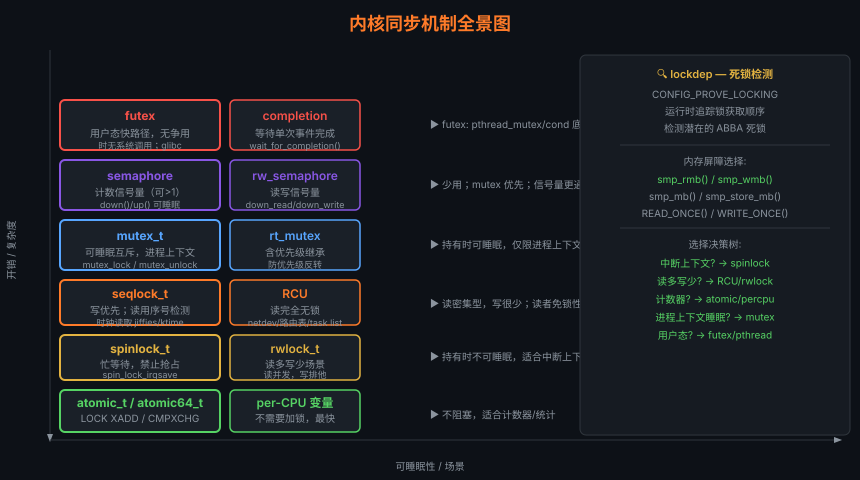

# 09 — 同步机制

> 多处理器（SMP）环境下，多个 CPU 可能同时访问共享数据。
> 本章从**为什么需要同步 → 各种锁的实现原理 → 使用场景**，
> 对照 Linux 0.11（单处理器，禁中断）与 Linux 2.6.0（SMP，丰富锁原语）拆解。



---

## 1. 并发场景与竞争条件

```
场景：两个 CPU 同时对计数器 count++ 操作

CPU0                    CPU1
────                    ────
读 count = 5
                        读 count = 5
count + 1 = 6
                        count + 1 = 6
写 count = 6
                        写 count = 6    ← 应该是 7，实际是 6！

根本原因：count++ 不是原子操作
  汇编展开为：
    MOV eax, [count]   ; 读
    ADD eax, 1         ; 加
    MOV [count], eax   ; 写
  三条指令可被中断/并发破坏
```

---

## 2. Linux 0.11：关中断（单核时代）

```c
/* 单核系统：只需关闭中断即可防止并发 */

#define cli() __asm__ ("cli"::)   /* 关中断 */
#define sti() __asm__ ("sti"::)   /* 开中断 */

/* 典型用法 */
void foo(void)
{
    cli();          /* 关中断 → 不会被抢占 */
    /* ... 访问共享数据 ... */
    sti();          /* 开中断 */
}
```

**局限**：SMP（多核）系统中，关中断只能防止**本 CPU** 的中断，
无法防止**其他 CPU** 的并发访问。

---

## 3. 原子操作（Atomic Operations）

原子操作由 CPU 硬件保证，不需要锁：

```c
/* include/asm-i386/atomic.h — Linux 2.6.0 */
typedef struct { volatile int counter; } atomic_t;

/* 原子读写 */
#define atomic_read(v)     ((v)->counter)
#define atomic_set(v, i)   (((v)->counter) = (i))

/* 原子加减 */
static inline void atomic_add(int i, atomic_t *v)
{
    __asm__ __volatile__(
        LOCK "addl %1,%0"     /* LOCK 前缀：总线锁定，多核安全 */
        :"=m" (v->counter)
        :"ir" (i), "m" (v->counter));
}

static inline int atomic_inc_and_test(atomic_t *v)
{
    unsigned char c;
    __asm__ __volatile__(
        LOCK "incl %0; sete %1"
        :"=m" (v->counter), "=qm" (c)
        :"m" (v->counter) : "memory");
    return c != 0;
}

/* 使用场景：引用计数 */
atomic_t ref_count = ATOMIC_INIT(1);
atomic_inc(&ref_count);           /* 增加引用 */
if (atomic_dec_and_test(&ref_count))  /* 减少引用，若为0则释放 */
    kfree(object);
```

**`LOCK` 前缀的作用**：

```
单核：LOCK 为空（不需要）
SMP：  LOCK → 在总线事务期间锁定内存总线
              （或 cache line 锁，更现代的实现）
```

---

## 4. 自旋锁（Spinlock）

### 原理

```
获取锁失败时，不休眠，而是"自旋"（busy-wait）不断重试：

      尝试获取锁
      ┌──────────────────┐
      │ locked == 0?     │
      │ 是 → 设为1，返回 │
      │ 否 → 继续等待    │
      └──────────────────┘
           ↑  ↓（自旋）
           └──┘
      ← 其他 CPU 释放锁 →
```

### Linux 2.6.0 实现

```c
/* include/asm-i386/spinlock.h */
typedef struct {
    volatile unsigned int lock;
} spinlock_t;

#define SPIN_LOCK_UNLOCKED (spinlock_t) { 1 }

static inline void spin_lock(spinlock_t *lock)
{
    __asm__ __volatile__(
        spin_lock_string    /* 原子比较并交换，或 xchg */
        :"=m" (lock->lock) : : "memory");
}

static inline void spin_unlock(spinlock_t *lock)
{
    __asm__ __volatile__(
        spin_unlock_string
        :"=m" (lock->lock) : : "memory");
}
```

**x86 自旋锁的本质（test-and-set）**：

```asm
/* 获取锁：原子地将 lock 置 0（0=locked, 1=unlocked）*/
spin_lock:
    lock decb (%eax)    ; 原子减1
    jns spin_acquired   ; 若结果 >= 0（原来 > 0），获取成功
spin_retry:
    pause               ; 提示 CPU 在自旋（节省电力，优化超线程）
    cmpb $0, (%eax)    ; 检查锁是否释放
    jle spin_retry      ; 若仍锁定，继续等待
    lock decb (%eax)
    jns spin_acquired
    jmp spin_retry
spin_acquired:
    ret

/* 释放锁 */
spin_unlock:
    movb $1, (%eax)     ; 写 1 表示解锁（不需要 LOCK 前缀，store 已是原子）
    ret
```

### 使用规则

```c
spinlock_t my_lock = SPIN_LOCK_UNLOCKED;

/* 中断上下文安全版本（禁止本 CPU 中断）*/
unsigned long flags;
spin_lock_irqsave(&my_lock, flags);
/* ... 临界区 ... */
spin_unlock_irqrestore(&my_lock, flags);

/* 普通版本（不禁中断，仅用于非中断上下文）*/
spin_lock(&my_lock);
/* ... 临界区 ... */
spin_unlock(&my_lock);
```

**适用场景**：临界区**极短**（几条指令），不能休眠（中断上下文）。

---

## 5. 互斥量（Mutex / Semaphore）

### 信号量（Semaphore）

```c
/* include/asm-i386/semaphore.h */
struct semaphore {
    atomic_t count;           /* 信号量计数 */
    int sleepers;             /* 等待中的进程数 */
    wait_queue_head_t wait;   /* 等待队列 */
};

/* 初始化为互斥量（count=1）*/
static DECLARE_MUTEX(my_mutex);  /* count = 1 */

/* 获取（P 操作）：count-- */
void down(struct semaphore *sem)
{
    /* 如果 count > 0，成功减1返回 */
    /* 如果 count == 0，将进程加入等待队列，休眠 */
}

/* 释放（V 操作）：count++ */
void up(struct semaphore *sem)
{
    /* count++ */
    /* 如果有等待的进程，唤醒一个 */
}
```

**与自旋锁的区别**：

```
             自旋锁                互斥量（信号量）
等待方式     忙等（自旋）           休眠（让出 CPU）
适用场景     临界区极短，中断上下文  临界区可能较长，进程上下文
开销         自旋期间浪费 CPU        上下文切换开销
可以休眠?    否                      是
```

### 读写信号量（rwsem）

```c
struct rw_semaphore rwsem = __RWSEM_INITIALIZER(rwsem);

/* 多个读者可以同时持有 */
down_read(&rwsem);
/* ... 读操作 ... */
up_read(&rwsem);

/* 写者需要独占 */
down_write(&rwsem);
/* ... 写操作 ... */
up_write(&rwsem);
```

---

## 6. RCU（Read-Copy-Update）

RCU 是 Linux 2.6.0 中引入的一种**无锁**并发技术，
专门为**读多写少**场景优化：

### 核心思想

```
RCU 的核心约束：
  · 读者：绝对不阻塞（也不需要加任何锁）
  · 写者：修改时创建副本，不影响正在读的读者

读者                 写者
──────               ──────
rcu_read_lock()      old_ptr = rcu_dereference(global_ptr)
data = rcu_dereference(ptr)  new_ptr = kmalloc(...)
/* 使用 data，不加锁 */      /* 修改 new_ptr */
rcu_read_unlock()    rcu_assign_pointer(global_ptr, new_ptr)
                     /* 等待所有读者完成当前临界区 */
                     synchronize_rcu()   ← 等待"宽限期"过去
                     kfree(old_ptr)      ← 安全释放旧数据

宽限期（Grace Period）：
  等待所有 CPU 都经历过一次上下文切换
  此后可保证没有读者还在使用旧数据
```

### 内核使用示例

```c
/* 链表的 RCU 遍历（无锁读）*/
rcu_read_lock();
list_for_each_entry_rcu(entry, &my_list, list) {
    /* 安全读取 entry，无锁 */
    do_something(entry);
}
rcu_read_unlock();

/* 安全删除链表元素（写者）*/
spin_lock(&list_lock);
list_del_rcu(&entry->list);
spin_unlock(&list_lock);
synchronize_rcu();    /* 等待所有读者完成 */
kfree(entry);         /* 现在可以安全释放 */
```

---

## 7. 死锁与调试

### 常见死锁场景

```
场景一：嵌套加锁顺序不一致

CPU0                    CPU1
────                    ────
lock(A)                 lock(B)
lock(B)  ← 等待B        lock(A)  ← 等待A
   ↑                         ↑
   └─────── 死锁! ────────────┘

避免方法：所有地方按相同顺序加锁（A 总是先于 B）

场景二：中断上下文与进程上下文

进程：spin_lock(&lock)
    此时发生中断
中断处理：spin_lock(&lock)  ← 自旋等待，但进程永远无法释放锁！

避免方法：进程中使用 spin_lock_irqsave()
```

### 调试工具

```bash
# lockdep：内核内置死锁检测器
# 编译时开启：CONFIG_PROVE_LOCKING=y

# 当检测到潜在死锁时，内核打印警告：
# [ BUG: possible circular locking dependency detected ]

# ftrace：跟踪锁获取/释放
echo function > /sys/kernel/debug/tracing/current_tracer
echo spin_lock > /sys/kernel/debug/tracing/set_ftrace_filter
cat /sys/kernel/debug/tracing/trace

# perf：分析锁竞争热点
perf lock record ls
perf lock report
```

---

## 8. 各同步机制对比总结

```
┌─────────────────┬──────────────┬─────────────┬──────────────────┐
│   机制           │  读性能      │  写性能      │  适用场景         │
├─────────────────┼──────────────┼─────────────┼──────────────────┤
│ 关中断（0.11）   │  最快        │  最快        │  单核，短临界区   │
│ 原子操作        │  快          │  快          │  单变量计数/标志  │
│ 自旋锁          │  快（无竞争）│  快（无竞争）│  短临界区，中断上下文│
│ 互斥量/信号量   │  慢（可休眠）│  慢（可休眠）│  长临界区，进程上下文│
│ 读写锁（rwlock）│  快（并发读）│  慢（独占写）│  读多写少         │
│ RCU             │  极快（无锁）│  中（写+等待）│  读极多写极少    │
└─────────────────┴──────────────┴─────────────┴──────────────────┘
```

> **选择原则**：
> 1. 能用原子操作就不用锁
> 2. 中断上下文用自旋锁
> 3. 进程上下文且临界区短用自旋锁，长用互斥量
> 4. 读远多于写用 RCU 或读写锁

---

## 9. 内存排序（Memory Ordering）

### 9.1 TSO（Total Store Ordering）vs 弱内存序

```
不同 CPU 架构对内存操作的排序保证不同：

x86/x86_64（TSO 模型）：
  · store-store 有序（写-写不会乱序）
  · load-load  有序（读-读不会乱序）
  · load-store 有序
  · 但：store-load 可能乱序！（这是 TSO 允许的唯一乱序）
  · 因此：x86 上大多数场景不需要内存屏障

ARM（弱内存序模型）：
  · 所有类型的操作都可能乱序（load-load, store-store, load-store, store-load）
  · 必须显式使用屏障指令（DMB, DSB, ISB）
  · 后果：ARM 上的并发代码比 x86 需要更多 barrier

示例：经典的"消息传递"模式
  Thread 1 (writer)         Thread 2 (reader)
  ─────────────────         ──────────────────
  data = 42;                while (flag == 0) ;   /* 等待 */
  flag = 1;                 use(data);             /* 读数据 */

  在 x86 上：可能因 store-load 乱序导致 Thread 2 看到 flag=1 但 data 还是 0！
  解决：在 flag=1 前加 smp_mb()（写屏障）
```

### 9.2 Linux 内核内存屏障 API

```c
/* 完整屏障（双向）：之前的 load/store 不会延迟到之后 */
smp_mb()        /* SMP 内存屏障（单核无效果）*/
mb()            /* 全内存屏障（含 I/O 内存）*/

/* 写屏障：之前的所有 store 在此点前对其他 CPU 可见 */
smp_wmb()       /* SMP 写屏障 */
wmb()           /* 写屏障（含 I/O）*/

/* 读屏障：确保之后的 load 看到屏障之前其他 CPU 的 store */
smp_rmb()       /* SMP 读屏障 */
rmb()           /* 读屏障（含 I/O）*/

/* 编译器屏障：仅防止编译器重排，不生成 CPU 指令 */
barrier()

/* 带 acquire/release 语义的原子操作（Linux 4.x+）*/
smp_load_acquire(ptr)    /* load + 隐含读屏障（之后的访问不会提前）*/
smp_store_release(ptr, v)/* store + 隐含写屏障（之前的访问不会延后）*/

/* x86 上 smp_mb() 的实现（注意实际的开销）*/
/* x86:  lock; addl $0,0(%rsp)  或  mfence */
/* ARM:  dmb ish（inner shareable domain barrier）*/

/* 正确的"消息传递"模式 */
/* 写者 */
WRITE_ONCE(data, 42);
smp_wmb();              /* 确保 data 写入先于 flag 写入 */
WRITE_ONCE(flag, 1);

/* 读者 */
while (!READ_ONCE(flag))
    cpu_relax();
smp_rmb();              /* 确保看到 flag=1 后再读 data */
val = READ_ONCE(data);  /* 保证是 42 */
```

---

## 10. RCU 深度剖析

### 10.1 宽限期（Grace Period）机制

```
RCU 的核心保证：
  在宽限期结束后，所有在宽限期开始前就已存在的 RCU 读者都已完成。

如何判断宽限期结束？
  · Classic RCU（UP/树形 RCU）：
    每个 CPU 经历一次上下文切换（quiescent state）→ 宽限期结束
    因为：RCU 读临界区不能睡眠，上下文切换意味着退出了临界区

  · SRCU（Sleepable RCU）：
    允许读者在临界区内休眠
    使用计数器（而非上下文切换）判断宽限期

宽限期时间线：
  T0: writer 调用 synchronize_rcu() 或 call_rcu()
  T1: 内核开始监视所有 CPU 的 quiescent state
  T2: CPU0 发生上下文切换（确认退出临界区）
  T3: CPU1 发生上下文切换
  T4: ... 所有 CPU 都经历过至少一次上下文切换
  T5: 宽限期结束，synchronize_rcu() 返回 / call_rcu 回调被调用
      → 现在可以安全释放旧数据
```

### 10.2 完整的 RCU 删除操作

```c
struct my_node {
    int data;
    struct list_head list;
    struct rcu_head rcu;    /* 用于 call_rcu() 的回调链接 */
};

static LIST_HEAD(my_list);
static DEFINE_SPINLOCK(list_lock);

/* 读者：无锁遍历 */
void read_data(void)
{
    struct my_node *node;

    rcu_read_lock();   /* 禁止抢占（但不阻塞中断）*/
    list_for_each_entry_rcu(node, &my_list, list) {
        /* 使用 node->data，可以睡眠吗？不行！
           classic RCU：rcu_read_lock 区间内不能睡眠 */
        process(node->data);
    }
    rcu_read_unlock();  /* 允许抢占，标记退出临界区 */
}

/* 写者方式一：同步等待（调用者可以阻塞）*/
void delete_sync(struct my_node *node)
{
    spin_lock(&list_lock);
    list_del_rcu(&node->list);  /* 从链表删除（非原子，需持锁）*/
    spin_unlock(&list_lock);

    synchronize_rcu();  /* 阻塞，直到宽限期结束 */
    kfree(node);        /* 安全释放 */
}

/* 写者方式二：异步回调（调用者不阻塞，适合中断上下文）*/
static void my_node_free(struct rcu_head *rcu)
{
    struct my_node *node = container_of(rcu, struct my_node, rcu);
    kfree(node);
}

void delete_async(struct my_node *node)
{
    spin_lock(&list_lock);
    list_del_rcu(&node->list);
    spin_unlock(&list_lock);

    call_rcu(&node->rcu, my_node_free);  /* 宽限期后异步调用 */
    /* 立即返回，不等待 */
}

/* 更新（修改链表中的节点值）*/
void update_node(struct my_node *old_node, int new_data)
{
    struct my_node *new_node = kmalloc(sizeof(*new_node), GFP_KERNEL);
    *new_node = *old_node;        /* 复制旧节点 */
    new_node->data = new_data;    /* 修改副本 */

    spin_lock(&list_lock);
    /* 原子替换：先插入新节点，再删除旧节点 */
    list_replace_rcu(&old_node->list, &new_node->list);
    spin_unlock(&list_lock);

    call_rcu(&old_node->rcu, my_node_free);
}
```

### 10.3 内核中 RCU 的实际应用

```
task_struct 访问（进程链表）：
  for_each_process_thread() 使用 RCU 遍历
  → 遍历时无需持锁，极高效

网络路由表：
  fib_lookup() 在 rcu_read_lock() 保护下查路由
  → 路由更新不会阻塞正在查找的数据包

模块引用计数：
  try_module_get() 使用 RCU 保护，防止模块卸载竞争

文件系统 dcache：
  __d_lookup_rcu() 无锁读取目录项缓存
  → 路径查找的热路径性能极关键
```

---

## 11. Lock-Free 数据结构（基于 RCU）

```c
/* 内核中的 RCU 保护链表（无锁读，有锁写）*/
#include <linux/rculist.h>

/* 无锁读者遍历（O(n)，无任何竞争）*/
rcu_read_lock();
list_for_each_entry_rcu(pos, head, member) {
    /* ... */
}
rcu_read_unlock();

/* 有锁写者 */
spin_lock(&my_lock);
list_add_rcu(&new->list, head);     /* 添加（rcu_assign_pointer 语义）*/
list_del_rcu(&entry->list);         /* 删除（不立即释放！）*/
spin_unlock(&my_lock);

/* RCU 保护的哈希表（hlist）*/
hlist_for_each_entry_rcu(pos, head, member) { ... }
hlist_add_head_rcu(&new->node, head);
hlist_del_rcu(&entry->node);

/* CAS（Compare-And-Swap）原子操作实现 lock-free 结构 */
/* 在内核中通过 cmpxchg() 实现 */
old_val = READ_ONCE(*ptr);
do {
    new_val = compute_new(old_val);
} while (cmpxchg(ptr, old_val, new_val) != old_val);
/* 适合简单的计数器更新，不适合复杂数据结构 */
```

---

## 12. futex 内部机制

```c
/* futex（Fast Userspace muTEX）：用户态的高效互斥锁 */

/* 基本原理：
   1. 无竞争时：完全在用户态用原子 CAS 完成（无系统调用）
   2. 有竞争时：才陷入内核等待（系统调用开销只在真正竞争时发生）*/

/* 用户态操作（glibc pthread_mutex_lock 简化版）*/
static int futex_val = 1;  /* 1=解锁, 0=锁定, -1=锁定且有等待者 */

void mutex_lock(int *uaddr)
{
    int c;
    /* 尝试 CAS: 1 → 0（无竞争，纯用户态）*/
    if ((c = cmpxchg(uaddr, 1, 0)) == 0)
        return;  /* 成功获取锁，无系统调用！ */

    /* 有竞争：陷入内核等待 */
    if (c != -1)
        c = xchg(uaddr, -1);  /* 标记有等待者：0/-1 → -1 */

    while (c != 0) {
        /* 系统调用：让当前线程进入 futex 等待队列 */
        syscall(SYS_futex, uaddr, FUTEX_WAIT_PRIVATE, -1, NULL);
        c = xchg(uaddr, -1);
    }
}

void mutex_unlock(int *uaddr)
{
    /* 原子设为 1（解锁）*/
    if (atomic_dec_and_fetch(uaddr) != 0) {
        /* 有等待者（值为 -1），唤醒一个 */
        WRITE_ONCE(*uaddr, 1);
        /* 系统调用：唤醒 futex 等待队列中的一个线程 */
        syscall(SYS_futex, uaddr, FUTEX_WAKE_PRIVATE, 1, NULL);
    }
}
```

**内核 futex 实现（kernel/futex/）**：

```
FUTEX_WAIT 系统调用路径：
  sys_futex() → futex_wait()
    1. 计算 hash：futex_hash_bucket(uaddr) → 找到 hash 桶
       （uaddr 物理地址作为 key，防止跨进程共享时虚拟地址冲突）
    2. 验证 *uaddr == val（原子检查）
    3. 将当前进程加入 hash 桶的等待队列（struct futex_q）
    4. 调度出去（schedule()）

FUTEX_WAKE 系统调用路径：
  sys_futex() → futex_wake()
    1. 计算相同 hash：找到 hash 桶
    2. 从等待队列取出 nr_wake 个进程
    3. wake_up_q() 唤醒它们

Priority Inheritance（优先级继承，pi_futex）：
  FUTEX_LOCK_PI / FUTEX_UNLOCK_PI
  防止优先级反转：低优先级持锁时，临时提升其优先级至等待者最高级别
  rt_mutex 实现：内核维护持有者→等待者优先级继承链
```

---

## 13. Per-CPU 变量

```c
/* Per-CPU 变量：每个 CPU 有独立副本，无需加锁 */

/* 定义静态 per-CPU 变量 */
DEFINE_PER_CPU(int, my_counter);
DEFINE_PER_CPU(struct my_stats, cpu_stats);

/* 访问 per-CPU 变量（需要禁止内核抢占）*/
int val;

/* 方式一：get_cpu_var / put_cpu_var（禁止抢占 + 返回当前 CPU 的变量引用）*/
val = get_cpu_var(my_counter);     /* 禁止抢占，返回当前 CPU 的 my_counter */
val++;
put_cpu_var(my_counter);           /* 恢复抢占 */

/* 方式二：this_cpu_* 系列（更快，隐式假设已禁止抢占或中断）*/
this_cpu_inc(my_counter);          /* 原子 RMW，无需显式禁止抢占 */
this_cpu_add(my_counter, 5);
val = this_cpu_read(my_counter);

/* 方式三：per_cpu_ptr（在中断或已禁抢占的上下文中）*/
preempt_disable();
int *ptr = this_cpu_ptr(&my_counter);
(*ptr)++;
preempt_enable();

/* 跨 CPU 读取（读者需注意：值可能在读取过程中被其他 CPU 修改）*/
for_each_possible_cpu(cpu) {
    total += per_cpu(my_counter, cpu);
}
/* 要精确的跨 CPU 总和，需要 synchronize_rcu() 后再读取 */

/* 应用场景 */
/* 网络统计（net/core/net-procfs.c）*/
DEFINE_PER_CPU(struct softnet_data, softnet_data);
/* 内存分配（mm/percpu.c）*/
DEFINE_PER_CPU_ALIGNED(struct pcpu_freelist, pcpu_freelist);
/* 调度统计（kernel/sched/stats.h）*/
DEFINE_PER_CPU(struct sched_info, cpu_sched_info);
```
