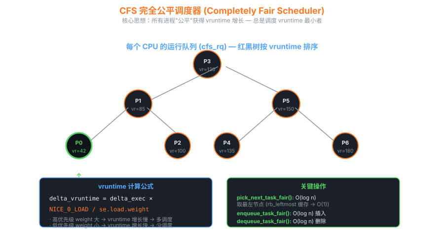

# 10 — CFS 完全公平调度器深入

> **目标**：从数学公式到红黑树实现，彻底理解 Linux CFS 调度器的每一个设计决策。

---

## 目录

1. [核心思想 — 理想多任务CPU与vruntime](#101-核心思想)
2. [vruntime 计算公式](#102-vruntime-计算公式)
3. [sched_entity 结构体](#103-sched_entity-结构体)
4. [update_curr() 源码分析](#104-update_curr-源码分析)
5. [红黑树的选择](#105-红黑树的选择)
6. [cfs_rq 与 pick_next_task_fair()](#106-cfs_rq-与-pick_next_task_fair)
7. [调度时间片计算](#107-调度时间片计算)
8. [5个调度类及其优先级](#108-5个调度类及其优先级)
9. [SCHED_DEADLINE — EDF算法](#109-sched_deadline--edf算法)
10. [负载均衡](#1010-负载均衡)
11. [EAS — 能效感知调度](#1011-eas--能效感知调度)
12. [cgroup v2 层次调度](#1012-cgroup-v2-层次调度)
13. [调试工具](#1013-调试工具)
14. [常见性能问题](#1014-常见性能问题)

---

## 10.1 核心思想

### 理想多任务CPU（Ideal Multi-Tasking CPU）

CFS 的设计目标是模拟一个**理想的多任务处理器**：假设有 N 个进程同时运行，每个进程都以 `1/N` 的速度并行执行。在真实硬件上，CPU 一次只能运行一个任务，CFS 通过快速切换来近似这个理想模型。

```
理想模型（3个等权进程）:
时间轴: ──────────────────────────────────────►
进程A:  ▓░░░▓░░░▓░░░▓░░░▓  (每时刻获得 1/3 CPU)
进程B:  ░▓░░░▓░░░▓░░░▓░░░  (每时刻获得 1/3 CPU)
进程C:  ░░▓░░░▓░░░▓░░░▓░░  (每时刻获得 1/3 CPU)

实际实现（时间片轮转近似）:
时间轴: ──────────────────────────────────────►
进程A:  ▓▓▓▓░░░░░░░░▓▓▓▓░  (集中执行后让出)
进程B:  ░░░░▓▓▓▓░░░░░░░░▓  
进程C:  ░░░░░░░░▓▓▓▓░░░░░  
```

### vruntime 的本质

**虚拟运行时间（virtual runtime）** 是 CFS 的核心抽象。它不是真实流逝的时间，而是经过优先级权重**归一化**后的时间。CFS 始终选择 vruntime 最小的任务运行，从而确保所有任务在"虚拟时钟"上保持同步。



```art
                    CFS 红黑树（按 vruntime 排序）
                    
           ┌──────────────────────────────────────┐
           │           cfs_rq                     │
           │   rb_root ──────────────────────┐    │
           │   min_vruntime = 100ns           │    │
           │   nr_running = 5                 │    │
           └──────────────────────────────────┘    │
                                                   │
                              [110ns] B            ▼
                             /         \
                    [100ns] A           [130ns] D
                   /         \         /         \
               [95ns] ?   [105ns] C [125ns] E   NULL
               
               ↑
           最左节点 = 下一个被调度的任务 (vruntime最小)
           pick_next_entity() 直接取 rb_leftmost → O(1)
```

---

## 10.2 vruntime 计算公式

### 核心公式

$$\text{delta\_vruntime} = \text{delta\_real} \times \frac{\text{NICE\_0\_LOAD}}{\text{weight}}$$

其中：
- `delta_real`：任务实际运行的物理时间（纳秒）
- `NICE_0_LOAD = 1024`：nice 值为 0 时的标准权重
- `weight`：当前任务的权重（由 nice 值决定）

**含义**：
- nice = 0 的任务：`delta_vruntime = delta_real × 1024/1024 = delta_real`（1:1）
- nice = -5 的任务（高优先级）：weight > 1024，vruntime 增长**慢**，更容易被选中
- nice = +5 的任务（低优先级）：weight < 1024，vruntime 增长**快**，被调度少

### Nice 值到 Weight 的映射表

每相邻 nice 值之间，CPU 份额比例约为 **1.25 : 1**。

| Nice 值 | Weight    | 相邻比值 | 说明 |
|---------|-----------|----------|------|
| -20     | 88761     | —        | 最高优先级 |
| -19     | 71755     | 1.237    | |
| -18     | 56483     | 1.270    | |
| -17     | 46273     | 1.220    | |
| -16     | 36291     | 1.275    | |
| -15     | 29154     | 1.245    | |
| -14     | 23254     | 1.253    | |
| -13     | 18705     | 1.243    | |
| -12     | 14949     | 1.251    | |
| -11     | 11916     | 1.255    | |
| -10     | 9548      | 1.248    | |
| -9      | 7620      | 1.253    | |
| -8      | 6100      | 1.249    | |
| -7      | 4904      | 1.244    | |
| -6      | 3906      | 1.255    | |
| -5      | 3121      | 1.252    | |
| -4      | 2501      | 1.248    | |
| -3      | 1991      | 1.256    | |
| -2      | 1586      | 1.256    | |
| -1      | 1277      | 1.242    | |
| **0**   | **1024**  | 1.247    | **基准（NICE_0_LOAD）** |
| +1      | 820       | 1.249    | |
| +2      | 655       | 1.252    | |
| +3      | 526       | 1.245    | |
| +4      | 423       | 1.244    | |
| +5      | 335       | 1.263    | |
| +6      | 272       | 1.232    | |
| +7      | 215       | 1.265    | |
| +8      | 172       | 1.250    | |
| +9      | 137       | 1.255    | |
| +10     | 110       | 1.245    | |
| +11     | 87        | 1.264    | |
| +12     | 70        | 1.243    | |
| +13     | 56        | 1.250    | |
| +14     | 45        | 1.244    | |
| +15     | 36        | 1.250    | |
| +16     | 29        | 1.241    | |
| +17     | 23        | 1.261    | |
| +18     | 18        | 1.278    | |
| +19     | 15        | 1.200    | 最低优先级 |

> **内核源码位置**：`kernel/sched/core.c` — `const int sched_prio_to_weight[40]`

```c
/* kernel/sched/core.c */
const int sched_prio_to_weight[40] = {
 /* -20 */     88761,     71755,     56483,     46273,     36291,
 /* -15 */     29154,     23254,     18705,     14949,     11916,
 /* -10 */      9548,      7620,      6100,      4904,      3906,
 /*  -5 */      3121,      2501,      1991,      1586,      1277,
 /*   0 */      1024,       820,       655,       526,       423,
 /*   5 */       335,       272,       215,       172,       137,
 /*  10 */       110,        87,        70,        56,        45,
 /*  15 */        36,        29,        23,        18,        15,
};
```

### 乘法逆元优化

为避免整数除法，内核预计算每个 weight 的**乘法逆元**（inv_weight），用移位乘法代替除法：

```c
/* kernel/sched/core.c */
const u32 sched_prio_to_wmult[40] = {
 /* -20 */     48388,     59856,     76040,     92818,    118348,
 /* ...每个值 = 2^32 / weight（近似）... */
 /*   0 */   4194304,   5237765,   6557202,   8166337,  10153587,
};

/* calc_delta_fair() 核心计算 */
static u64 __calc_delta(u64 delta_exec, unsigned long weight,
                        struct load_weight *lw)
{
    u64 fact = scale_load_down(weight);
    u32 fact_hi = (u32)(fact >> 32);
    int shift = 32;
    /* 使用 inv_weight 避免除法: delta * weight * inv_lw_weight >> 32 */
    ...
}
```

---

## 10.3 sched_entity 结构体

每个可调度实体（进程或 cgroup）都嵌入一个 `sched_entity`：

```c
/* include/linux/sched.h */
struct sched_entity {
    /* 负载权重，包含 weight 和 inv_weight */
    struct load_weight      load;

    /* 红黑树节点，key = vruntime */
    struct rb_node          run_node;

    /* 调度统计信息链表节点 */
    struct list_head        group_node;

    /* 是否在运行队列中 */
    unsigned int            on_rq;

    /* 上次开始执行的时间戳（ns，单调时钟）*/
    u64                     exec_start;

    /* 总累计执行时间（物理时间，ns）*/
    u64                     sum_exec_runtime;

    /* 虚拟运行时间 — CFS 排序的关键字段 */
    u64                     vruntime;

    /* 上次统计时的 sum_exec_runtime（用于计算本次 delta）*/
    u64                     prev_sum_exec_runtime;

    /* 进程被抢占次数 */
    u64                     nr_migrations;

#ifdef CONFIG_SCHEDSTATS
    struct sched_statistics statistics;
#endif

#ifdef CONFIG_FAIR_GROUP_SCHED
    /* 所属调度组的深度（层次调度）*/
    int                     depth;

    /* 父调度实体（cgroup 层次）*/
    struct sched_entity    *parent;

    /* 所在的 CFS 运行队列 */
    struct cfs_rq          *cfs_rq;

    /* 代表该 cgroup 的 "my_q" */
    struct cfs_rq          *my_q;

    /* 平滑负载（PELT：Per-Entity Load Tracking）*/
    unsigned long           runnable_weight;
#endif

#ifdef CONFIG_SMP
    /* 用于 PELT 负载追踪的平均值结构 */
    struct sched_avg        avg;
#endif
};
```

### task_struct 中的嵌入

```c
struct task_struct {
    ...
    /* CFS 调度实体 */
    struct sched_entity     se;
    /* 实时调度实体 */
    struct sched_rt_entity  rt;
    /* Deadline 调度实体 */
    struct sched_dl_entity  dl;
    ...
    int                     prio;        /* 动态优先级 */
    int                     static_prio; /* 静态优先级（nice转换而来）*/
    int                     normal_prio; /* 归一化优先级 */
    unsigned int            rt_priority; /* 实时优先级（1-99）*/
    ...
};
```

---

## 10.4 update_curr() 源码分析

`update_curr()` 在每次 tick、任务入队/出队时调用，负责更新 vruntime：

```c
/* kernel/sched/fair.c */
static void update_curr(struct cfs_rq *cfs_rq)
{
    struct sched_entity *curr = cfs_rq->curr;
    u64 now = rq_clock_task(rq_of(cfs_rq));  /* 获取当前时间戳 */
    u64 delta_exec;

    if (unlikely(!curr))
        return;

    /* 计算自上次更新以来的实际执行时间 */
    delta_exec = now - curr->exec_start;
    if (unlikely((s64)delta_exec <= 0))
        return;

    /* 更新 exec_start 为当前时间 */
    curr->exec_start = now;

    /* 更新调度统计 */
    schedstat_set(curr->statistics.exec_max,
                  max(delta_exec, curr->statistics.exec_max));

    /* 累加真实执行时间 */
    curr->sum_exec_runtime += delta_exec;

#ifdef CONFIG_SCHEDSTATS
    schedstat_add(cfs_rq->exec_clock, delta_exec);
#endif

    /* 关键：更新 vruntime
     * calc_delta_fair() 实现公式:
     * delta_vruntime = delta_exec * NICE_0_LOAD / weight
     */
    curr->vruntime += calc_delta_fair(delta_exec, curr);

    /* 更新运行队列的 min_vruntime
     * min_vruntime 只增不减，防止新进程入队时 vruntime 过小导致独占 CPU
     */
    update_min_vruntime(cfs_rq);

    /* 如果是进程组调度，递归更新父实体 */
    if (entity_is_task(curr)) {
        struct task_struct *curtask = task_of(curr);
        trace_sched_stat_runtime(curtask, delta_exec, curr->vruntime);
        cgroup_account_cputime(curtask, delta_exec);
        account_group_exec_runtime(curtask, delta_exec);
    }

    account_cfs_rq_runtime(cfs_rq, delta_exec);
}
```

### update_min_vruntime() 的关键作用

```c
static void update_min_vruntime(struct cfs_rq *cfs_rq)
{
    struct sched_entity *curr = cfs_rq->curr;
    struct rb_node *leftmost = rb_first_cached(&cfs_rq->tasks_timeline);

    u64 vruntime = cfs_rq->min_vruntime;

    if (curr) {
        if (curr->on_rq)
            vruntime = curr->vruntime;
        else
            curr = NULL;
    }

    if (leftmost) {
        struct sched_entity *se = __node_2_se(leftmost);
        if (!curr)
            vruntime = se->vruntime;
        else
            vruntime = min_vruntime(vruntime, se->vruntime);
    }

    /* 保证 min_vruntime 单调递增 */
    cfs_rq->min_vruntime = max_vruntime(cfs_rq->min_vruntime, vruntime);
}
```

---

## 10.5 红黑树的选择

### 数据结构复杂度对比

| 操作         | 链表    | 二叉堆   | 红黑树     | 跳表       |
|-------------|---------|----------|-----------|-----------|
| 插入         | O(1)    | O(log n) | O(log n)  | O(log n)  |
| 删除         | O(1)*   | O(log n) | O(log n)  | O(log n)  |
| 查找最小值   | O(n)    | O(1)     | O(log n)† | O(log n)  |
| 任意查找     | O(n)    | O(n)     | O(log n)  | O(log n)  |
| 内存开销     | 最小    | 紧凑     | 中等      | 较高      |
| 缓存友好性   | 差      | 好（数组）| 中等      | 差        |

†：内核通过 `rb_leftmost` 缓存最小节点指针，实际为 O(1)。

### 为什么选红黑树

```art
红黑树特性与调度需求的匹配：

需求1: 快速找到 vruntime 最小的任务
  → rb_leftmost 缓存左端节点 → O(1) ✓

需求2: 任务入队（唤醒、fork）
  → O(log n) 插入 ✓（n 通常很小，几百以内）

需求3: 任务出队（调度离开）
  → O(log n) 删除 ✓

需求4: 树始终平衡（防止退化为链表）
  → 红黑树自平衡保证最坏 O(2 log n) ✓

需求5: 不需要随机访问第 k 个元素
  → 不需要完美排名，红黑树满足 ✓
```

### 内核红黑树 API

```c
/* include/linux/rbtree.h — 泛型红黑树 */

/* 插入（需要调用者实现比较逻辑）*/
void rb_insert_color(struct rb_node *node, struct rb_root *root);

/* 删除 */
void rb_erase(struct rb_node *node, struct rb_root *root);

/* 遍历 */
struct rb_node *rb_first(const struct rb_root *root);
struct rb_node *rb_next(const struct rb_node *node);

/* CFS 使用带缓存的版本 */
struct rb_root_cached {
    struct rb_root rb_root;
    struct rb_node *rb_leftmost;  /* 缓存最左（最小）节点 */
};

void rb_insert_color_cached(struct rb_node *node,
                             struct rb_root_cached *root,
                             bool leftmost);
```

---

## 10.6 cfs_rq 与 pick_next_task_fair()

### cfs_rq 结构体关键字段

```c
/* kernel/sched/sched.h */
struct cfs_rq {
    /* 队列总权重（所有任务 load.weight 之和）*/
    struct load_weight      load;

    /* 可运行任务数 + h_nr_running（含下层 cgroup）*/
    unsigned int            nr_running;
    unsigned int            h_nr_running;

    /* 时钟 */
    u64                     exec_clock;

    /* 当前最小 vruntime（单调递增）*/
    u64                     min_vruntime;

    /* 红黑树根（带 leftmost 缓存）*/
    struct rb_root_cached   tasks_timeline;

    /* 当前正在运行的实体 */
    struct sched_entity    *curr;

    /* 下一个推荐的实体（used by wakeup preemption）*/
    struct sched_entity    *next;

    /* 上次被抢占的实体（skip buddy）*/
    struct sched_entity    *skip;

#ifdef CONFIG_FAIR_GROUP_SCHED
    /* 所属 rq 和父 sched_entity */
    struct rq              *rq;
    struct task_group      *tg;
    struct sched_entity    *tg_load_avg_contrib;
#endif

    /* PELT 负载追踪 */
    struct sched_avg        avg;
    u64                     runnable_load_avg;
    u64                     load_avg;
};
```

### pick_next_task_fair() — O(1) 选择下一个任务

```c
/* kernel/sched/fair.c（简化版）*/
static struct task_struct *
pick_next_task_fair(struct rq *rq, struct task_struct *prev, struct rq_flags *rf)
{
    struct cfs_rq *cfs_rq = &rq->cfs;
    struct sched_entity *se;
    struct task_struct *p;
    int new_tasks;

again:
    if (!sched_fair_runnable(rq))
        goto idle;  /* 没有可运行任务 */

    /* 处理前一个任务 */
    put_prev_task(rq, prev);

    /* 从最高层 cfs_rq 开始向下选择 */
    do {
        /* 关键：pick_next_entity() 直接取 rb_leftmost → O(1) */
        se = pick_next_entity(cfs_rq, NULL);
        set_next_entity(cfs_rq, se);
        /* 如果是 group entity，进入其 my_q（向下遍历层次）*/
        cfs_rq = group_cfs_rq(se);
    } while (cfs_rq);

    p = task_of(se);
    ...
    return p;

idle:
    ...
}

/* 选择红黑树最左节点（vruntime 最小）*/
static struct sched_entity *
pick_next_entity(struct cfs_rq *cfs_rq, struct sched_entity *curr)
{
    /* rb_leftmost 已缓存，直接取 O(1) */
    struct sched_entity *left = __pick_first_entity(cfs_rq);
    struct sched_entity *se;

    /* 处理 skip buddy（被显式跳过的实体）*/
    if (!left || (curr && entity_before(curr, left)))
        left = curr;

    se = left;

    /* wakeup buddy 抢占逻辑 */
    if (cfs_rq->next && wakeup_preempt_entity(cfs_rq->next, left) < 1)
        se = cfs_rq->next;

    /* 清理 skip/next 指针 */
    if (se == cfs_rq->skip) {
        ...
    }
    return se;
}
```

---

## 10.7 调度时间片计算

### 目标延迟（sched_latency_ns）

内核保证每个可运行任务在**目标延迟**内至少运行一次：

```
默认 sched_latency_ns = 6ms（内核编译默认值，实际可通过 sysctl 调整）

每个任务的时间片 = sched_latency_ns × (task_weight / cfs_rq_total_weight)
```

### 时间片下界（sched_min_granularity_ns）

当任务数量很多时，每个任务的时间片可能过小，导致切换开销过大。内核设置最小粒度：

```c
/* kernel/sched/fair.c */
static u64 sched_slice(struct cfs_rq *cfs_rq, struct sched_entity *se)
{
    unsigned int nr_running = cfs_rq->nr_running;
    struct load_weight *load;
    struct load_weight lw;
    u64 slice;

    if (sched_feat(ALT_PERIOD))
        nr_running = rq_of(cfs_rq)->cfs.h_nr_running;

    /* 计算总调度周期 */
    slice = __sched_period(nr_running + !se->on_rq);

    /* 按权重比例分配时间片 */
    load = &cfs_rq->load;
    ...
    slice = __calc_delta(slice, se->load.weight, load);

    /* 保证最小粒度 */
    if (sched_feat(BASE_SLICE))
        slice = max_t(u64, slice, (u64)sysctl_sched_min_granularity);

    return slice;
}
```

### 关键 sysctl 参数

```bash
# 查看当前调度参数
cat /proc/sys/kernel/sched_latency_ns        # 目标延迟（默认 6000000 ns = 6ms）
cat /proc/sys/kernel/sched_min_granularity_ns # 最小时间片（默认 750000 ns = 0.75ms）
cat /proc/sys/kernel/sched_wakeup_granularity_ns  # 唤醒抢占粒度
cat /proc/sys/kernel/sched_migration_cost_ns      # 迁移代价阈值

# 实时系统调优（降低延迟）
sysctl kernel.sched_latency_ns=2000000
sysctl kernel.sched_min_granularity_ns=500000
```

```art
时间片计算示例（3个进程，nice=0/0/+10）：

sched_latency_ns = 6ms
进程权重: A=1024, B=1024, C=110
总权重 = 2158

A 的时间片 = 6ms × 1024/2158 ≈ 2.85ms
B 的时间片 = 6ms × 1024/2158 ≈ 2.85ms
C 的时间片 = 6ms × 110/2158  ≈ 0.31ms（但保底 0.75ms）

实际: A=2.85ms, B=2.85ms, C=0.75ms (min granularity 保底)
```

---

## 10.8 5个调度类及其优先级

Linux 内核调度器采用模块化设计，共有 5 个调度类，按优先级从高到低：

```art
调度类优先级链（高 → 低）:

  stop_sched_class      优先级最高
       │  (per-CPU 停止线程，迁移/hotplug)
       ▼
  dl_sched_class
       │  (SCHED_DEADLINE — 硬实时)
       ▼
  rt_sched_class
       │  (SCHED_FIFO / SCHED_RR — 软实时)
       ▼
  fair_sched_class      ← CFS 在此
       │  (SCHED_NORMAL / SCHED_BATCH / SCHED_IDLE)
       ▼
  idle_sched_class      优先级最低
          (swapper/N 线程，CPU空闲时运行)
```

### 5个调度类详细对比

| 调度类     | 调度策略                    | 优先级范围        | 抢占性 | 时间片     | 典型用途                    |
|-----------|----------------------------|-----------------|--------|-----------|---------------------------|
| stop      | 内部专用                    | 最高（特殊）     | 是     | 无限制    | CPU 热插拔、任务迁移         |
| deadline  | SCHED_DEADLINE              | 无 nice         | 是     | runtime/period | 硬实时任务（视频编码）      |
| realtime  | SCHED_FIFO<br>SCHED_RR     | 1–99（RT优先级） | 是（被更高RT抢占）| FIFO=无限<br>RR=100ms | 音频、工业控制       |
| fair(CFS) | SCHED_NORMAL<br>SCHED_BATCH<br>SCHED_IDLE | nice -20~+19 | 是     | 见§10.7   | 普通进程（绝大多数）         |
| idle      | 内部专用                    | 最低            | 否     | —         | 空闲循环（HLT/mwait）       |

### 调度类切换示例

```bash
# 查看进程调度策略
chrt -p $$

# 设置为 SCHED_FIFO 优先级 50（需要 CAP_SYS_NICE 或 root）
chrt -f -p 50 <pid>

# 设置为 SCHED_RR 优先级 10
chrt -r -p 10 <pid>

# 设置为 SCHED_DEADLINE
chrt -d --sched-runtime 5000000 --sched-deadline 10000000 \
        --sched-period 10000000 -p 0 <pid>

# 恢复为普通调度
chrt -o -p 0 <pid>
nice -n 10 <command>
renice -n 5 -p <pid>
```

---

## 10.9 SCHED_DEADLINE — EDF算法

### EDF（Earliest Deadline First）理论

SCHED_DEADLINE 基于实时调度理论中的 EDF 算法，并结合 CBS（Constant Bandwidth Server）保证隔离性。

**三元组参数**：
- `runtime`（执行时间）：任务在每个周期内最多运行多少纳秒
- `deadline`（截止时间）：任务必须在周期开始后多少纳秒内完成
- `period`（周期）：任务的重复周期

**可调度性检验**（所有 DL 任务在单核上可调度的充要条件）：

$$\sum_{i} \frac{\text{runtime}_i}{\text{period}_i} \leq 1$$

```art
SCHED_DEADLINE 时间轴示例:
period=10ms, deadline=8ms, runtime=3ms

时间(ms): 0    2    4    6    8    10   12   14   16   18   20
          |    |    |    |    |    |    |    |    |    |    |
任务执行:  [███]░░░░░░░░░░     [███]░░░░░░░░░░     [███]
          ◄─── runtime=3ms       ◄─── 下一周期
          ◄──────── deadline=8ms ──────►
          ◄──────────── period=10ms ──────────────►
```

```c
/* 设置 SCHED_DEADLINE 属性 */
struct sched_attr attr = {
    .size           = sizeof(attr),
    .sched_policy   = SCHED_DEADLINE,
    .sched_runtime  = 5 * 1000 * 1000,   /* 5ms runtime */
    .sched_deadline = 10 * 1000 * 1000,  /* 10ms deadline */
    .sched_period   = 10 * 1000 * 1000,  /* 10ms period */
};
syscall(SYS_sched_setattr, getpid(), &attr, 0);
```

---

## 10.10 负载均衡

### 调度域层次结构

```art
NUMA 系统的调度域层次:

Node 0                    Node 1
┌─────────────────────┐   ┌─────────────────────┐
│ Socket 0            │   │ Socket 1            │
│ ┌───────┐ ┌───────┐ │   │ ┌───────┐ ┌───────┐ │
│ │Core 0 │ │Core 1 │ │   │ │Core 2 │ │Core 3 │ │
│ │[HT0]  │ │[HT0]  │ │   │ │[HT0]  │ │[HT0]  │ │
│ │[HT1]  │ │[HT1]  │ │   │ │[HT1]  │ │[HT1]  │ │
│ └───────┘ └───────┘ │   └─────────────────────┘
└─────────────────────┘   
         
调度域层次（由小到大）:
  SD_SMT   : 同一物理核的超线程
  SD_MC    : 同一 Socket 的多核
  SD_NUMA  : 跨 NUMA 节点
```

### load_balance() 核心流程

```c
/* kernel/sched/fair.c */
static int load_balance(int this_cpu, struct rq *this_rq,
                        struct sched_domain *sd,
                        enum cpu_idle_type idle,
                        int *continue_balancing)
{
    int ld_moved = 0;
    struct sched_group *group;
    struct rq *busiest;

    /* 1. 找到最繁忙的调度组 */
    group = find_busiest_group(&env);
    if (!group) goto out_balanced;

    /* 2. 找到该组中最繁忙的 CPU */
    busiest = find_busiest_queue(&env, group);
    if (!busiest) goto out_balanced;

    /* 3. 计算需要迁移多少任务 */
    env.src_cpu = busiest->cpu;
    env.src_rq  = busiest;

    /* 4. 实际迁移任务 */
    ld_moved = move_tasks(&env);

    /* 5. 如果仍不平衡，触发 active 迁移（通过 IPI）*/
    if (!ld_moved) {
        ...
        active_load_balance_cpu_stop(busiest, ...);
    }
    ...
}
```

### newidle_balance — 空闲时主动拉取

```c
/* CPU 变为空闲时主动从其他 CPU 拉取任务 */
static int newidle_balance(struct rq *this_rq, struct rq_flags *rf)
{
    /* 快速路径：如果上次均衡很近，跳过 */
    if (this_rq->avg_idle < sysctl_sched_migration_cost) {
        ...
        return 0;
    }

    /* 遍历调度域从最近的开始 */
    for_each_domain(this_cpu, sd) {
        if (sd->flags & SD_BALANCE_NEWIDLE) {
            pulled_task = load_balance(this_cpu, this_rq, sd,
                                       CPU_NEWLY_IDLE, ...);
            if (pulled_task)
                break;
        }
    }
    return pulled_task;
}
```

---

## 10.11 EAS — 能效感知调度

### big.LITTLE 架构下的挑战

```art
Arm big.LITTLE 典型拓扑（如 Cortex-A55 + A78）：

LITTLE 核（节能）          big 核（高性能）
┌──────────────────┐      ┌──────────────────┐
│ A55 × 4          │      │ A78 × 4          │
│ 频率: 0.6-1.8GHz │      │ 频率: 1.0-3.0GHz │
│ 容量: 100-380     │      │ 容量: 170-1024   │
│ 功耗: 低          │      │ 功耗: 高         │
└──────────────────┘      └──────────────────┘

EAS 目标：在满足性能要求的前提下，最小化系统能耗
```

### cpu_capacity 与任务放置

```c
/* kernel/sched/fair.c — EAS 任务放置 */
static int find_energy_efficient_cpu(struct task_struct *p,
                                     int prev_cpu, int sync)
{
    unsigned long prev_energy = ULONG_MAX, best_energy = ULONG_MAX;
    int best_cpu = -1;

    /* 遍历性能域（pd）— 通常是 LITTLE 和 big 两组 */
    for_each_perf_domain(pd) {
        unsigned long cur_energy;

        /* 检查该域的 CPU 是否满足任务的性能需求 */
        if (!cpumask_intersects(perf_domain_span(pd), &p->cpus_mask))
            continue;

        /* 计算将任务放在此域的能耗 */
        cur_energy = compute_energy(p, pd, &cpus_to_visit);

        if (cur_energy < best_energy) {
            best_energy = cur_energy;
            best_cpu = ...;
        }
    }

    /* 只有节能收益超过阈值才迁移（避免频繁迁移）*/
    if (prev_energy - best_energy > prev_energy >> 4)
        return best_cpu;
    return prev_cpu;
}
```

---

## 10.12 cgroup v2 层次调度

### 两级 cfs_rq 结构

```art
cgroup v2 层次调度示例:

                    根 cfs_rq (CPU 0)
                   /                \
          group_A/cfs_rq          group_B/cfs_rq
          cpu.weight=100          cpu.weight=200
          (获得 33% CPU)           (获得 67% CPU)
          /         \              /            \
      task_1      task_2       task_3          task_4
      nice=0      nice=5       nice=0          nice=-5
```

### cgroup v2 CPU 控制接口

```bash
# 创建 cgroup 层次
mkdir /sys/fs/cgroup/myapp

# 设置 CPU 权重（默认 100，范围 1-10000）
echo 200 > /sys/fs/cgroup/myapp/cpu.weight

# 设置 CPU 带宽限制（每 100ms 最多用 50ms）
echo "50000 100000" > /sys/fs/cgroup/myapp/cpu.max

# 将进程加入 cgroup
echo $$ > /sys/fs/cgroup/myapp/cgroup.procs

# 查看 CPU 统计
cat /sys/fs/cgroup/myapp/cpu.stat
# usage_usec 1234567   ← 总 CPU 使用时间（微秒）
# user_usec  987654    ← 用户态时间
# system_usec 246913   ← 内核态时间
# nr_periods  1000     ← 带宽控制周期数
# nr_throttled 50      ← 被限速次数
# throttled_usec 250000 ← 被限速总时长
```

### cpu.max 带宽控制实现（CFS Bandwidth）

```c
/* kernel/sched/fair.c — CFS 带宽控制核心 */
struct cfs_bandwidth {
    raw_spinlock_t  lock;
    ktime_t         period;       /* 统计周期 */
    u64             quota;        /* 每周期配额（ns）*/
    u64             runtime;      /* 剩余可用时间 */
    s64             hierarchical_quota;
    u8              idle;
    struct hrtimer  period_timer; /* 每周期重填配额 */
    struct hrtimer  slack_timer;  /* 归还未用完配额 */
    struct list_head throttled_cfs_rq;
    int             nr_periods;
    int             nr_throttled;
    u64             throttled_time;
};
```

---

## 10.13 调试工具

### /proc/sched_debug

```bash
cat /proc/sched_debug

# 输出示例（部分）:
# Sched Debug Version: v0.11, 5.15.0
# ktime                                   : 12345678901
# sched_clk                               : 12345679000
# cpu_clk                                 : 12345679100
#
# nr_running                              : 3
# nr_switches                             : 1234567
# nr_load_updates                         : 890123
# nr_uninterruptible                      : 0
#
# cfs_rq[0]:/
#   .exec_clock                           : 12345.678901
#   .MIN_vruntime                         : 0.000001
#   .min_vruntime                         : 12345.678
#   .max_vruntime                         : 12345.700
#   .spread                               : 0.022
#   .nr_running                           : 3
#   .load                                 : 3072          (3 × 1024)
```

### perf sched — 调度事件分析

```bash
# 记录 5 秒的调度事件
perf sched record -a sleep 5

# 分析延迟
perf sched latency

# 输出示例:
# -------------------------------------------------
#  Task                  |   Runtime ms  | Switches |
# -------------------------------------------------
#  swapper/0:0           |    4998.000   |      500 |
#  bash:12345            |       2.345   |       12 |
#  kworker/0:1:234       |       0.123   |        5 |

# 调度时间线（可视化）
perf sched timehist

# 详细输出每次切换
perf sched script | head -50
```

### ftrace 追踪 CFS 调度

```bash
# 方法1: 使用 trace-cmd
trace-cmd record -e sched_switch -e sched_wakeup -p function_graph \
    -g pick_next_task_fair sleep 1

# 方法2: 直接使用 tracefs
echo 0 > /sys/kernel/debug/tracing/tracing_on
echo "pick_next_task_fair" > /sys/kernel/debug/tracing/set_ftrace_filter
echo function > /sys/kernel/debug/tracing/current_tracer
echo 1 > /sys/kernel/debug/tracing/tracing_on
sleep 1
echo 0 > /sys/kernel/debug/tracing/tracing_on
cat /sys/kernel/debug/tracing/trace | head -30

# 方法3: sched_switch tracepoint（推荐）
echo 1 > /sys/kernel/debug/tracing/events/sched/sched_switch/enable
cat /sys/kernel/debug/tracing/trace_pipe
# 输出: prev_comm=bash prev_pid=1234 prev_prio=120 prev_state=S
#       next_comm=vim  next_pid=5678 next_prio=120
```

### schedstats — 详细调度统计

```bash
# 启用 schedstats（需要内核编译选项 CONFIG_SCHEDSTATS）
echo 1 > /proc/sys/kernel/sched_schedstats

# 查看每个 CPU 的调度统计
cat /proc/schedstat
# 版本号
# cpu0 0 0 0 0 0 0 25862403 3456789 1234
#  字段: yld_count(让出次数) sched_count(调度次数) sched_goidle
#        ttwu_count(唤醒次数) ttwu_local(本地唤醒次数)
#        run_delay(等待运行的总延迟ns) pcount(进程数)

# 查看单个进程的调度统计（需要 /proc/PID/schedstat）
cat /proc/$$/schedstat
# 字段: sum_exec_runtime(总运行ns) run_delay(总等待ns) pcount
```

### bpftrace 快速调度分析

```bash
# 统计各进程的调度延迟（等待运行的时间）
bpftrace -e '
tracepoint:sched:sched_wakeup { @ts[args->pid] = nsecs; }
tracepoint:sched:sched_switch {
    if (@ts[args->next_pid]) {
        @latency_us = hist((nsecs - @ts[args->next_pid]) / 1000);
        delete(@ts[args->next_pid]);
    }
}'

# 统计各进程运行时间（top 10）
bpftrace -e '
tracepoint:sched:sched_switch {
    @on_cpu[args->prev_comm] = sum(args->prev_pid ? 1 : 0);
} interval:s:5 { print(@on_cpu, 10); clear(@on_cpu); }'
```

---

## 10.14 常见性能问题

### 问题1：调度延迟 Spike

**症状**：应用程序偶发性延迟高，P99 延迟远高于平均值。

**排查步骤**：
```bash
# 1. 使用 perf 查看延迟分布
perf sched latency --sort max | head -20

# 2. 检查是否有高优先级 RT 任务抢占
cat /proc/sched_debug | grep -E "rt_rq|dl_rq"

# 3. 检查 CPU throttling（cgroup 带宽限制）
cat /sys/fs/cgroup/*/cpu.stat | grep throttled

# 4. 使用 bpftrace 精确定位
bpftrace -e '
tracepoint:sched:sched_switch /args->prev_state == 0/ {
    @[args->prev_comm] = hist(nsecs - @start[args->prev_pid]);
}
tracepoint:sched:sched_switch {
    @start[args->next_pid] = nsecs;
}'
```

**常见原因与解决**：

| 原因 | 解决方案 |
|------|----------|
| cgroup cpu.max 限速过紧 | 调大 quota 或关闭 bandwidth control |
| RT 任务长期占用 CPU | 设置 `sysctl kernel.sched_rt_runtime_us` 限制 RT 带宽 |
| 大量内核中断 | `irqbalance` 优化中断分配，或绑定中断到专用 CPU |
| NUMA 内存访问延迟 | 绑定进程到单 NUMA 节点 `numactl --cpunodebind=0` |

### 问题2：跨 NUMA 迁移导致性能下降

```bash
# 检测 NUMA 命中率
numastat -p <pid>
# 或
cat /sys/fs/cgroup/<cgroup>/memory.numa_stat

# 绑定进程到 NUMA 节点
numactl --cpunodebind=0 --membind=0 ./myapp

# 设置 NUMA 平衡策略
echo 0 > /proc/sys/kernel/numa_balancing  # 关闭自动 NUMA 迁移

# 查看 NUMA 迁移统计
cat /proc/vmstat | grep numa
# numa_hit: 本地访问命中
# numa_miss: 远端访问（需要优化）
```

### 问题3：实时任务饿死 CFS 进程

**现象**：`SCHED_FIFO` 任务进入死循环，导致所有普通进程（CFS）无法运行。

```bash
# 内核防护机制：sched_rt_runtime_us
# 默认：每秒 RT 任务最多占用 950ms（留 50ms 给 CFS）
cat /proc/sys/kernel/sched_rt_period_us    # 1000000（1秒）
cat /proc/sys/kernel/sched_rt_runtime_us   # 950000（950ms）

# 设置为 -1 则禁用此限制（危险！仅适合受控实时系统）
# echo -1 > /proc/sys/kernel/sched_rt_runtime_us

# 检查是否有 RT 任务在跑
ps -eo pid,comm,cls,pri --sort=-pri | head -20
# CLS 字段：TS=normal, FF=SCHED_FIFO, RR=SCHED_RR, DL=DEADLINE
```

### 问题4：vruntime 不均衡导致新进程独占

**原因**：新创建/唤醒的进程 vruntime 为 0，远小于其他进程，会被连续调度。

**内核解决方案**：
```c
/* 新进程入队时，vruntime 从 min_vruntime 开始 */
static void place_entity(struct cfs_rq *cfs_rq, struct sched_entity *se,
                         int initial)
{
    u64 vruntime = cfs_rq->min_vruntime;

    if (sched_feat(START_DEBIT) && initial) {
        /* 新进程额外惩罚：加上一个时间片，防止抢占现有任务 */
        vruntime += sched_vslice(cfs_rq, se);
    }

    /* 保证 vruntime 不小于 min_vruntime（唤醒睡眠任务）*/
    if (!initial) {
        unsigned long thresh = sysctl_sched_latency;
        if (sched_feat(GENTLE_FAIR_SLEEPERS))
            thresh >>= 1;  /* 睡眠奖励最多半个延迟窗口 */
        vruntime -= thresh;
    }

    se->vruntime = max_vruntime(se->vruntime, vruntime);
}
```

---

## 总结

```art
CFS 调度器全景图:

  用户空间               内核调度器              硬件
  ─────────            ───────────────         ──────
  nice/renice ──────► sched_prio_to_weight
  chrt        ──────► 调度类选择
  cgroup      ──────► cfs_rq 层次树
  
  调度触发点:
  timer tick  ──────► update_curr()  ──────► vruntime += delta
  sys_sched   ──────► schedule()     ──────► pick_next_task_fair()
  wakeup      ──────► enqueue_entity()──────► rb_insert (红黑树)
  
  核心数据流:
  delta_real × (NICE_0_LOAD/weight) = delta_vruntime
                                           │
                                           ▼
                                    红黑树（vruntime排序）
                                           │
                                     rb_leftmost ──► 下一个运行任务
```

**参考资料**：
- `kernel/sched/fair.c` — CFS 主实现
- `kernel/sched/sched.h` — 核心数据结构
- `Documentation/scheduler/sched-design-CFS.rst` — 官方设计文档
- Ingo Molnár 的原始 CFS 补丁说明（2007年）
