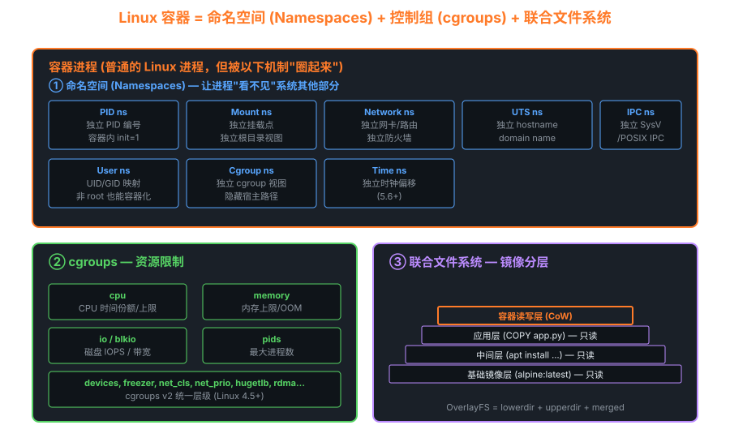

# 11 — 容器与命名空间

> **目标**：从内核 namespace/cgroup 原语出发，彻底理解容器技术的底层实现，并动手构建一个 mini-docker。

---

## 目录

1. [容器不是虚拟机](#111-容器不是虚拟机)
2. [8种 Linux Namespace](#112-8种-linux-namespace)
3. [clone/unshare/setns 系统调用](#113-cloneunsharesetns-系统调用)
4. [PID 命名空间深入](#114-pid-命名空间深入)
5. [Network 命名空间](#115-network-命名空间)
6. [User 命名空间](#116-user-命名空间)
7. [Mount 命名空间与 pivot_root](#117-mount-命名空间与-pivot_root)
8. [cgroups v1 vs v2](#118-cgroups-v1-vs-v2)
9. [cgroup v2 内存控制](#119-cgroup-v2-内存控制)
10. [OverlayFS 原理](#1110-overlayfs-原理)
11. [seccomp BPF 系统调用过滤](#1111-seccomp-bpf)
12. [Linux Capabilities](#1112-linux-capabilities)
13. [容器运行时内部：runc 流程](#1113-容器运行时内部runc-流程)
14. [mini-docker 实现](#1114-mini-docker-实现)

---

## 11.1 容器不是虚拟机

### 核心区别



```art
虚拟机 vs 容器隔离层次对比:

┌─────────────────────────────────────────────────────────────┐
│                        物理硬件                              │
├─────────────────────────────────────────────────────────────┤
│                                                             │
│  虚拟机模式:                    容器模式:                    │
│  ┌──────────┐ ┌──────────┐     ┌──────┐ ┌──────┐ ┌──────┐  │
│  │  Guest   │ │  Guest   │     │容器A │ │容器B │ │容器C │  │
│  │  OS      │ │  OS      │     │进程  │ │进程  │ │进程  │  │
│  ├──────────┤ ├──────────┤     ├──────┴─┴──────┴─┴──────┤  │
│  │ VMKernel │ │ VMKernel │     │     共享 Host Kernel     │  │
│  ├──────────┴─┴──────────┤     │   (namespace隔离)        │  │
│  │    Hypervisor          │     └──────────────────────────┤  │
│  ├───────────────────────┤     │       Host OS            │  │
│  │       Host OS         │     └──────────────────────────┘  │
└─────────────────────────────────────────────────────────────┘
```

### 详细对比表

| 维度             | 虚拟机（KVM/VMware）                    | 容器（Docker/containerd）              |
|----------------|----------------------------------------|--------------------------------------|
| 隔离级别         | 硬件级别（完全隔离）                    | 内核级别（namespace隔离）             |
| 内核共享         | 每个 VM 独立内核                       | 共享宿主机内核                        |
| 启动时间         | 秒级~分钟                              | 毫秒级~秒级                           |
| 内存开销         | GiB（含 Guest OS）                    | MiB（仅进程开销）                     |
| 存储开销         | 完整 OS 镜像（几GiB）                  | 分层镜像（增量）                      |
| 网络隔离         | 虚拟网卡/虚拟交换机（完全隔离）         | veth pair/iptables/eBPF              |
| 安全边界         | 强（CVE 逃逸极少）                     | 弱（内核漏洞可能逃逸）               |
| 文件系统         | 独立虚拟磁盘                           | OverlayFS 分层                       |
| 性能损耗         | 5-15%（CPU/内存）                      | < 1%（接近原生）                     |
| 混合部署         | 不同 OS（Windows + Linux）             | 只能同 Kernel ABI                    |
| 典型用途         | 强隔离、多OS、有状态服务               | 微服务、CI/CD、无状态服务             |

---

## 11.2 8种 Linux Namespace

Linux 内核目前支持 **8 种** namespace，每种隔离不同的系统资源：

| Namespace  | 隔离内容                          | 引入版本   | clone 标志          | /proc/PID/ns/ 文件 | 关键系统调用 |
|-----------|----------------------------------|-----------|--------------------|--------------------|------------|
| Mount      | 文件系统挂载点视图                 | 2.4.19    | `CLONE_NEWNS`      | `mnt`              | `mount(2)` |
| UTS        | hostname / domainname            | 2.6.19    | `CLONE_NEWUTS`     | `uts`              | `sethostname(2)` |
| IPC        | SysV IPC, POSIX 消息队列          | 2.6.19    | `CLONE_NEWIPC`     | `ipc`              | `msgget(2)` |
| Network    | 网络接口/路由/iptables/socket     | 2.6.24    | `CLONE_NEWNET`     | `net`              | `socket(2)` |
| PID        | 进程 ID 空间                     | 2.6.24    | `CLONE_NEWPID`     | `pid`/`pid_for_children` | `getpid(2)` |
| User       | UID/GID 映射，特权隔离            | 3.8       | `CLONE_NEWUSER`    | `user`             | `setuid(2)` |
| Cgroup     | cgroup 根目录（/proc/self/cgroup）| 4.6       | `CLONE_NEWCGROUP`  | `cgroup`           | `mount("cgroup2")` |
| Time       | 单调时钟/启动时钟偏移             | 5.6       | `CLONE_NEWTIME`    | `time`/`time_for_children` | `clock_settime(2)` |

### 查看进程的 Namespace

```bash
# 查看当前进程的所有 namespace
ls -la /proc/$$/ns/
# lrwxrwxrwx 1 root root 0 Jan 1 00:00 cgroup -> 'cgroup:[4026531835]'
# lrwxrwxrwx 1 root root 0 Jan 1 00:00 ipc    -> 'ipc:[4026531839]'
# lrwxrwxrwx 1 root root 0 Jan 1 00:00 mnt    -> 'mnt:[4026531840]'
# lrwxrwxrwx 1 root root 0 Jan 1 00:00 net    -> 'net:[4026531992]'
# lrwxrwxrwx 1 root root 0 Jan 1 00:00 pid    -> 'pid:[4026531836]'
# lrwxrwxrwx 1 root root 0 Jan 1 00:00 time   -> 'time:[4026531834]'
# lrwxrwxrwx 1 root root 0 Jan 1 00:00 user   -> 'user:[4026531837]'
# lrwxrwxrwx 1 root root 0 Jan 1 00:00 uts    -> 'uts:[4026531838]'

# 数字即 namespace inode，相同 inode = 同一 namespace
readlink /proc/$$/ns/pid   # pid:[4026531836]

# 比较两个进程是否在同一 namespace
stat -L /proc/1/ns/net /proc/$$/ns/net
```

---

## 11.3 clone/unshare/setns 系统调用

### clone(2) — 创建新进程并指定 namespace

```c
#include <sched.h>
#include <sys/types.h>

/* 原型 */
int clone(int (*fn)(void *), void *stack, int flags, void *arg, ...
          /* pid_t *parent_tid, void *tls, pid_t *child_tid */);

/* 示例：创建新的 PID + UTS + Network namespace */
#define STACK_SIZE (1024 * 1024)  /* 1 MiB 栈 */

static int child_func(void *arg)
{
    /* 此时已在新 namespace 中 */
    printf("Child PID in new ns: %d\n", getpid());  /* 输出: 1 */

    /* 设置新 hostname */
    sethostname("container", 9);

    /* 执行 shell */
    execlp("/bin/sh", "/bin/sh", NULL);
    return 0;
}

int main(void)
{
    char *stack = malloc(STACK_SIZE);
    char *stack_top = stack + STACK_SIZE;  /* 栈向下增长 */

    int flags = CLONE_NEWPID | CLONE_NEWUTS | CLONE_NEWNET |
                CLONE_NEWNS  | CLONE_NEWIPC | SIGCHLD;

    pid_t pid = clone(child_func, stack_top, flags, NULL);
    if (pid < 0) {
        perror("clone");
        return 1;
    }

    printf("Parent: child PID = %d\n", pid);
    waitpid(pid, NULL, 0);
    return 0;
}
```

### unshare(2) — 当前进程离开已有 namespace

```bash
# 在新的 UTS namespace 中运行 bash（无需 root，仅改 hostname）
unshare --uts bash
hostname mycontainer    # 只影响此 namespace

# 创建完整隔离的 shell（需要 root）
unshare --pid --fork --mount-proc bash
ps aux  # 只看到自己的进程

# User namespace（无需 root！）
unshare --user --map-root-user bash
id  # uid=0(root) — 在新 namespace 内是 root，宿主机上无特权
```

```c
/* unshare(2) 系统调用 */
#include <sched.h>
int unshare(int flags);

/* 示例：当前进程进入新的 mount namespace */
if (unshare(CLONE_NEWNS) < 0) {
    perror("unshare");
    exit(1);
}
/* 现在 mount/umount 不影响其他进程 */
mount("tmpfs", "/tmp", "tmpfs", 0, NULL);
```

### setns(2) — 加入已有 namespace

```c
#include <fcntl.h>
#include <sched.h>

/* 进入另一个进程的 network namespace */
int nsfd = open("/proc/12345/ns/net", O_RDONLY);
if (setns(nsfd, CLONE_NEWNET) < 0) {
    perror("setns");
    exit(1);
}
close(nsfd);
/* 现在共享 PID 12345 的网络 namespace */
```

```bash
# nsenter 工具（封装 setns）
nsenter --target <pid> --net --pid --mount -- bash
# 或进入 Docker 容器
nsenter --target $(docker inspect -f '{{.State.Pid}}' mycontainer) \
        --net --pid --mount -- bash
```

---

## 11.4 PID 命名空间深入

### 双重 PID 视图

每个进程在不同的 PID namespace 中拥有不同的 PID：

```art
PID Namespace 层次视图:

  Host namespace (init_pid_ns)
  PID: 1=systemd, 234=sshd, 567=dockerd, 890=containerd

  container ns (child_pid_ns)          container ns (sibling)
  ┌────────────────────────────┐        ┌──────────────┐
  │ PID 1 = bash               │        │ PID 1 = nginx│
  │ PID 2 = ps                 │        │ PID 2 = worker│
  │（宿主机看到的是 890, 891）  │        └──────────────┘
  └────────────────────────────┘

规则：
- 容器内 PID 1 对应宿主机某个 PID（如 890）
- 容器内只能看到本 namespace 的进程
- 父 namespace 可以看到所有子 namespace 的进程（用宿主机 PID）
- /proc/<pid>/status 中有 NSpid 字段显示所有层级的 PID
```

```bash
# 查看容器内进程的宿主机 PID
docker inspect --format '{{.State.Pid}}' mycontainer

# 查看多层 PID 映射
cat /proc/$(docker inspect -f '{{.State.Pid}}' mycontainer)/status \
    | grep NSpid
# NSpid: 890  1    ← 宿主机 PID=890，容器内 PID=1

# pid_for_children — 影响子进程使用的 PID namespace
cat /proc/$$/ns/pid_for_children   # 子进程在哪个 PID ns 中创建
```

### 容器 init 进程的特殊性

```bash
# PID 1 在 PID namespace 中有特殊职责：
# 1. 收割孤儿进程（子进程的父进程退出时，孤儿被 PID 1 收养）
# 2. 处理 SIGTERM（PID 1 默认忽略信号！需显式处理）
# 3. PID namespace 消亡：当 PID 1 退出时，整个 namespace 销毁

# 这就是为什么 Docker 容器在 CMD 退出时容器也退出

# 使用 tini 作为 PID 1（正确处理信号和孤儿进程）
docker run --init myimage
# 或在 Dockerfile 中：
# ENTRYPOINT ["/usr/bin/tini", "--", "/myapp"]
```

---

## 11.5 Network 命名空间

### veth pair 手动搭建网络隔离

```bash
# 创建两个 network namespace
ip netns add ns1
ip netns add ns2

# 创建 veth pair（虚拟以太网对）
ip link add veth1 type veth peer name veth2

# 将 veth 两端分别放入两个 namespace
ip link set veth1 netns ns1
ip link set veth2 netns ns2

# 配置 IP 地址
ip netns exec ns1 ip addr add 10.0.0.1/24 dev veth1
ip netns exec ns2 ip addr add 10.0.0.2/24 dev veth2

# 启动接口
ip netns exec ns1 ip link set veth1 up
ip netns exec ns1 ip link set lo up
ip netns exec ns2 ip link set veth2 up
ip netns exec ns2 ip link set lo up

# 测试连通性
ip netns exec ns1 ping -c 3 10.0.0.2  # ✓

# 清理
ip netns del ns1
ip netns del ns2
```

### 容器网络架构（Docker bridge 模式）

```art
Docker bridge 网络架构:

宿主机:                              容器:
┌──────────────────────────────────────────────────────────────┐
│  eth0 (192.168.1.100)                                        │
│    │                                                         │
│  iptables MASQUERADE (NAT出口)                               │
│    │                                                         │
│  docker0 bridge (172.17.0.1/16)                             │
│    ├── veth_a_host (172.17.0.0/16)  ◄──► veth_a (172.17.0.2)│
│    └── veth_b_host (172.17.0.0/16)  ◄──► veth_b (172.17.0.3)│
│                                          (容器A)  (容器B)    │
└──────────────────────────────────────────────────────────────┘

数据包路径（容器A → 外网）:
veth_a → docker0 → iptables MASQUERADE → eth0 → 外网
```

```bash
# 查看容器网络 namespace 的网络配置
pid=$(docker inspect -f '{{.State.Pid}}' mycontainer)
ip netns exec /proc/$pid/ns/net ip addr
# 等价于：
nsenter --target $pid --net -- ip addr
```

---

## 11.6 User 命名空间

### UID 映射机制

User namespace 允许将容器内的 UID/GID 映射到宿主机上的不同值，实现 **rootless 容器**：

```bash
# 查看 UID 映射格式（容器内UID 宿主机UID 数量）
cat /proc/$$/uid_map
# 0  1000  1    ← 容器内UID 0 映射到宿主机 UID 1000（只有1个）

# 创建 User namespace（无需 root！）
unshare --user --map-root-user bash
id  # uid=0(root) gid=0(root) — 容器内是 root
cat /proc/$$/uid_map  # 0  1000  1

# 扩展映射：容器内 0-65535 映射到宿主机 100000-165535
# /etc/subuid 文件：alice:100000:65536
newuidmap <pid> 0 100000 65536
newgidmap <pid> 0 100000 65536
```

```c
/* 内核中 UID 映射的数据结构 */
struct uid_gid_extent {
    u32 first;          /* namespace 内的起始 ID */
    u32 lower_first;    /* 宿主机上的起始 ID */
    u32 count;          /* 映射的 ID 数量 */
};

struct uid_gid_map {    /* 最多 5 条映射规则 */
    u32 nr_extents;
    union {
        struct uid_gid_extent extent[UID_GID_MAP_MAX_EXTENTS];
        struct {
            struct uid_gid_extent *forward;
            struct uid_gid_extent *reverse;
        };
    };
};
```

### Rootless 容器安全模型

```bash
# Podman rootless 模式（推荐生产使用）
podman run --rm -it alpine sh
id  # 容器内: uid=0(root) — 宿主机: uid=1000(alice)

# 验证：rootless 容器无法访问宿主机敏感资源
ls /root  # Permission denied（宿主机 /root 归 uid=0 所有）
```

---

## 11.7 Mount 命名空间与 pivot_root

### pivot_root vs chroot

```art
chroot vs pivot_root 对比:

chroot:                        pivot_root:
┌─────────────────────┐        ┌─────────────────────┐
│    / (宿主机)        │        │   new_root/          │
│    ├── etc/          │        │   ├── etc/           │
│    ├── var/          │        │   ├── var/           │
│    └── container/   │        │   └── put_old/       │
│        └── (chroot  │        │       └── (原始/)    │
│            到这里)  │        │                      │
│                     │        │  原始 / 被卸载        │
│ 问题：仍可访问原始   │        │  或隐藏在 put_old    │
│ /proc /sys 等敏感   │        │                      │
│ 路径（安全漏洞）     │        │ 优势：真正替换根文件  │
│                     │        │ 系统，与旧 / 彻底隔离 │
└─────────────────────┘        └─────────────────────┘
```

```c
/* pivot_root 使用示例（在新 mount namespace 中）*/
#include <sys/syscall.h>
#include <sys/mount.h>

int pivot_root(const char *new_root, const char *put_old)
{
    return syscall(SYS_pivot_root, new_root, put_old);
}

/* 容器启动流程 */
void setup_rootfs(const char *rootfs)
{
    char put_old[PATH_MAX];

    /* 1. 确保 rootfs 是挂载点（bind mount 自身）*/
    mount(rootfs, rootfs, NULL, MS_BIND | MS_REC, NULL);

    /* 2. 创建 put_old 目录 */
    snprintf(put_old, sizeof(put_old), "%s/.pivot_root", rootfs);
    mkdir(put_old, 0700);

    /* 3. 切换根文件系统 */
    pivot_root(rootfs, put_old);

    /* 4. 切换工作目录 */
    chdir("/");

    /* 5. 卸载旧根文件系统 */
    umount2("/.pivot_root", MNT_DETACH);
    rmdir("/.pivot_root");
}
```

### 挂载传播类型

```bash
# 挂载传播类型（Shared/Private/Slave/Unbindable）

# 默认：shared（双向传播）
mount --make-shared /mnt

# private（不传播）— Docker 容器默认用此
mount --make-private /mnt

# slave（只接收宿主机挂载，不向上传播）— 适合容器挂载卷
mount --make-slave /mnt

# 查看挂载传播
cat /proc/$$/mountinfo | head -5
# 22 1 8:1 / / rw,relatime shared:1 - ext4 /dev/sda1 rw
#                            ^^^^^^^^
#                            传播类型 + peer group ID
```

---

## 11.8 cgroups v1 vs v2

### 架构对比

```art
cgroups v1（多棵树）:              cgroups v2（单棵树）:
                                   
/sys/fs/cgroup/                    /sys/fs/cgroup/
├── cpu/                           ├── system.slice/
│   └── myapp/                     │   └── myapp.service/
│       └── tasks                  │       ├── cpu.weight
├── memory/                        │       ├── memory.max
│   └── myapp/                     │       └── cgroup.procs
│       └── tasks                  ├── user.slice/
├── blkio/                         └── cgroup.controllers
│   └── myapp/
│       └── tasks
└── pids/
    └── myapp/
        └── tasks

问题: 同一进程在不同控制器下的视图不一致
优势: 每个控制器独立挂载，灵活

优势: 统一视图，强一致性
     委托层次（Delegation）
     线程模式（Thread Mode）
```

### 详细功能对比表

| 特性                        | cgroups v1                          | cgroups v2                           |
|---------------------------|-------------------------------------|--------------------------------------|
| 挂载方式                    | 多个子系统独立挂载                  | 单一统一层次                          |
| 进程归属                    | 可在不同控制器的不同位置             | 一个进程只属于一个 cgroup             |
| 控制器激活                  | 挂载时自动激活                      | 按需通过 `cgroup.subtree_control`    |
| 线程支持                    | 不支持线程级控制                    | Thread Mode（`cgroup.type=threaded`）|
| 委托管理                    | 有限支持                            | 完整委托（用户可管理子 cgroup）       |
| io 控制                    | blkio（权重+带宽）                  | io（统一 BFQ + iocost 模型）         |
| 内存统计                    | 粗粒度                              | 更细粒度（含 slab/anon/file）        |
| 压力指标                    | 无                                  | PSI（pressure stall information）    |
| Kubernetes 支持             | v1.19 之前                          | v1.25+ 默认，推荐                    |

### 主要控制器

```bash
# v2：查看可用控制器
cat /sys/fs/cgroup/cgroup.controllers
# cpuset cpu io memory hugetlb pids rdma misc

# 启用子 cgroup 的控制器
echo "+cpu +memory +io" > /sys/fs/cgroup/myapp/cgroup.subtree_control

# CPU 控制
echo 200 > /sys/fs/cgroup/myapp/cpu.weight       # 权重（1-10000）
echo "50000 100000" > /sys/fs/cgroup/myapp/cpu.max # 带宽限制(quota period)

# 内存控制
echo $((512*1024*1024)) > /sys/fs/cgroup/myapp/memory.max    # 512MB 上限
echo $((400*1024*1024)) > /sys/fs/cgroup/myapp/memory.high   # 400MB 软限制

# IO 控制（基于设备号）
echo "8:0 rbps=10485760 wbps=10485760" > /sys/fs/cgroup/myapp/io.max # 10MB/s

# PID 限制
echo 100 > /sys/fs/cgroup/myapp/pids.max    # 最多100个进程/线程
```

---

## 11.9 cgroup v2 内存控制

### 内存限制层次

```art
内存限制层次（软限制 → 硬限制 → OOM）:

            memory.min   memory.low   memory.high   memory.max
            (预留底线)   (软保护)     (软上限)      (硬上限)

使用量:  ──────────────────────────────────────────────────────►
         0    min       low          high          max
              │          │            │             │
              │          │         超过后触发       │
              │          │         内存回收压力     │
              │          │         (仍可继续使用)   OOM killer
              │        低于此       
              │        值时保护
              │        不被回收
           保证至少有
           min字节可用
```

```bash
# memory.max — 硬上限（超过直接 OOM kill）
echo $((256*1024*1024)) > /sys/fs/cgroup/myapp/memory.max

# memory.high — 软上限（超过触发回收，但不立即 OOM）
echo $((200*1024*1024)) > /sys/fs/cgroup/myapp/memory.high

# memory.low — 软保护（内存紧张时优先保留此量）
echo $((100*1024*1024)) > /sys/fs/cgroup/myapp/memory.low

# memory.min — 硬保护（保证此量不被回收）
echo $((50*1024*1024)) > /sys/fs/cgroup/myapp/memory.min

# 查看内存使用统计
cat /sys/fs/cgroup/myapp/memory.current   # 当前使用量（字节）
cat /sys/fs/cgroup/myapp/memory.stat      # 详细统计

# OOM 事件监控
cat /sys/fs/cgroup/myapp/memory.events
# low 0          ← 触发 low 阈值回收次数
# high 5         ← 触发 high 阈值回收次数
# max 2          ← 触发 max 阈值次数
# oom 1          ← OOM kill 次数
# oom_kill 3     ← OOM 杀死进程次数

# PSI（压力指标）— 判断容器是否"内存饥渴"
cat /sys/fs/cgroup/myapp/memory.pressure
# some avg10=0.00 avg60=0.00 avg300=0.00 total=0
# full avg10=0.00 avg60=0.00 avg300=0.00 total=0
```

---

## 11.10 OverlayFS 原理

### 四层结构

```art
OverlayFS 层次结构:

merged（用户看到的）:
  /merged/
  ├── etc/ (来自 upper)        ← 修改的文件在 upper
  ├── bin/ (来自 lower)        ← 未修改的在 lower（只读）
  └── new_file (来自 upper)    ← 新建文件在 upper

upper（可读写）:              lower（只读，可多个）:
  /upper/                       /lower1/
  ├── etc/passwd (modified)     ├── etc/passwd (original)
  ├── new_file (new)            ├── bin/sh
  └── .wh.deleted_file (whiteout) └── lib/

workdir（内核工作目录）:      （copy-up 临时区域）
  /workdir/work/
```

### Copy-Up 机制

当容器修改只读层（lower）中的文件时，内核执行 copy-up：

```art
Copy-Up 流程（修改 /etc/passwd）:

步骤1: 用户写 /merged/etc/passwd
步骤2: OverlayFS 发现 passwd 在 lower（只读）
步骤3: Copy-Up:
  a. 在 upper 创建 /upper/etc/ 目录
  b. 将 /lower/etc/passwd 复制到 /upper/etc/passwd
  c. 修改 /upper/etc/passwd
步骤4: 后续读写直接操作 /upper/etc/passwd

注意：Copy-Up 是文件级别，非块级别
     大文件的首次写入会有延迟（拷贝整个文件）
```

### Whiteout 文件（删除标记）

```bash
# 当在容器中删除 lower 层中的文件时
# OverlayFS 在 upper 层创建特殊的 whiteout 文件

# whiteout 是字符设备 0:0
rm /merged/some_file
# 效果：在 upper 创建 .wh.some_file（设备号 0:0）
ls -la /upper/.wh.some_file
# c--------- 1 root root 0, 0 Jan 1 00:00 .wh.some_file

# 挂载 OverlayFS 的命令
mount -t overlay overlay \
    -o lowerdir=/lower1:/lower2,upperdir=/upper,workdir=/workdir \
    /merged

# Docker 的 OverlayFS 位置
ls /var/lib/docker/overlay2/<container-id>/
# diff/    ← upper 层（容器写入的变更）
# link     ← 层 ID 的短链接（节省 mount option 长度）
# lower    ← lower 层路径列表
# merged/  ← 挂载点（运行时存在）
# work/    ← workdir
```

---

## 11.11 seccomp BPF

### 系统调用过滤原理

```art
seccomp BPF 工作流程:

用户进程                     内核
    │                          │
    │  syscall(execve, ...)    │
    ├─────────────────────────►│
    │                          │  seccomp_run_filters()
    │                          │  ┌─────────────────┐
    │                          │  │ BPF 程序执行    │
    │                          │  │ seccomp_data:   │
    │                          │  │  .nr = 59       │
    │                          │  │  .arch = x86_64 │
    │                          │  │  .args[6]       │
    │                          │  └────────┬────────┘
    │                          │           │
    │                          │  返回码：  │
    │                          │  ALLOW ───┼──► 继续执行
    │◄─────────────────────────┼── ERRNO ──┼──► 返回错误
    │  SIGSYS                  │  KILL ────┼──► 杀死进程
    │                          │  TRACE ───┼──► ptrace 通知
```

```c
/* 使用 libseccomp 设置过滤规则 */
#include <seccomp.h>

int setup_seccomp(void)
{
    scmp_filter_ctx ctx;

    /* 默认拒绝所有系统调用 */
    ctx = seccomp_init(SCMP_ACT_ERRNO(EPERM));
    if (!ctx) return -1;

    /* 白名单：允许的系统调用 */
    seccomp_rule_add(ctx, SCMP_ACT_ALLOW, SCMP_SYS(read), 0);
    seccomp_rule_add(ctx, SCMP_ACT_ALLOW, SCMP_SYS(write), 0);
    seccomp_rule_add(ctx, SCMP_ACT_ALLOW, SCMP_SYS(exit_group), 0);
    seccomp_rule_add(ctx, SCMP_ACT_ALLOW, SCMP_SYS(openat), 0);

    /* 条件过滤：只允许打开 /dev/null */
    /* seccomp_rule_add(ctx, SCMP_ACT_ALLOW, SCMP_SYS(open),
                        1, SCMP_A0(SCMP_CMP_EQ, (scmp_datum_t)"/dev/null")); */

    seccomp_load(ctx);
    seccomp_release(ctx);
    return 0;
}
```

```bash
# Docker 默认 seccomp profile 禁用的危险系统调用（部分）：
# - kexec_load      (加载新内核)
# - mount           (除非 --privileged)
# - setns           (命名空间操作)
# - reboot          (重启系统)
# - clone (CLONE_NEWUSER) (创建 user namespace)
# - ptrace          (调试其他进程)
# - perf_event_open (性能监控，可侧信道攻击)
# - bpf             (eBPF 程序)
# 共禁用约 44 个系统调用

# 查看被 seccomp 阻止的调用
strace -e trace=all -e seccomp=1 docker run --rm alpine sleep 1 2>&1 \
    | grep EPERM

# 以禁用 seccomp 运行（危险！）
docker run --security-opt seccomp=unconfined myimage
```

---

## 11.12 Linux Capabilities

### 拆分 root 权限

传统 Unix 的 root（UID=0）拥有所有特权。Linux 将其拆分为约 **37 个独立 capability**：

```bash
# 查看当前进程的 capability
cat /proc/$$/status | grep -i cap
# CapInh: 0000000000000000   (可继承)
# CapPrm: 0000003fffffffff   (允许集)
# CapEff: 0000003fffffffff   (有效集)
# CapBnd: 0000003fffffffff   (边界集)
# CapAmb: 0000000000000000   (环境集)

# 解码 capability 位掩码
capsh --decode=0000003fffffffff
```

### 常用 Capability 对照表

| Capability          | 对应权限                              | Docker 默认 |
|--------------------|--------------------------------------|------------|
| `CAP_NET_ADMIN`    | 网络配置（路由/iptables/接口）        | ✗ 移除     |
| `CAP_NET_BIND_SERVICE` | 绑定 1024 以下端口               | ✓ 保留     |
| `CAP_SYS_ADMIN`    | 挂载/sethostname/namespace 等        | ✗ 移除     |
| `CAP_SYS_PTRACE`   | ptrace 其他进程                      | ✗ 移除     |
| `CAP_SYS_CHROOT`   | chroot(2)                           | ✓ 保留     |
| `CAP_SETUID`       | 任意设置 UID                         | ✓ 保留     |
| `CAP_SETGID`       | 任意设置 GID                         | ✓ 保留     |
| `CAP_KILL`         | 向任意进程发送信号                    | ✓ 保留     |
| `CAP_CHOWN`        | 任意修改文件所有权                    | ✓ 保留     |
| `CAP_DAC_OVERRIDE` | 绕过 DAC 权限检查                    | ✓ 保留     |
| `CAP_MKNOD`        | 创建设备文件                         | ✓ 保留     |
| `CAP_NET_RAW`      | 原始套接字（ping 等）                 | ✓ 保留     |
| `CAP_SYS_BOOT`     | 重启系统                             | ✗ 移除     |
| `CAP_SYS_MODULE`   | 加载/卸载内核模块                    | ✗ 移除     |
| `CAP_AUDIT_WRITE`  | 写审计日志                           | ✓ 保留     |

```bash
# 最小权限容器（移除所有 capability，仅保留必要的）
docker run --cap-drop=ALL --cap-add=NET_BIND_SERVICE nginx

# 使用 setcap 给非 root 程序授予单个 capability
setcap 'cap_net_bind_service=+ep' /usr/bin/node
# 现在 node 可以绑定 80 端口，无需 root

# 查看文件的 capability
getcap /usr/bin/ping
# /usr/bin/ping = cap_net_raw+ep
```

---

## 11.13 容器运行时内部：runc 流程

### runc 执行流程

```art
runc 启动容器的完整流程:

  runc run mycontainer
       │
       ▼
  1. 读取 config.json (OCI Runtime Spec)
       │  ├── process (cmd/args/env)
       │  ├── mounts (文件系统挂载列表)
       │  ├── linux.namespaces (要创建的 ns)
       │  └── linux.cgroupsPath (cgroup 路径)
       │
       ▼
  2. clone(CLONE_NEWPID|CLONE_NEWNS|CLONE_NEWNET|...) 
       │  创建子进程（runc init）
       │
       ▼
  3. runc init（子进程内执行）:
       │  a. 应用 cgroup 限制
       │  b. 设置 network namespace（veth配置）
       │  c. pivot_root 切换根文件系统
       │  d. 挂载 /proc /sys /dev
       │  e. 设置 hostname (UTS namespace)
       │  f. 应用 seccomp 过滤
       │  g. 降低 capabilities
       │  h. 切换 UID/GID
       │  i. execve(container_cmd)
       │
       ▼
  4. 容器进程运行（PID 1 = container_cmd）
```

### OCI Runtime Spec (config.json) 示例

```json
{
  "ociVersion": "1.0.2",
  "process": {
    "terminal": false,
    "user": { "uid": 0, "gid": 0 },
    "args": ["/bin/sh"],
    "env": ["PATH=/usr/local/sbin:/usr/local/bin:/usr/sbin:/usr/bin:/sbin:/bin"],
    "cwd": "/"
  },
  "root": {
    "path": "rootfs",
    "readonly": false
  },
  "linux": {
    "namespaces": [
      { "type": "pid" },
      { "type": "network" },
      { "type": "mount" },
      { "type": "uts" },
      { "type": "ipc" }
    ],
    "cgroupsPath": "/mycontainer",
    "seccomp": {
      "defaultAction": "SCMP_ACT_ERRNO",
      "syscalls": [
        { "names": ["read","write","exit_group"], "action": "SCMP_ACT_ALLOW" }
      ]
    }
  }
}
```

---

## 11.14 mini-docker 实现

以下约 **65 行 C 代码**演示容器的核心机制：

```c
/* mini_docker.c — 使用 clone + pivot_root + cgroups 的最简容器 */
#define _GNU_SOURCE
#include <stdio.h>
#include <stdlib.h>
#include <string.h>
#include <unistd.h>
#include <sched.h>
#include <sys/mount.h>
#include <sys/stat.h>
#include <sys/types.h>
#include <sys/wait.h>
#include <fcntl.h>
#include <limits.h>

#define STACK_SIZE (1024 * 1024)  /* 子进程栈 1MiB */
#define ROOTFS     "/tmp/rootfs"  /* 容器根文件系统路径 */

/* 设置 cgroup 内存限制（v1）*/
static void setup_cgroup(pid_t pid)
{
    char path[PATH_MAX];
    int fd;

    mkdir("/sys/fs/cgroup/memory/minicontainer", 0755);

    /* 内存限制 64MB */
    snprintf(path, sizeof(path),
             "/sys/fs/cgroup/memory/minicontainer/memory.limit_in_bytes");
    fd = open(path, O_WRONLY);
    write(fd, "67108864", 8);  /* 64 * 1024 * 1024 */
    close(fd);

    /* 将进程加入 cgroup */
    snprintf(path, sizeof(path),
             "/sys/fs/cgroup/memory/minicontainer/cgroup.procs");
    fd = open(path, O_WRONLY);
    char pid_str[16];
    snprintf(pid_str, sizeof(pid_str), "%d", pid);
    write(fd, pid_str, strlen(pid_str));
    close(fd);
}

/* 容器内部初始化（在新 namespace 中执行）*/
static int container_main(void *arg)
{
    char **argv = (char **)arg;

    /* 1. 设置 hostname */
    sethostname("minicontainer", 13);

    /* 2. 挂载新的 /proc（在新 PID namespace 中）*/
    mount("proc", ROOTFS "/proc", "proc", 0, NULL);

    /* 3. pivot_root 切换根文件系统 */
    char put_old[PATH_MAX];
    snprintf(put_old, sizeof(put_old), "%s/.old_root", ROOTFS);
    mkdir(put_old, 0700);

    /* 确保 rootfs 是挂载点 */
    mount(ROOTFS, ROOTFS, NULL, MS_BIND | MS_REC, NULL);
    
    if (syscall(SYS_pivot_root, ROOTFS, put_old) < 0) {
        /* fallback: 使用 chroot */
        chroot(ROOTFS);
    }
    chdir("/");

    /* 卸载旧根文件系统 */
    umount2("/.old_root", MNT_DETACH);

    /* 4. 执行容器命令 */
    printf("[minicontainer] PID=%d, hostname=minicontainer\n", getpid());
    execvp(argv[0], argv);
    perror("execvp");
    return 1;
}

int main(int argc, char *argv[])
{
    if (argc < 2) {
        fprintf(stderr, "Usage: %s <command> [args...]\n", argv[0]);
        return 1;
    }

    /* 分配子进程栈 */
    char *stack = malloc(STACK_SIZE);
    char *stack_top = stack + STACK_SIZE;

    /* 创建所有 namespace */
    int flags = CLONE_NEWPID  |   /* 新 PID namespace */
                CLONE_NEWUTS  |   /* 新 UTS namespace (hostname) */
                CLONE_NEWNET  |   /* 新 Network namespace */
                CLONE_NEWNS   |   /* 新 Mount namespace */
                CLONE_NEWIPC  |   /* 新 IPC namespace */
                SIGCHLD;

    pid_t pid = clone(container_main, stack_top, flags, &argv[1]);
    if (pid < 0) {
        perror("clone");
        return 1;
    }

    printf("[host] Container PID on host: %d\n", pid);

    /* 在宿主机侧设置 cgroup（子进程创建后立即执行）*/
    setup_cgroup(pid);

    /* 等待容器退出 */
    int status;
    waitpid(pid, &status, 0);
    printf("[host] Container exited with status %d\n",
           WEXITSTATUS(status));

    free(stack);
    return 0;
}
```

### 编译与运行

```bash
# 编译
gcc -o mini_docker mini_docker.c

# 准备最简 rootfs（使用 BusyBox）
mkdir -p /tmp/rootfs/{bin,proc,sys,dev,tmp}
cp $(which busybox) /tmp/rootfs/bin/
/tmp/rootfs/bin/busybox --install /tmp/rootfs/bin/

# 运行容器
sudo ./mini_docker /bin/sh

# 在容器内验证隔离
hostname          # → minicontainer
ps aux            # → 只看到自己的进程
ip addr           # → 只有 lo 接口
cat /proc/1/ns/pid  # → 新的 namespace inode
```

### 与真实 Docker 的差距

| 功能               | mini-docker          | Docker/containerd       |
|------------------|----------------------|------------------------|
| Namespace 隔离   | 6 种基本 namespace   | 全部 8 种              |
| 文件系统         | 简单 chroot/pivot    | OverlayFS 分层镜像     |
| 网络             | 无网络配置           | veth + bridge + iptables |
| cgroup           | 简单内存限制         | 全部控制器 + v1/v2     |
| 安全             | 无 seccomp/capabilities | 完整 seccomp profile  |
| 镜像管理         | 无                   | OCI 镜像格式 + 仓库    |
| 生命周期管理     | 无                   | start/stop/restart/pause |

---

## 总结

```art
容器技术全景图:

  ┌─────────────────────────────────────────────────────────────┐
  │                    容器 = 进程 + 隔离 + 限制               │
  │                                                             │
  │  隔离机制（Namespace）:                                     │
  │  PID + Net + Mount + UTS + IPC + User + Cgroup + Time      │
  │                                                             │
  │  限制机制（cgroups v2）:                                    │
  │  cpu.weight + memory.max + io.max + pids.max               │
  │                                                             │
  │  文件系统（OverlayFS）:                                     │
  │  lower(镜像层) + upper(写入层) = merged(容器视图)           │
  │                                                             │
  │  安全机制:                                                  │
  │  seccomp(syscall过滤) + capabilities(权限最小化)            │
  │  + AppArmor/SELinux(MAC) + User namespace(rootless)        │
  └─────────────────────────────────────────────────────────────┘
```

**参考资料**：
- `kernel/nsproxy.c` — namespace 核心实现
- `kernel/cgroup/cgroup.c` — cgroup v2 实现
- `fs/overlayfs/` — OverlayFS 实现
- `kernel/seccomp.c` — seccomp 实现
- OCI Runtime Specification: https://github.com/opencontainers/runtime-spec
- runc 源码: https://github.com/opencontainers/runc
