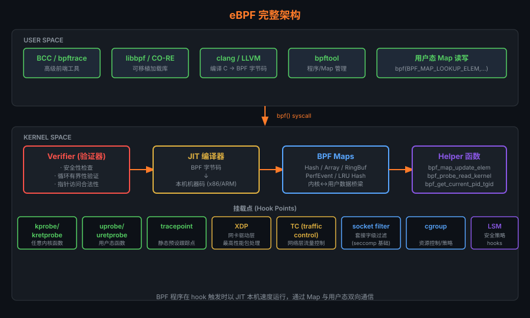

# 12 — eBPF 与可观测性

> **目标**：从 cBPF 历史到生产级 XDP/Cilium，系统掌握 eBPF 的安全模型、编程接口和可观测性工具链。

---

## 目录

1. [eBPF 历史演进](#121-ebpf-历史演进)
2. [eBPF 安全模型](#122-ebpf-安全模型)
3. [eBPF JIT 编译器](#123-ebpf-jit-编译器)
4. [eBPF Map 类型详解](#124-ebpf-map-类型详解)
5. [挂载点全景](#125-挂载点全景)
6. [第一个 eBPF 程序](#126-第一个-ebpf-程序)
7. [XDP 深入](#127-xdp-深入)
8. [网络可观测性](#128-网络可观测性)
9. [CO-RE：一次编译，到处运行](#129-co-re一次编译到处运行)
10. [bpftrace 实战](#1210-bpftrace-实战)
11. [BCC 工具集](#1211-bcc-工具集)
12. [生产级应用](#1212-生产级应用)
13. [eBPF 限制](#1213-ebpf-限制)
14. [调试 eBPF 程序](#1214-调试-ebpf-程序)

---

## 12.1 eBPF 历史演进

### 从 cBPF 到 eBPF

```art
BPF 发展时间线:

1992 ─── cBPF (Classic BPF)
         Steven McCanne & Van Jacobson
         论文: "The BSD Packet Filter: A New Architecture for
               User-level Packet Capture"
         用途: tcpdump 的包过滤（2个32位寄存器，固定指令集）
         
2012 ─── seccomp-BPF (Linux 3.5)
         将 cBPF 用于系统调用过滤
         
2014 ─── eBPF 诞生 (Linux 3.18)
         Alexei Starovoitov 大规模重写
         ├── 64位寄存器（R0-R10，11个）
         ├── 512字节栈
         ├── Maps（持久化键值存储）
         ├── 辅助函数（helper functions）
         └── JIT 编译器（从解释执行转为机器码）
         
2015 ─── kprobes/tracepoints 支持 (Linux 4.1)
         tc BPF 支持（网络 ingress/egress）
         
2016 ─── XDP (eXpress Data Path) (Linux 4.8)
         最快包处理路径（网卡驱动层）
         
2017 ─── cgroup eBPF (Linux 4.10)
         socket 级别策略控制
         
2018 ─── BTF (BPF Type Format) (Linux 4.18)
         类型信息嵌入内核
         
2019 ─── BPF ringbuf, bpf_link (Linux 5.8)
         
2020 ─── LSM BPF, CO-RE 成熟 (Linux 5.7)
         运行时安全策略
         
2021 ─── BPF 骨架（skeleton）自动生成
         
2022+ ── Signed BPF programs, BPF token
         企业级安全特性
```

### eBPF 架构概览



```art
eBPF 完整执行架构:

用户空间                    内核空间
─────────────               ─────────────────────────────────────
                            
BPF C 源码                  
    │ clang/LLVM             
    ▼                        
BPF 字节码(.o)              
    │                        ┌─────────────────────────────┐
    │  bpf(BPF_PROG_LOAD)   │        Verifier             │
    ├─────────────────────► │  ├── CFG 分析（无环检测）    │
    │                        │  ├── 类型检查              │
    │                        │  ├── 有界循环验证           │
    │                        │  └── 指针安全检查           │
    │                        └──────────┬──────────────────┘
    │                                   │ 通过
    │                                   ▼
    │                           ┌──────────────┐
    │                           │  JIT 编译器   │
    │                           │  x86_64/ARM64│
    │                           └──────┬───────┘
    │                                  │ 机器码
    │  bpf(BPF_PROG_ATTACH)            ▼
    ├─────────────────────►  ┌──────────────────────┐
    │                        │    挂载点             │
    │                        │  kprobe/xdp/tc/...   │
    │                        └──────────────────────┘
    │                                  │ 触发执行
    │  Map read/write                  ▼
    ◄─────────────────────►  ┌──────────────────────┐
    │                        │     eBPF Maps        │
    │                        │  (共享内存区域)       │
    └────────────────────────┴──────────────────────┘
```

---

## 12.2 eBPF 安全模型

### Verifier — 静态分析守门人

Verifier 是 eBPF 安全性的核心，在程序加载时进行严格的静态分析：

```art
Verifier 分析流程:

BPF 字节码
    │
    ▼
┌─────────────────────────────────────────────┐
│              Verifier 检查项                 │
│                                             │
│  1. 基本检查:                               │
│     ├── 指令数量 ≤ 1M (内核5.2+)            │
│     ├── 函数调用深度 ≤ 8                    │
│     └── 无非法指令                          │
│                                             │
│  2. CFG 分析（控制流图）:                   │
│     ├── 程序必须可终止                      │
│     ├── 检测死代码                          │
│     └── 有界循环验证（5.3+支持有限循环）     │
│                                             │
│  3. 类型与指针安全:                         │
│     ├── 寄存器类型追踪                      │
│     ├── 指针算术范围检查                    │
│     ├── 内存访问边界验证                    │
│     └── 禁止访问内核非公开内存             │
│                                             │
│  4. Helper 函数白名单:                      │
│     ├── 每种程序类型允许的 helper 不同      │
│     ├── 参数类型检查                        │
│     └── 返回值类型追踪                      │
└─────────────────────────────────────────────┘
    │通过           │拒绝
    ▼               ▼
  加载成功        EINVAL + verifier log
```

```bash
# 查看 verifier 拒绝原因
bpftool prog load bad_prog.o /sys/fs/bpf/bad 2>&1
# Error: failed to load program: Permission denied
# 0: (85) call unknown#123
# unknown func 123

# 启用详细 verifier 日志
bpftool prog load prog.o /sys/fs/bpf/test \
    --log-level 2 2>&1 | head -50
```

### BTF（BPF Type Format）

BTF 是 eBPF 的类型系统，将内核数据结构的类型信息嵌入内核镜像：

```bash
# 查看内核是否包含 BTF
ls /sys/kernel/btf/vmlinux   # 内核自带 BTF

# 生成 vmlinux.h（包含所有内核类型）
bpftool btf dump file /sys/kernel/btf/vmlinux format c > vmlinux.h
wc -l vmlinux.h  # 约 20 万行类型定义

# 查看特定类型的 BTF 信息
bpftool btf dump file /sys/kernel/btf/vmlinux format raw \
    | grep -A 10 '"task_struct"'
```

---

## 12.3 eBPF JIT 编译器

### JIT 工作原理

eBPF 字节码在加载后通过 JIT 编译为目标平台的机器码，性能接近原生 C 代码：

```bash
# 启用 JIT（现代内核默认开启）
cat /proc/sys/net/core/bpf_jit_enable
# 0: 禁用（解释执行）
# 1: 启用 JIT
# 2: 启用 JIT + 打印机器码到内核日志

# 启用 JIT
echo 1 > /proc/sys/net/core/bpf_jit_enable

# 启用 JIT 并查看生成的机器码（调试用）
echo 2 > /proc/sys/net/core/bpf_jit_enable
dmesg | grep -A 30 "flen="
```

### x86_64 JIT 寄存器映射

```art
eBPF 寄存器 → x86_64 寄存器映射:

eBPF 寄存器    用途              x86_64 寄存器
──────────────────────────────────────────────
R0            返回值/函数返回值    rax
R1            参数1（ctx）         rdi
R2            参数2               rsi
R3            参数3               rdx
R4            参数4               rcx
R5            参数5               r8
R6-R9         被调保存寄存器      rbx, r13, r14, r15
R10           只读帧指针          rbp
```

```bash
# 查看 JIT 生成的机器码
bpftool prog dump jited id <prog_id>
# int bpf_prog_xxx:
# bpf_prog_xxx:
#    0:	nopl   0x0(%rax,%rax,1)
#    5:	push   %rbp
#    6:	mov    %rsp,%rbp
#   ...

# 查看 eBPF 字节码（翻译后的指令）
bpftool prog dump xlated id <prog_id>
# int bpf_prog_xxx:
#    0: (85) call bpf_get_current_pid_tgid#14
#    1: (77) r1 >>= 32
#   ...
```

---

## 12.4 eBPF Map 类型详解

Map 是 eBPF 程序与用户空间之间、以及多个 eBPF 程序之间共享数据的机制：

| Map 类型                    | 结构        | 查找复杂度  | 典型用途                          |
|---------------------------|-------------|-----------|----------------------------------|
| `BPF_MAP_TYPE_HASH`        | 哈希表       | O(1) avg  | 连接追踪、频率计数                 |
| `BPF_MAP_TYPE_ARRAY`       | 数组         | O(1)      | 统计计数器、固定配置               |
| `BPF_MAP_TYPE_LRU_HASH`    | LRU 哈希    | O(1) avg  | 大规模连接追踪（自动淘汰旧条目）    |
| `BPF_MAP_TYPE_PERCPU_HASH` | Per-CPU 哈希 | O(1)      | 高性能无锁计数（per-CPU 独立）    |
| `BPF_MAP_TYPE_PERCPU_ARRAY`| Per-CPU 数组 | O(1)      | 高性能统计                        |
| `BPF_MAP_TYPE_RINGBUF`     | 环形缓冲区   | —         | 高效向用户空间推送事件（5.8+推荐） |
| `BPF_MAP_TYPE_PERF_EVENT_ARRAY` | perf 事件 | O(1)   | 向用户空间传递事件（旧方式）       |
| `BPF_MAP_TYPE_PROG_ARRAY`  | 程序数组     | O(1)      | tail call（程序链跳转）            |
| `BPF_MAP_TYPE_SOCKMAP`     | Socket 映射  | O(1)      | Socket 重定向（L7 负载均衡）      |
| `BPF_MAP_TYPE_CGROUP_ARRAY`| cgroup 映射  | O(1)      | cgroup 级别策略                   |
| `BPF_MAP_TYPE_STACK_TRACE` | 栈追踪       | —         | 火焰图采样                        |
| `BPF_MAP_TYPE_BLOOM_FILTER`| 布隆过滤器   | O(k)      | 快速成员检测（5.16+）             |

```c
/* 创建 Hash Map 示例 */
struct {
    __uint(type, BPF_MAP_TYPE_HASH);
    __uint(max_entries, 10240);
    __type(key,   u32);       /* PID */
    __type(value, u64);       /* 计数 */
} pid_counter SEC(".maps");

/* eBPF 程序内使用 */
SEC("kprobe/__x64_sys_read")
int trace_read(struct pt_regs *ctx)
{
    u32 pid = bpf_get_current_pid_tgid() >> 32;
    u64 *count = bpf_map_lookup_elem(&pid_counter, &pid);
    if (count) {
        __sync_fetch_and_add(count, 1);
    } else {
        u64 init_val = 1;
        bpf_map_update_elem(&pid_counter, &pid, &init_val, BPF_ANY);
    }
    return 0;
}
```

### Ring Buffer（推荐的事件传递方式）

```c
/* Ring Buffer（5.8+ 推荐，比 perf_event 更高效）*/
struct {
    __uint(type, BPF_MAP_TYPE_RINGBUF);
    __uint(max_entries, 256 * 1024);  /* 256KB */
} events SEC(".maps");

struct event {
    u32  pid;
    char comm[16];
    char filename[256];
};

SEC("tracepoint/syscalls/sys_enter_openat")
int trace_openat(struct trace_event_raw_sys_enter *ctx)
{
    struct event *e;

    /* 从 ring buffer 预留空间 */
    e = bpf_ringbuf_reserve(&events, sizeof(*e), 0);
    if (!e) return 0;

    e->pid = bpf_get_current_pid_tgid() >> 32;
    bpf_get_current_comm(&e->comm, sizeof(e->comm));
    bpf_probe_read_user_str(e->filename, sizeof(e->filename),
                             (void *)ctx->args[1]);

    /* 提交事件 */
    bpf_ringbuf_submit(e, 0);
    return 0;
}
```

---

## 12.5 挂载点全景

| 挂载点类型            | 触发时机                      | 内核版本  | 特点                                    |
|---------------------|------------------------------|---------|----------------------------------------|
| `kprobe`            | 任意内核函数入口               | 3.18    | 动态，无需重编内核；符号可能被优化消除    |
| `kretprobe`         | 任意内核函数返回               | 3.18    | 可获取函数返回值                         |
| `uprobe`            | 用户空间函数入口               | 4.0+    | 追踪用户程序，无需修改源码               |
| `tracepoint`        | 内核静态探针点                 | 4.7     | 稳定 ABI，性能好，推荐优先使用           |
| `raw_tracepoint`    | 原始 tracepoint（无参数处理）   | 4.17    | 比 tracepoint 开销低                    |
| `fentry/fexit`      | 内核函数入口/返回（BTF辅助）   | 5.5     | 比 kprobe 开销低 ~3×                    |
| `XDP`               | 网卡驱动收包（最早期）         | 4.8     | 零拷贝，最高性能（14Mpps+）              |
| `TC (cls_bpf)`      | 内核流量控制（ingress/egress） | 4.1     | 可修改包内容，支持 redirect              |
| `socket filter`     | Socket 收包过滤               | 3.19    | 替代 cBPF，用于 tcpdump                 |
| `sockops`           | TCP 连接事件（建连/关闭等）    | 4.13    | socket 级别拥塞控制                     |
| `cgroup/skb`        | cgroup 级别包过滤             | 4.10    | 容器网络策略                            |
| `LSM BPF`           | Linux Security Module 钩子   | 5.7     | 运行时安全策略（代替 AppArmor/SELinux） |
| `iterator (BPF iter)`| 遍历内核对象（进程/文件等）   | 5.8     | 安全高效地dump内核状态                  |
| `struct_ops`        | 替换内核结构体中的函数指针     | 5.6     | 自定义 TCP 拥塞算法                     |

---

## 12.6 第一个 eBPF 程序

### 完整 Hello World（追踪 execve）

```c
/* hello_ebpf.bpf.c — 追踪 execve 系统调用 */
#include "vmlinux.h"          /* 内核类型定义（由 bpftool 生成）*/
#include <bpf/bpf_helpers.h>  /* eBPF helper 函数 */
#include <bpf/bpf_tracing.h>  /* kprobe 辅助宏 */

char LICENSE[] SEC("license") = "Dual BSD/GPL";

/* SEC 宏指定挂载点类型和名称 */
SEC("kprobe/__x64_sys_execve")
int BPF_KPROBE(trace_execve, const char __user *filename,
               const char __user *const __user *argv,
               const char __user *const __user *envp)
{
    /* 获取当前进程信息 */
    pid_t pid  = bpf_get_current_pid_tgid() >> 32;
    pid_t tgid = bpf_get_current_pid_tgid() & 0xFFFFFFFF;
    u32   uid  = bpf_get_current_uid_gid() & 0xFFFFFFFF;

    /* 读取进程名 */
    char comm[16];
    bpf_get_current_comm(comm, sizeof(comm));

    /* 读取要执行的文件名（从用户空间）*/
    char fname[256];
    bpf_probe_read_user_str(fname, sizeof(fname), filename);

    /* 输出到 trace_pipe */
    bpf_printk("execve: pid=%d uid=%d comm=%s filename=%s",
               pid, uid, comm, fname);

    return 0;
}
```

```c
/* hello_ebpf.c — 用户空间加载程序 */
#include <stdio.h>
#include <unistd.h>
#include <signal.h>
#include <bpf/libbpf.h>
#include "hello_ebpf.skel.h"  /* 自动生成的骨架 */

static volatile bool running = true;

static void sig_handler(int sig) { running = false; }

int main(void)
{
    struct hello_ebpf_bpf *skel;
    int err;

    /* 1. 打开并加载 BPF 对象 */
    skel = hello_ebpf_bpf__open_and_load();
    if (!skel) {
        fprintf(stderr, "Failed to open/load BPF skeleton\n");
        return 1;
    }

    /* 2. 附加到挂载点 */
    err = hello_ebpf_bpf__attach(skel);
    if (err) {
        fprintf(stderr, "Failed to attach BPF: %d\n", err);
        goto cleanup;
    }

    /* 3. 读取输出 */
    printf("Tracing execve... Hit Ctrl-C to stop.\n");
    printf("%-8s %-6s %-16s %s\n", "TIME", "PID", "COMM", "FILENAME");

    signal(SIGINT, sig_handler);
    while (running) {
        /* 从 /sys/kernel/debug/tracing/trace_pipe 读取 */
        /* 生产代码应使用 ring buffer 回调 */
        sleep(1);
    }

cleanup:
    hello_ebpf_bpf__destroy(skel);
    return err;
}
```

```makefile
# Makefile
CLANG   := clang
BPFTOOL := bpftool
ARCH    := $(shell uname -m | sed 's/x86_64/x86/')

# 生成 vmlinux.h
vmlinux.h:
	$(BPFTOOL) btf dump file /sys/kernel/btf/vmlinux format c > $@

# 编译 BPF 程序
hello_ebpf.bpf.o: hello_ebpf.bpf.c vmlinux.h
	$(CLANG) -g -O2 -target bpf -D__TARGET_ARCH_$(ARCH) \
		-I/usr/include/bpf -c $< -o $@

# 生成骨架头文件
hello_ebpf.skel.h: hello_ebpf.bpf.o
	$(BPFTOOL) gen skeleton $< > $@

# 编译用户空间程序
hello_ebpf: hello_ebpf.c hello_ebpf.skel.h
	gcc -g -O2 -o $@ $< -lbpf -lelf -lz
```

```bash
# 编译与运行
make
sudo ./hello_ebpf

# 查看输出
sudo cat /sys/kernel/debug/tracing/trace_pipe
# bash-1234    [001] .... 12345.678: bpf_trace_printk:
#   execve: pid=1234 uid=1000 comm=bash filename=/usr/bin/ls
```

---

## 12.7 XDP 深入

### XDP 包处理路径

```art
XDP 在网络栈中的位置:

网卡（NIC）
    │ 网卡驱动收到数据包
    ▼
┌─────────────────────────────────────┐
│  XDP（eXpress Data Path）           │  ← eBPF 在此处理，最快！
│  运行于驱动层，在分配 skb 之前      │
└─────────────┬───────────────────────┘
              │ XDP_PASS
              ▼
         分配 sk_buff
              │
              ▼
         TC (traffic control)
         cls_bpf ingress          ← eBPF 也可在此
              │
              ▼
         Netfilter / iptables
              │
              ▼
         IP 路由
              │
              ▼
         TCP/UDP 协议栈
              │
              ▼
         Socket 应用程序
```

### XDP 返回码

```c
/* XDP 程序必须返回以下之一 */
enum xdp_action {
    XDP_ABORTED = 0,  /* 程序异常，丢弃并触发 xdp:xdp_exception tracepoint */
    XDP_DROP,         /* 静默丢弃数据包（最快的防 DDoS 方式）*/
    XDP_PASS,         /* 将包传递给正常网络栈 */
    XDP_TX,           /* 从同一网卡发回去（反射）*/
    XDP_REDIRECT,     /* 重定向到其他 CPU/网卡/用户空间（AF_XDP）*/
};
```

### XDP 防 DDoS 示例

```c
/* ddos_filter.bpf.c — XDP 速率限制 */
#include "vmlinux.h"
#include <bpf/bpf_helpers.h>
#include <bpf/bpf_endian.h>

#define MAX_ENTRIES 65536
#define RATE_LIMIT  1000  /* 每秒最多 1000 个包 */

struct {
    __uint(type, BPF_MAP_TYPE_LRU_HASH);
    __uint(max_entries, MAX_ENTRIES);
    __type(key,   __u32);     /* 源 IP */
    __type(value, __u64);     /* 包计数 */
} ip_count SEC(".maps");

SEC("xdp")
int xdp_ddos_filter(struct xdp_md *ctx)
{
    void *data_end = (void *)(long)ctx->data_end;
    void *data     = (void *)(long)ctx->data;

    /* 解析以太网头 */
    struct ethhdr *eth = data;
    if ((void *)(eth + 1) > data_end)
        return XDP_PASS;

    if (eth->h_proto != bpf_htons(ETH_P_IP))
        return XDP_PASS;

    /* 解析 IP 头 */
    struct iphdr *iph = (void *)(eth + 1);
    if ((void *)(iph + 1) > data_end)
        return XDP_PASS;

    __u32 src_ip = iph->saddr;

    /* 查找/更新计数 */
    __u64 *count = bpf_map_lookup_elem(&ip_count, &src_ip);
    if (count) {
        __sync_fetch_and_add(count, 1);
        if (*count > RATE_LIMIT)
            return XDP_DROP;  /* 超速，丢弃 */
    } else {
        __u64 init = 1;
        bpf_map_update_elem(&ip_count, &src_ip, &init, BPF_ANY);
    }

    return XDP_PASS;
}

char LICENSE[] SEC("license") = "GPL";
```

```bash
# 加载 XDP 程序到网卡
ip link set dev eth0 xdp obj ddos_filter.bpf.o sec xdp

# 查看 XDP 程序状态
ip link show eth0
# 2: eth0: <BROADCAST,MULTICAST,UP,LOWER_UP> mtu 1500 xdp ...
#    prog/xdp id 42 tag abc123def456

# 卸载 XDP
ip link set dev eth0 xdp off

# 性能数据（基准测试）
# XDP_DROP 速率：14Mpps（单核，Intel X710 10G NIC）
# 相比 iptables DROP：约快 10x
# 相比内核网络栈处理：约快 6x
```

### AF_XDP — 零拷贝到用户空间

```bash
# AF_XDP 允许将包直接从 NIC 传递到用户空间（绕过内核网络栈）
# 适合需要用户空间包处理的高性能场景（DPDK 替代方案）

# 性能对比:
# ┌──────────────────────┬─────────────┬──────────────┐
# │ 技术                 │ 延迟（µs）   │ 吞吐量       │
# ├──────────────────────┼─────────────┼──────────────┤
# │ 内核网络栈           │  50-200     │  ~1 Mpps     │
# │ XDP（内核处理）      │  5-20       │  14+ Mpps    │
# │ AF_XDP（用户空间）   │  2-10       │  10+ Mpps    │
# │ DPDK                │  1-5        │  20+ Mpps    │
# └──────────────────────┴─────────────┴──────────────┘
```

---

## 12.8 网络可观测性

### TCP 连接追踪

```c
/* tcp_trace.bpf.c — 追踪 TCP 连接建立 */
#include "vmlinux.h"
#include <bpf/bpf_helpers.h>
#include <bpf/bpf_tracing.h>
#include <bpf/bpf_core_read.h>

struct conn_event {
    u32 pid;
    u32 saddr;    /* 源 IP */
    u32 daddr;    /* 目标 IP */
    u16 sport;    /* 源端口 */
    u16 dport;    /* 目标端口 */
    char comm[16];
};

struct {
    __uint(type, BPF_MAP_TYPE_RINGBUF);
    __uint(max_entries, 1 << 20);
} events SEC(".maps");

/* 追踪 TCP connect 完成 */
SEC("kprobe/tcp_connect")
int trace_tcp_connect(struct pt_regs *ctx)
{
    struct sock *sk = (struct sock *)PT_REGS_PARM1(ctx);
    struct conn_event *e;

    e = bpf_ringbuf_reserve(&events, sizeof(*e), 0);
    if (!e) return 0;

    e->pid = bpf_get_current_pid_tgid() >> 32;
    bpf_get_current_comm(&e->comm, sizeof(e->comm));

    /* 使用 CO-RE 安全读取内核结构体字段 */
    BPF_CORE_READ_INTO(&e->saddr, sk,
                       __sk_common.skc_rcv_saddr);
    BPF_CORE_READ_INTO(&e->daddr, sk,
                       __sk_common.skc_daddr);
    BPF_CORE_READ_INTO(&e->dport, sk,
                       __sk_common.skc_dport);

    bpf_ringbuf_submit(e, 0);
    return 0;
}
```

### sk_buff 延迟测量

```c
/* 测量数据包在网络栈中的延迟 */
struct {
    __uint(type, BPF_MAP_TYPE_HASH);
    __uint(max_entries, 10240);
    __type(key,   u64);   /* skb 地址 */
    __type(value, u64);   /* 进入时间戳 */
} skb_ts SEC(".maps");

SEC("kprobe/ip_rcv")
int kprobe_ip_rcv(struct pt_regs *ctx)
{
    struct sk_buff *skb = (struct sk_buff *)PT_REGS_PARM1(ctx);
    u64 ts = bpf_ktime_get_ns();
    u64 skb_addr = (u64)skb;
    bpf_map_update_elem(&skb_ts, &skb_addr, &ts, BPF_ANY);
    return 0;
}

SEC("kprobe/__skb_free_head")
int kprobe_skb_free(struct pt_regs *ctx)
{
    struct sk_buff *skb = (struct sk_buff *)PT_REGS_PARM1(ctx);
    u64 skb_addr = (u64)skb;
    u64 *ts = bpf_map_lookup_elem(&skb_ts, &skb_addr);
    if (ts) {
        u64 delta_us = (bpf_ktime_get_ns() - *ts) / 1000;
        bpf_printk("skb latency: %llu us", delta_us);
        bpf_map_delete_elem(&skb_ts, &skb_addr);
    }
    return 0;
}
```

---

## 12.9 CO-RE：一次编译，到处运行

### 传统 BCC 的问题

```art
传统 BCC 方式（有问题）:

  用户机器                        目标机器
  ─────────                      ─────────
  BPF C 源码                     
      │ clang 编译                
      ▼                           
  BPF 字节码                     
      │ 分发                      
      ├──────────────────────►  加载失败！
                                  因为内核版本不同
                                  struct task_struct 字段偏移不同
                                  
问题：BPF 程序硬编码了内核结构体的偏移量
```

### CO-RE 解决方案

```art
CO-RE 方式（正确）:

  开发机器                        任意目标机器
  ─────────                      ─────────────────
  BPF C 源码（使用 BPF_CORE_READ）
      │ clang + BTF               
      ▼                           
  BPF 对象（含 BTF 重定位信息）   
      │ 分发                      
      ├──────────────────────►   libbpf 加载
                                      │
                                  读取 /sys/kernel/btf/vmlinux
                                      │
                                  动态计算字段偏移
                                      │
                                  修补 BPF 字节码
                                      │
                                  加载成功 ✓
```

```c
/* CO-RE 编程示例 */
#include "vmlinux.h"
#include <bpf/bpf_helpers.h>
#include <bpf/bpf_core_read.h>   /* 提供 BPF_CORE_READ 宏 */

SEC("kprobe/do_sys_openat2")
int trace_open(struct pt_regs *ctx)
{
    struct task_struct *task = (struct task_struct *)bpf_get_current_task();

    /* 传统方式（硬编码偏移，不安全）: */
    // pid_t pid = *(pid_t *)((char *)task + 1244);  // 错误！

    /* CO-RE 方式（动态适配内核版本）: */
    pid_t pid = BPF_CORE_READ(task, pid);           // 安全 ✓
    pid_t tgid = BPF_CORE_READ(task, tgid);         // 安全 ✓

    /* 读取嵌套字段 */
    unsigned int uid = BPF_CORE_READ(task, cred, uid.val);

    /* 读取数组元素 */
    // u64 nvcsw = BPF_CORE_READ(task, nvcsw);

    bpf_printk("open: pid=%d tgid=%d uid=%d", pid, tgid, uid);
    return 0;
}
```

---

## 12.10 bpftrace 实战

bpftrace 是基于 eBPF 的高级追踪语言，类似 DTrace：

```bash
# ─── 文件 I/O ───────────────────────────────────────────────

# opensnoop：追踪所有文件打开（类似 opensnoop 工具）
bpftrace -e '
tracepoint:syscalls:sys_enter_openat {
    printf("%-6d %-16s %s\n", pid, comm, str(args->filename));
}'

# 统计每个进程打开的文件数
bpftrace -e '
tracepoint:syscalls:sys_enter_openat {
    @[comm] = count();
} interval:s:5 { print(@); clear(@); }'

# ─── 进程执行 ───────────────────────────────────────────────

# execsnoop：追踪新进程创建
bpftrace -e '
tracepoint:syscalls:sys_enter_execve {
    printf("%-10u %-6d %-16s %s\n", elapsed/1e9, pid, comm,
           str(args->filename));
}'

# ─── 网络 ───────────────────────────────────────────────────

# tcplife：TCP 连接生命周期
bpftrace -e '
kprobe:tcp_set_state / arg1 == 1 / {
    @start[arg0] = nsecs;
}
kprobe:tcp_set_state / arg1 == 7 && @start[arg0] / {
    printf("TCP conn duration: %d ms\n",
           (nsecs - @start[arg0]) / 1000000);
    delete(@start[arg0]);
}'

# 统计 TCP 连接目标端口分布
bpftrace -e '
kprobe:tcp_connect {
    $sk = (struct sock *)arg0;
    @[($sk->__sk_common.skc_dport >> 8) |
      (($sk->__sk_common.skc_dport & 0xff) << 8)] = count();
}'

# ─── 调度 ───────────────────────────────────────────────────

# 运行队列延迟直方图
bpftrace -e '
tracepoint:sched:sched_wakeup,
tracepoint:sched:sched_wakeup_new {
    @ts[args->pid] = nsecs;
}
tracepoint:sched:sched_switch {
    if (@ts[args->next_pid]) {
        @runqlat = hist((nsecs - @ts[args->next_pid]) / 1000);
        delete(@ts[args->next_pid]);
    }
}
interval:s:5 { print(@runqlat); clear(@runqlat); }'

# ─── 内存 ───────────────────────────────────────────────────

# 追踪 OOM kill 事件
bpftrace -e '
kprobe:oom_kill_process {
    printf("OOM kill: pid=%d comm=%s\n",
           ((struct task_struct *)arg1)->pid,
           ((struct task_struct *)arg1)->comm);
}'

# 统计 malloc 大小分布（uprobe 追踪用户空间）
bpftrace -e '
uprobe:/lib/x86_64-linux-gnu/libc.so.6:malloc {
    @sizes = hist(arg0);
} interval:s:5 { print(@sizes); exit(); }'

# ─── CPU ────────────────────────────────────────────────────

# CPU 使用率（按进程）
bpftrace -e '
tracepoint:sched:sched_switch {
    @[args->prev_comm] = count();
} interval:s:1 {
    print(@);
    clear(@);
}'

# 内核函数调用频率
bpftrace -e 'kprobe:vfs_* { @[probe] = count(); }
             interval:s:5  { print(@); exit(); }'
```

---

## 12.11 BCC 工具集

BCC（BPF Compiler Collection）提供了一组生产级可观测性工具：

```bash
# ─── 安装 BCC ───────────────────────────────────────────────
apt-get install bpfcc-tools linux-headers-$(uname -r)
# 工具位于 /usr/share/bcc/tools/ 或 /sbin/

# ─── 文件系统 ───────────────────────────────────────────────

# 追踪 open 系统调用（含失败）
opensnoop-bpfcc -x     # -x 显示失败的调用

# 追踪文件系统慢操作（>10ms）
fileslower-bpfcc 10

# 统计文件 I/O 大小分布
filelife-bpfcc         # 追踪短暂文件的生命周期

# ─── 磁盘 I/O ───────────────────────────────────────────────

# 块设备延迟直方图
biolatency-bpfcc -D    # -D 按磁盘分类

# 块设备 I/O 追踪（类似 iotop）
biotop-bpfcc 1 5       # 每1秒刷新，共5次

# 慢速块 I/O（>10ms）
biosnoop-bpfcc

# ─── 网络 ───────────────────────────────────────────────────

# TCP 连接追踪
tcpconnect-bpfcc       # 追踪主动连接
tcpaccept-bpfcc        # 追踪被动连接
tcpretrans-bpfcc       # 追踪 TCP 重传
tcplife-bpfcc          # TCP 连接生命周期（含字节数）

# 网络延迟
tcptracer-bpfcc        # 全量 TCP 事件

# ─── CPU/调度 ───────────────────────────────────────────────

# 运行队列延迟直方图
runqlat-bpfcc

# CPU 火焰图采样
profile-bpfcc -F 99 30 > profile.folded  # 99Hz，30秒
flamegraph.pl profile.folded > flame.svg

# Off-CPU 分析（阻塞在哪里）
offcputime-bpfcc 30 > offcpu.folded
flamegraph.pl --color=io offcpu.folded > offcpu-flame.svg

# ─── 内存 ───────────────────────────────────────────────────

# 追踪内存分配（用户空间）
memleak-bpfcc -p <pid>  # 检测内存泄漏

# slab 分配统计
slabratetop-bpfcc 1 5

# ─── BCC Python 自定义工具 ───────────────────────────────────

# openat 追踪（Python BCC 版本）
python3 - <<'EOF'
from bcc import BPF

prog = """
#include <uapi/linux/ptrace.h>
#include <linux/sched.h>

BPF_HASH(counts, u32, u64);

TRACEPOINT_PROBE(syscalls, sys_enter_openat) {
    u32 pid = bpf_get_current_pid_tgid() >> 32;
    u64 *val = counts.lookup(&pid);
    if (val) (*val)++;
    else {
        u64 one = 1;
        counts.update(&pid, &one);
    }
    return 0;
}
"""

b = BPF(text=prog)
import time
time.sleep(5)
print("Top processes by open() calls:")
for k, v in sorted(b["counts"].items(),
                   key=lambda x: x[1].value, reverse=True)[:10]:
    print(f"  PID {k.value}: {v.value}")
EOF
```

---

## 12.12 生产级应用

### Cilium — eBPF CNI 网络插件

```art
Cilium 架构:

  Pod A                          Pod B
  ┌──────────┐                   ┌──────────┐
  │ 应用程序  │                   │ 应用程序  │
  └────┬─────┘                   └────┬─────┘
       │                              │
  ┌────▼──────────────────────────────▼────┐
  │              eBPF 数据平面              │
  │                                        │
  │  ┌─────────────┐  ┌─────────────────┐  │
  │  │ L3/L4 策略  │  │ L7 (HTTP/gRPC)  │  │
  │  │ 零 iptables │  │ 感知策略         │  │
  │  └─────────────┘  └─────────────────┘  │
  │                                        │
  │  ┌──────────────────────────────────┐  │
  │  │     负载均衡 (替代 kube-proxy)   │  │
  │  │     XDP + TC BPF               │  │
  │  └──────────────────────────────────┘  │
  └────────────────────────────────────────┘
```

```bash
# 安装 Cilium（Kubernetes）
cilium install --version 1.15.0

# 验证 eBPF 程序已加载
cilium status --all-controllers

# 查看 Cilium 加载的 eBPF 程序
bpftool prog list | grep cilium
# 1234: xdp tag abc123  cilium_xdp_ingress
# 1235: tc  tag def456  cilium_tc_ingress

# Hubble — 基于 eBPF 的网络可观测性
hubble observe --namespace production --last 100
```

### Falco — 安全运行时检测

```yaml
# falco_rules.yaml — 检测容器内的危险操作
- rule: Write below binary dir
  desc: Write operation to /usr/bin or /bin（可能被注入）
  condition: >
    evt.type = write and
    container and
    fd.directory in (/usr/bin, /usr/sbin, /bin, /sbin)
  output: >
    Writing to binary directory
    (user=%user.name container=%container.name
     file=%fd.name proc=%proc.name)
  priority: WARNING

- rule: Terminal shell in container
  desc: 容器内出现交互式 shell（可能被攻击）
  condition: >
    evt.type = execve and
    container and
    proc.name in (bash, sh, zsh) and
    proc.tty != 0
  output: >
    Interactive shell in container
    (user=%user.name container=%container.id
     shell=%proc.name parent=%proc.pname)
  priority: NOTICE
```

### Pixie — 无插桩全链路追踪

```bash
# Pixie 使用 eBPF uprobe 自动追踪 HTTP/gRPC/MySQL 等协议
# 无需修改应用代码

# 安装 Pixie
px deploy

# 查询 HTTP 请求延迟（PxL 语言）
px run px/http_data -- start_time='-5m'

# 查询 SQL 请求（自动识别 MySQL 协议）
px run px/mysql_data
```

### Meta Katran — eBPF L4 负载均衡

```bash
# Meta 开源的 eBPF L4 负载均衡器
# 替代传统的 IPVS/HAProxy
# 性能：在单台服务器上处理 100Gbps 流量

# 关键特性:
# - XDP 数据平面（14Mpps+ per core）
# - ECMP 一致性哈希（Maglev 算法）
# - Healthcheck 集成
# - GUE（Generic UDP Encapsulation）封装
```

---

## 12.13 eBPF 限制

### 技术限制汇总

```art
eBPF 程序限制（以 Linux 5.15 为基准）:

  ┌─────────────────────────────────────────────────────────┐
  │  栈大小: 512 字节（硬限制）                             │
  │  → 大缓冲区必须用 Map 或 per-CPU array                 │
  │                                                         │
  │  程序大小: 100万条指令（5.2+ 提升，原来 4096）          │
  │  → 复杂策略需要 tail call 分割                         │
  │                                                         │
  │  循环: 有界循环（5.3+），必须可证明终止                  │
  │  → 无限循环被 Verifier 拒绝                            │
  │                                                         │
  │  函数调用深度: 8 层（不含 tail call）                   │
  │                                                         │
  │  Map 数量: 每个程序 64 个 Map                          │
  │                                                         │
  │  BPF-to-BPF 调用: 支持（4.16+）                        │
  │                                                         │
  │  Tail call 深度: 33 次                                  │
  │                                                         │
  │  内核版本要求:                                          │
  │  - 基础功能: 3.18+                                     │
  │  - tracepoint: 4.7+                                    │
  │  - XDP: 4.8+                                           │
  │  - CO-RE: 5.2+（libbpf）                               │
  │  - LSM BPF: 5.7+                                       │
  │  - 有界循环: 5.3+                                      │
  └─────────────────────────────────────────────────────────┘
```

### 内核版本要求对照表

| 功能                    | 最低内核版本 | 说明                          |
|------------------------|------------|------------------------------|
| 基础 eBPF              | 3.18       | Maps + JIT                   |
| kprobe                 | 4.1        | 追踪内核函数                  |
| tracepoint             | 4.7        | 稳定 ABI 追踪点               |
| XDP                    | 4.8        | 高性能包处理                  |
| cgroup BPF             | 4.10       | 容器网络策略                  |
| sockmap                | 4.14       | Socket 重定向                |
| 有界循环               | 5.3        | for 循环支持                  |
| fentry/fexit           | 5.5        | 低开销函数追踪                |
| CO-RE + BTF            | 5.2+       | 跨版本兼容                   |
| LSM BPF                | 5.7        | 运行时安全                   |
| Ring Buffer            | 5.8        | 高效事件传递                 |
| Bloom Filter Map       | 5.16       | 概率性数据结构                |

---

## 12.14 调试 eBPF 程序

### bpf_printk — 打印调试信息

```c
/* 在 eBPF 程序中打印（慢，仅用于调试）*/
SEC("kprobe/__x64_sys_read")
int debug_read(struct pt_regs *ctx)
{
    pid_t pid = bpf_get_current_pid_tgid() >> 32;
    char comm[16];
    bpf_get_current_comm(comm, sizeof(comm));

    /* 最多3个参数（内核5.13前限制）*/
    bpf_printk("read: pid=%d comm=%s", pid, comm);
    return 0;
}
```

```bash
# 读取 bpf_printk 输出
cat /sys/kernel/debug/tracing/trace_pipe

# 或者
trace-cmd stream -e bpf

# 只显示 BPF 输出（过滤其他 trace）
sudo bash -c 'echo "" > /sys/kernel/debug/tracing/trace'  # 清空
cat /sys/kernel/debug/tracing/trace_pipe | grep bpf_trace
```

### bpftool — eBPF 对象管理工具

```bash
# ─── 程序管理 ───────────────────────────────────────────────

# 列出所有已加载的 BPF 程序
bpftool prog list
# 42: kprobe  name trace_execve  tag a1b2c3d4e5f6  gpl
#     loaded_at 2024-01-01T00:00:00+0000  uid 0
#     xlated 128B  jited 256B  memlock 4096B  map_ids 1,2

# 查看程序的翻译字节码
bpftool prog dump xlated id 42
bpftool prog dump xlated id 42 visual > prog.dot
# dot -Tsvg prog.dot > prog.svg  # 可视化控制流图

# 查看 JIT 生成的机器码
bpftool prog dump jited id 42
bpftool prog dump jited id 42 opcodes  # 含十六进制

# 钉住程序（防止被垃圾回收）
bpftool prog pin id 42 /sys/fs/bpf/my_prog

# ─── Map 管理 ────────────────────────────────────────────────

# 列出所有 Map
bpftool map list

# 查看 Map 内容
bpftool map dump id 5

# 查看特定键的值
bpftool map lookup id 5 key 0x01 0x02 0x03 0x04

# 更新 Map 值（可在运行时修改 eBPF 行为）
bpftool map update id 5 key 0x01 0x00 0x00 0x00 value 0xff 0x00

# ─── BTF 信息 ────────────────────────────────────────────────

# 查看内核 BTF 类型
bpftool btf list
bpftool btf dump id 1 format c | grep -A 10 "task_struct"

# 查看程序关联的 BTF
bpftool prog show id 42 --json | jq '.btf_id'

# ─── Perf 事件关联 ────────────────────────────────────────────

# 查看程序的挂载点（link）
bpftool link list
# 1: kprobe  prog 42
#     pids bash(1234)

# 查看网络接口上的 BPF 程序
bpftool net list
# xdp:
# eth0(2) generic id 42

# ─── 高级诊断 ────────────────────────────────────────────────

# 显示 verifier 日志（调试加载失败）
bpftool prog load bad.o /sys/fs/bpf/bad \
    --log-level 2 2>&1 | grep -A 5 "invalid"

# 统计 BPF 程序运行时间（需要 CONFIG_DEBUG_INFO_BTF）
bpftool prog profile id 42 duration 5 cycles instructions
# cycles     : 12345678  /sec
# instructions: 23456789 /sec
# ipc:        1.900
```

### Verifier 错误排查

```bash
# 常见 Verifier 错误及原因

# 错误1: "R1 type=inv expected=ctx"
# 原因：向 helper 传递了错误类型的指针
# 修复：确保传递的是 ctx 指针，而不是普通指针

# 错误2: "invalid read from stack R1 off=-512 size=4"
# 原因：访问了栈以外的内存（栈溢出）
# 修复：减少栈变量大小，使用 Map 存储大数据

# 错误3: "back-edge from insn X to Y"
# 原因：无界循环（5.3以前内核）
# 修复：用有界循环或升级内核

# 错误4: "map_lookup_elem: R0=map_value P"
# 原因：没有检查 map_lookup_elem 返回值是否为 NULL
# 修复：
u64 *val = bpf_map_lookup_elem(&my_map, &key);
if (!val) return 0;  // 必须检查 NULL！
*val += 1;           // 安全

# 错误5: "dereference of modified ctx ptr R1"
# 原因：修改了 ctx 指针后解引用
# 修复：不要对 ctx 指针进行算术运算

# 使用 libbpf verbose 模式获取详细错误
libbpf_set_print(LIBBPF_DEBUG, libbpf_print_fn, NULL);
```

### 完整调试工作流

```bash
# 1. 编译时启用调试信息
clang -g -O2 -target bpf -c prog.bpf.c -o prog.bpf.o

# 2. 检查字节码是否正确
llvm-objdump -S prog.bpf.o

# 3. 验证加载（带详细日志）
bpftool prog load prog.bpf.o /sys/fs/bpf/test \
    --log-level 2 2>&1 | tee verifier.log

# 4. 查看运行时输出
cat /sys/kernel/debug/tracing/trace_pipe &

# 5. 运行工作负载
./trigger_workload.sh

# 6. 检查 Map 内容
bpftool map dump pinned /sys/fs/bpf/my_map

# 7. 性能分析
perf stat -e 'bpf:*' ./my_app 2>&1  # 需要 perf + BPF 追踪事件

# 8. 清理
rm /sys/fs/bpf/test /sys/fs/bpf/my_map
kill %1  # 停止 trace_pipe
```

---

## 总结

```art
eBPF 生态系统全景:

  ┌────────────────────────────────────────────────────────────┐
  │                    eBPF 应用场景                           │
  │                                                            │
  │  可观测性           安全                网络               │
  │  ─────────         ──────             ──────              │
  │  bpftrace          seccomp BPF        XDP (DDoS防护)      │
  │  BCC 工具集         Falco              Cilium (CNI)        │
  │  Pixie             Tetragon           Katran (LB)         │
  │  perf + BPF        LSM BPF            tc BPF              │
  │  火焰图             syscall过滤         sockmap             │
  │                                                            │
  │  基础设施层                                                │
  │  ─────────────────────────────────────────────────────    │
  │  挂载点: kprobe/tracepoint/XDP/TC/LSM/cgroup/uprobe       │
  │  Maps:   Hash/Array/RingBuf/Perf/Sockmap/...              │
  │  安全:   Verifier + BTF + CO-RE                           │
  │  工具:   bpftool/libbpf/clang(BPF后端)                   │
  └────────────────────────────────────────────────────────────┘

关键原则:
  ✓ 安全第一：Verifier 保证程序不崩溃内核
  ✓ 高性能：JIT 编译，接近原生速度
  ✓ 可移植：CO-RE + BTF，一次编译到处运行
  ✓ 无需修改内核：动态加载，无侵入性
```

**参考资料**：
- `kernel/bpf/verifier.c` — Verifier 实现
- `net/core/filter.c` — 网络 BPF 实现
- `samples/bpf/` — 内核自带示例
- libbpf 文档: https://libbpf.readthedocs.io
- bpftrace 参考手册: https://github.com/iovisor/bpftrace/blob/master/docs/reference_guide.md
- eBPF 官网: https://ebpf.io
- Brendan Gregg 的 BPF 书: "BPF Performance Tools" (2019)
