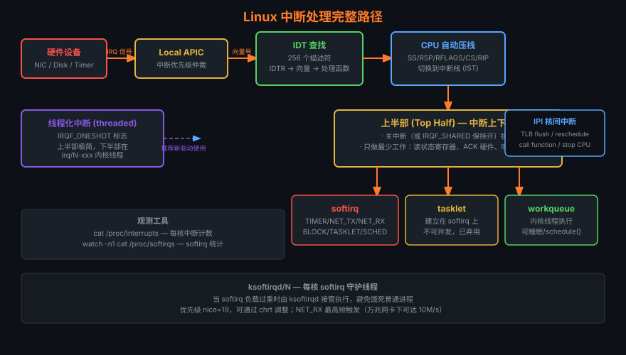

# 13 — 中断与异常

> **学习目标**：掌握 x86/ARM64 中断体系结构，理解 Linux 内核从硬件信号到驱动回调的完整处理路径，
> 能够分析中断延迟、合理使用 softirq/tasklet/workqueue/线程化中断，并对生产系统进行中断调优。



---

## 目录

| 节 | 主题 |
|----|------|
| 13.1 | 中断 vs 异常 |
| 13.2 | x86 IDT — 256 个向量 |
| 13.3 | APIC 架构 |
| 13.4 | IRQ 线与 /proc/interrupts |
| 13.5 | 中断处理上半部源码 |
| 13.6 | 中断上下文约束 |
| 13.7 | softirq |
| 13.8 | tasklet |
| 13.9 | workqueue (cmwq) |
| 13.10 | 线程化中断 |
| 13.11 | IPI 核间中断 |
| 13.12 | 中断亲和性调优 |
| 13.13 | 定时器中断与高精度时钟 |
| 13.14 | 中断延迟测量 |

---

## 13.1 中断 vs 异常

### 分类体系

```
CPU 控制流中断事件
├── 同步事件（异常 Exception）— 由当前指令引发
│   ├── 故障 Fault     — 可恢复，EIP 指向出错指令（缺页 #PF、段错误 #GP）
│   ├── 陷阱 Trap      — 可恢复，EIP 指向下一条指令（int3 断点、syscall）
│   ├── 中止 Abort     — 不可恢复（双重故障 #DF、机器检查 #MC）
│   └── 软件中断 INT n  — 程序主动触发（int 0x80 旧版 syscall）
└── 异步事件（中断 Interrupt）— 与当前指令无关
    ├── 可屏蔽中断 IRQ  — INTR 引脚，可被 CLI 屏蔽
    └── 不可屏蔽中断 NMI— NMI 引脚，watchdog/内存错误
```

### 关键区别对比表

| 维度 | 异常（同步） | 中断（异步） |
|------|------------|------------|
| 触发源 | CPU 执行指令 | 外部硬件/IPI |
| 可预测性 | 确定性 | 随机时序 |
| 保存的 RIP | 故障=出错指令；陷阱=下一条 | 被打断的下一条 |
| 典型例子 | `#PF`(14), `#GP`(13), `#UD`(6) | 键盘(IRQ1), 网卡(MSI) |
| 内核响应 | 发送信号/修复/杀进程 | 驱动 ISR + 下半部 |

### x86 异常向量（部分）

```c
/* arch/x86/include/asm/trapnr.h */
#define X86_TRAP_DE      0   /* 除零错误 */
#define X86_TRAP_DB      1   /* 调试陷阱 */
#define X86_TRAP_NMI     2   /* 不可屏蔽中断 */
#define X86_TRAP_BP      3   /* 断点 int3 */
#define X86_TRAP_OF      4   /* 溢出 */
#define X86_TRAP_BR      5   /* 边界检查 */
#define X86_TRAP_UD      6   /* 无效操作码 */
#define X86_TRAP_NM      7   /* 设备不可用（FPU） */
#define X86_TRAP_DF      8   /* 双重故障 */
#define X86_TRAP_TS     10   /* 无效 TSS */
#define X86_TRAP_NP     11   /* 段不存在 */
#define X86_TRAP_SS     12   /* 栈段故障 */
#define X86_TRAP_GP     13   /* 通用保护故障 */
#define X86_TRAP_PF     14   /* 缺页故障 */
#define X86_TRAP_MF     16   /* x87 FPU 错误 */
#define X86_TRAP_AC     17   /* 对齐检查 */
#define X86_TRAP_MC     18   /* 机器检查 */
#define X86_TRAP_XF     19   /* SIMD FP 异常 */
```

---

## 13.2 x86 中断向量表 (IDT)

### IDT 结构

x86-64 的 IDT 包含 256 个门描述符，每个 16 字节：

```
IDT（中断描述符表）
┌─────────────────────────────────────────────┐
│  向量 0–31   : CPU 保留异常（故障/陷阱/中止）  │
│  向量 32–47  : PIC 8259 遗留 IRQ（已弃用）    │
│  向量 32–255 : 硬件中断（APIC 分配）          │
│  向量 128(0x80): Linux 系统调用（int 0x80）   │
│  向量 239(0xEF): Local APIC 定时器           │
│  向量 242(0xF2): 热插拔 IPI                  │
│  向量 243(0xF3): 重调度 IPI                  │
│  向量 244(0xF4): 函数调用 IPI                │
│  向量 251(0xFB): IRQ Work IPI               │
│  向量 252(0xFC): x86 平台 IPI               │
│  向量 255(0xFF): APIC Spurious（伪中断）      │
└─────────────────────────────────────────────┘
```

### IDT 门描述符（64位）

```c
/* arch/x86/include/asm/desc_defs.h */
struct gate_struct {
    u16 offset_low;     /* 处理函数偏移 [15:0]  */
    u16 segment;        /* 代码段选择子          */
    struct idt_bits {
        u16 ist   : 3;  /* IST 栈索引（NMI用）  */
        u16 zero  : 5;
        u16 type  : 5;  /* 0xE=中断门,0xF=陷阱门*/
        u16 dpl   : 2;  /* 描述符特权级          */
        u16 p     : 1;  /* 存在位               */
    } bits;
    u16 offset_middle;  /* 偏移 [31:16]          */
    u32 offset_high;    /* 偏移 [63:32]          */
    u32 reserved;
} __attribute__((packed));
```

**中断门 vs 陷阱门**：中断门进入时自动 `CLI`（关中断），陷阱门不关。内核大多用中断门。

### 加载 IDT

```asm
; arch/x86/kernel/idt.c → load_current_idt()
lidt    idt_descr(%rip)   ; 加载 IDTR 寄存器
                          ; idt_descr = {limit=0xFFF, base=idt_table}
```

---

## 13.3 APIC 架构

### 演进历史

```
8259A PIC（传统）
  ├── 主 PIC：IRQ0-7  → 向量 32-39
  └── 从 PIC：IRQ8-15 → 向量 40-47
  缺点：仅支持单处理器，EOI 串行化

APIC 体系（现代）
  ├── Local APIC（每个 CPU 核心一个）
  │   ├── 接收来自 IO-APIC 的中断
  │   ├── 发送/接收 IPI
  │   ├── 本地定时器（LAPIC Timer）
  │   └── 性能计数器/温度传感器中断
  ├── IO-APIC（芯片组，通常 1-3 个）
  │   ├── 24~120 个输入引脚
  │   ├── 重定向表（RTE）：引脚→向量→目标CPU
  │   └── 支持电平/边沿触发
  └── MSI / MSI-X（PCIe 设备直写 LAPIC）
      ├── 无需中断线，写内存地址触发
      ├── MSI：最多 32 个向量
      └── MSI-X：最多 2048 个向量，每个独立配置
```

### Local APIC 寄存器（MMIO，基址 0xFEE00000）

```c
/* 关键寄存器偏移 */
#define APIC_ID         0x020  /* APIC ID */
#define APIC_LVR        0x030  /* 版本寄存器 */
#define APIC_TASKPRI    0x080  /* 任务优先级（TPR）*/
#define APIC_EOI        0x0B0  /* 中断结束寄存器 */
#define APIC_LDR        0x0D0  /* 逻辑目标寄存器 */
#define APIC_SPIV       0x0F0  /* 伪中断向量/使能位 */
#define APIC_ICR        0x300  /* 中断命令寄存器（低32位）*/
#define APIC_ICR2       0x310  /* 中断命令寄存器（高32位）*/
#define APIC_LVTT       0x320  /* 定时器 LVT 条目 */
#define APIC_TMICT      0x380  /* 定时器初始计数 */
#define APIC_TMCCT      0x390  /* 定时器当前计数 */
```

### 查看 APIC 信息

```bash
# 查看 IO-APIC 路由表
cat /proc/interrupts | head -5
cat /sys/firmware/acpi/tables/APIC   # MADT 表

# x2APIC 模式检查（现代大系统）
dmesg | grep -i apic
grep -i apic /proc/cpuinfo | head -3

# 查看 MSI 分配
lspci -v | grep -A5 "MSI"
```

---

## 13.4 中断请求线 (IRQ)

### /proc/interrupts 格式解析

```
           CPU0       CPU1       CPU2       CPU3
  0:         46          0          0          0  IO-APIC   2-edge      timer
  1:          0          0          0          9  IO-APIC   1-edge      i8042
 16:          0          0          0          0  IO-APIC  16-fasteoi   ehci_hcd
 23:          1          0          0          0  IO-APIC  23-fasteoi   ehci_hcd
 56:          0      74821          0          0  PCI-MSI 524288-edge   nvme0q0
 57:      12431          0      98234          0  PCI-MSI 524289-edge   nvme0q1

列说明：
  [向量/IRQ号] [各CPU计数...] [中断控制器] [触发类型] [设备名]
```

### /proc/irq/N/ 目录结构

```bash
ls /proc/irq/56/
# affinity_hint          每次中断后建议亲和性
# effective_affinity     实际生效的亲和性掩码
# effective_affinity_list  CPU 列表格式
# node                   NUMA 节点
# smp_affinity           CPU 亲和性位掩码（十六进制）
# smp_affinity_list      CPU 亲和性列表（十进制范围）
# spurious               伪中断统计

# 读取 IRQ 56 的亲和性
cat /proc/irq/56/smp_affinity       # e.g. "0000000f" = CPU 0-3
cat /proc/irq/56/smp_affinity_list  # e.g. "0-3"

# 设置 IRQ 56 只在 CPU2 上处理
echo "4" > /proc/irq/56/smp_affinity        # 位掩码：CPU2=bit2=4
echo "2" > /proc/irq/56/smp_affinity_list   # 直接指定 CPU2
```

### irqdesc 数据结构

```c
/* include/linux/irqdesc.h */
struct irq_desc {
    struct irq_common_data  irq_common_data;
    struct irq_data         irq_data;
    unsigned int __percpu  *kstat_irqs;  /* 每 CPU 计数 */
    irq_flow_handler_t      handle_irq;  /* 流处理函数 */
    struct irqaction       *action;      /* IRQ action 链表 */
    unsigned int            status_use_accessors;
    unsigned int            core_internal_state__do_not_mess_with_it;
    unsigned int            depth;       /* 嵌套禁用计数 */
    unsigned int            wake_depth;  /* wakeup 计数 */
    unsigned int            tot_count;
    unsigned int            irq_count;   /* 用于检测卡死 */
    unsigned long           last_unhandled; /* 未处理时间戳 */
    unsigned int            irqs_unhandled;
    atomic_t                threads_handled;
    int                     threads_handled_last;
    raw_spinlock_t          lock;
    struct cpumask          *percpu_enabled;
    const struct cpumask    *percpu_affinity;
    const struct cpumask    *affinity_hint;
    struct irq_affinity_notify *affinity_notify;
    cpumask_var_t           pending_mask;
    unsigned long           threads_oneshot;
    atomic_t                threads_active;
    wait_queue_head_t       wait_for_threads;
} ____cacheline_internodealigned_in_smp;
```

---

## 13.5 中断处理上半部源码

### 硬件触发到驱动回调的完整路径

```
硬件设备发出中断信号
    ↓
Local APIC 接收，写入 IRR（中断请求寄存器）
    ↓
CPU 完成当前指令，检查 IF 标志
    ↓
CPU 从 IDT[vector] 取门描述符，切换到内核栈
    ↓
common_interrupt()  ← arch/x86/kernel/irq.c
    ↓
handle_irq(irq_desc)
    ↓
desc->handle_irq(desc)  ← 流处理函数
    │   handle_edge_irq()    — 边沿触发
    │   handle_fasteoi_irq() — 电平触发（IO-APIC FASTeoI）
    │   handle_percpu_irq()  — per-CPU 中断
    ↓
__handle_irq_event_percpu(desc)
    ↓
for each action in desc->action:
    action->handler(irq, action->dev_id)  ← 驱动 ISR
    ↓
写 LAPIC EOI 寄存器（告知中断结束）
    ↓
iret / eret  返回被打断的上下文
```

### 关键源码片段（kernel 6.x）

```c
/* arch/x86/kernel/irq.c */
DEFINE_IDTENTRY_IRQ(common_interrupt)
{
    struct pt_regs *old_regs = set_irq_regs(regs);
    struct irq_desc *desc;

    /* 处理 APIC 向量，转换为 Linux IRQ 号 */
    desc = __this_cpu_read(vector_irq[vector]);

    if (likely(!IS_ERR_OR_NULL(desc))) {
        handle_irq(desc, regs);
    } else {
        ack_APIC_irq();  /* 必须写 EOI，否则 APIC 卡死 */
    }

    set_irq_regs(old_regs);
}

/* kernel/irq/handle.c */
irqreturn_t __handle_irq_event_percpu(struct irq_desc *desc)
{
    irqreturn_t retval = IRQ_NONE;
    unsigned int irq = desc->irq_data.irq;
    struct irqaction *action;

    record_irq_time(desc);

    for_each_action_of_desc(desc, action) {
        irqreturn_t res;

        trace_irq_handler_entry(irq, action);
        res = action->handler(irq, action->dev_id);
        trace_irq_handler_exit(irq, action, res);

        if (WARN_ONCE(!irqs_disabled(),
                      "irq %u handler %ps enabled interrupts\n",
                      irq, action->handler))
            local_irq_disable();

        switch (res) {
        case IRQ_WAKE_THREAD:
            __irq_wake_thread(desc, action);
            /* fall through */
        case IRQ_HANDLED:
            retval = IRQ_HANDLED;
            break;
        default:
            break;
        }
    }
    return retval;
}
```

### 注册中断

```c
/* 驱动中注册中断的标准方式 */
ret = request_irq(irq,                    /* IRQ 号 */
                  my_interrupt_handler,   /* 处理函数 */
                  IRQF_SHARED,            /* 标志 */
                  "my_device",            /* 名称（/proc/interrupts）*/
                  dev);                   /* dev_id，共享 IRQ 用于区分 */

/* IRQF 标志 */
IRQF_SHARED        /* 允许多驱动共享同一 IRQ */
IRQF_TRIGGER_RISING  /* 上升沿触发 */
IRQF_TRIGGER_LEVEL   /* 电平触发 */
IRQF_NOBALANCING     /* 禁止 irqbalance 调整 */
IRQF_PERCPU          /* per-CPU 中断 */
IRQF_NO_THREAD       /* 禁止线程化 */
```

---

## 13.6 中断上下文约束

### 为什么中断上下文不能睡眠

```
进程 A 运行在 CPU0
    ↓
硬件中断发生，CPU 跳入 ISR
    ↓
ISR 调用 mutex_lock() → 尝试睡眠
    ↓
schedule() 被调用 → 试图切换到进程 B
    ↓
问题：当前"进程"不是真正的进程，没有 task_struct 可以切换！
      内核栈处于中断上下文，恢复时无法正确还原
      → 内核崩溃 / 数据损坏
```

### 检查是否在中断上下文

```c
/* include/linux/preempt.h */
#define in_interrupt()    (irq_count())          /* 硬中断+软中断 */
#define in_irq()          (hardirq_count())      /* 仅硬中断 */
#define in_softirq()      (softirq_count())      /* 仅软中断 */
#define in_serving_softirq() (softirq_count() & SOFTIRQ_OFFSET)
#define in_nmi()          (preempt_count() & NMI_MASK)
#define in_task()         (!(in_nmi() | in_irq() | in_softirq()))

/* 调试：BUG_ON 检查 */
might_sleep();           /* 若在中断上下文则警告 */
BUG_ON(in_interrupt());  /* 强制检查 */
```

### 中断栈大小

```bash
# x86-64：每个 CPU 的中断栈 = 16KB（IRQ_STACK_SIZE）
grep IRQ_STACK_SIZE arch/x86/include/asm/page_64_types.h
# #define IRQ_STACK_SIZE (PAGE_SIZE << ORDER_IRQ_STACK)
# ORDER_IRQ_STACK = 2 → 4 * 4096 = 16384 bytes

# 查看内核栈使用
cat /proc/$(pgrep -f "kworker" | head -1)/status | grep VmStk

# 特殊栈（x86-64 IST）：
# IST1 = #DB 调试栈    (8KB)
# IST2 = #NMI 不可屏蔽中断栈 (8KB)
# IST3 = #DF 双重故障栈  (8KB)
# IST4 = #MCE 机器检查栈 (8KB)
```

---

## 13.7 softirq（软中断）

### 10 种 softirq 类型

```c
/* include/linux/interrupt.h */
enum {
    HI_SOFTIRQ = 0,      /* 高优先级 tasklet */
    TIMER_SOFTIRQ,       /* 定时器超时处理 */
    NET_TX_SOFTIRQ,      /* 网络发送 */
    NET_RX_SOFTIRQ,      /* 网络接收（最高频） */
    BLOCK_SOFTIRQ,       /* 块设备 IO 完成 */
    IRQ_POLL_SOFTIRQ,    /* IRQ 轮询 */
    TASKLET_SOFTIRQ,     /* 普通 tasklet */
    SCHED_SOFTIRQ,       /* 调度器（负载均衡）*/
    HRTIMER_SOFTIRQ,     /* 高精度定时器 */
    RCU_SOFTIRQ,         /* RCU 回调处理 */
    NR_SOFTIRQS          /* = 10 */
};
```

### softirq 执行路径

```
硬件中断 ISR 结尾
    ↓
raise_softirq(NET_RX_SOFTIRQ)
    ↓
设置 per-CPU 位图 __softirq_pending
    ↓
irq_exit() → __do_softirq()
    ↓
循环处理 pending 位图
    for each pending softirq:
        softirq_vec[i].action(h)  ← 注册的处理函数
    如果处理超时(2ms)或新 softirq 出现 > 10次：
        wakeup ksoftirqd/N 线程处理剩余
```

### 核心源码

```c
/* kernel/softirq.c */
asmlinkage __visible void __softirq_entry __do_softirq(void)
{
    unsigned long end = jiffies + MAX_SOFTIRQ_TIME;  /* 2ms 时限 */
    unsigned long old_flags = current->flags;
    int max_restart = MAX_SOFTIRQ_RESTART;           /* 10 次 */
    struct softirq_action *h;
    __u32 pending;
    int softirq_bit;

    pending = local_softirq_pending();

restart:
    set_softirq_pending(0);       /* 清除 pending 位图 */
    local_irq_enable();           /* 重新开中断（允许新中断打断softirq）*/

    h = softirq_vec;
    while ((softirq_bit = ffs(pending))) {
        unsigned int vec_nr;
        int prev_count;

        h += softirq_bit - 1;
        vec_nr = h - softirq_vec;

        trace_softirq_entry(vec_nr);
        h->action(h);             /* 执行 softirq 处理函数 */
        trace_softirq_exit(vec_nr);

        h++;
        pending >>= softirq_bit;
    }

    local_irq_disable();
    pending = local_softirq_pending();
    if (pending) {
        if (time_before(jiffies, end) && !need_resched() &&
            --max_restart)
            goto restart;
        wakeup_softirqd();        /* 唤醒 ksoftirqd */
    }
    current->flags |= old_flags & PF_MEMALLOC;
}

/* 注册 softirq（编译时静态注册）*/
void open_softirq(int nr, void (*action)(struct softirq_action *))
{
    softirq_vec[nr].action = action;
}
```

### ksoftirqd 线程

```bash
# 每个 CPU 一个 ksoftirqd 线程
ps aux | grep ksoftirqd
# root         14  0.0  0.0      0     0 ?  S    00:00   0:00 [ksoftirqd/0]
# root         23  0.0  0.0      0     0 ?  S    00:00   0:00 [ksoftirqd/1]

# 查看 softirq 统计
cat /proc/softirqs
#                     CPU0       CPU1       CPU2       CPU3
#           HI:          1          0          0          0
#        TIMER:     432891     412043     398012     441293
#       NET_TX:        234        891        123        456
#       NET_RX:    1234567    2345678     987654    1654321
#        BLOCK:      98234      87654      76543      65432
#     IRQ_POLL:          0          0          0          0
#      TASKLET:       1234       2345       3456       4567
#        SCHED:     234567     345678     456789     567890
#      HRTIMER:      12345      23456      34567      45678
#          RCU:     345678     456789     567890     678901
```

---

## 13.8 tasklet

### tasklet 基于 softirq 的实现

```c
/* include/linux/interrupt.h */
struct tasklet_struct {
    struct tasklet_struct *next;  /* 链表 */
    unsigned long          state; /* TASKLET_STATE_SCHED/LOCK */
    atomic_t               count; /* 引用计数，非零则禁用 */
    bool                   use_callback;
    union {
        void (*func)(unsigned long);     /* 旧接口 */
        void (*callback)(struct tasklet_struct *); /* 新接口 */
    };
    unsigned long          data;  /* 传给 func 的参数 */
};

/* 静态定义 */
DECLARE_TASKLET(name, callback);
DECLARE_TASKLET_DISABLED(name, callback);

/* 动态初始化 */
tasklet_init(t, func, data);
tasklet_setup(t, callback);  /* 6.x 新接口 */

/* 调度执行（在 TASKLET_SOFTIRQ 或 HI_SOFTIRQ）*/
tasklet_schedule(&my_tasklet);
tasklet_hi_schedule(&my_tasklet);  /* 高优先级 */

/* 禁用/启用 */
tasklet_disable(&my_tasklet);  /* 等待正在执行的完成 */
tasklet_enable(&my_tasklet);
tasklet_kill(&my_tasklet);     /* 确保不再运行后销毁 */
```

### ⚠️ tasklet 在 6.x 内核中的弃用

```
Linux 6.1+ 内核：tasklet 官方标记为 deprecated
原因：
  1. 不能并发执行（同一 tasklet 同时只在一个 CPU）
  2. 不能睡眠（依然在 softirq 上下文）
  3. 长时间延迟低优先级工作
替代方案：
  - 短小非睡眠工作 → 直接写 softirq（驱动核心用）
  - 可睡眠工作     → workqueue
  - 线程化处理     → request_threaded_irq()
```

---

## 13.9 workqueue (cmwq)

### Concurrency Managed Workqueue 架构

```
cmwq（并发管理 workqueue）架构（2.6.36+）

驱动调用 queue_work(wq, &work)
    ↓
工作项加入 per-CPU 的 pool_workqueue
    ↓
worker_pool（每个 NUMA 节点 × bound/unbound × 优先级）
    ↓
worker 线程（kworker/uN:M）执行 work->func()
    ↓
cmwq 动态创建/销毁 worker 线程（min=0，max=512）
```

### 创建和使用 workqueue

```c
/* 创建 workqueue */
struct workqueue_struct *wq;

/* 简单创建 */
wq = create_singlethread_workqueue("my_wq");   /* 单线程（有序）*/
wq = create_workqueue("my_wq");                /* 每CPU一个线程（弃用）*/

/* 推荐：alloc_workqueue */
wq = alloc_workqueue("my_wq",
    WQ_UNBOUND |        /* 不绑定CPU，允许迁移 */
    WQ_MEM_RECLAIM |    /* 参与内存回收 */
    WQ_HIGHPRI |        /* 高优先级 worker */
    WQ_FREEZABLE |      /* 休眠时冻结 */
    WQ_SYSFS,           /* 在 sysfs 暴露 */
    max_active);        /* 并发上限，0=默认 */

/* 定义工作项 */
DECLARE_WORK(my_work, my_work_handler);
DECLARE_DELAYED_WORK(my_dwork, my_delayed_handler);

/* 动态初始化 */
INIT_WORK(&work, handler);
INIT_DELAYED_WORK(&dwork, handler);

/* 提交工作 */
queue_work(wq, &work);
queue_delayed_work(wq, &dwork, msecs_to_jiffies(100));

/* 系统预定义 workqueue */
schedule_work(&work);                    /* system_wq */
schedule_delayed_work(&dwork, delay);   /* system_wq */

/* 等待所有工作完成 */
flush_workqueue(wq);
flush_work(&work);          /* 等待特定工作完成 */
cancel_work_sync(&work);    /* 取消并等待 */

/* 销毁 */
destroy_workqueue(wq);
```

### 查看 kworker 线程

```bash
# 列出所有 kworker 线程
ps aux | grep kworker
# kworker/0:1H  — CPU0, 线程1, H=高优先级
# kworker/u8:3  — unbound, 8个CPU, 线程3

# 查看 workqueue 信息
cat /sys/kernel/debug/workqueue/
ls /sys/bus/workqueue/devices/

# 统计
cat /proc/workqueue_stats  # 需要 CONFIG_WQ_WATCHDOG
```

---

## 13.10 线程化中断 (Threaded IRQ)

### 原理与动机

```
传统中断模型：
  硬中断（上半部）→ 快速处理 → softirq/tasklet/workqueue（下半部）
  问题：softirq 在中断上下文，延迟大，实时性差

线程化中断模型：
  硬中断（最小处理，返回IRQ_WAKE_THREAD）
      ↓
  唤醒 irq/N-name 内核线程
      ↓
  线程中执行完整处理（可睡眠！可设置优先级！）
  优势：可被调度器管理，支持实时优先级（PREEMPT_RT）
```

### request_threaded_irq()

```c
/* kernel/irq/manage.c */
int request_threaded_irq(unsigned int irq,
                         irq_handler_t handler,      /* 上半部（快速）*/
                         irq_handler_t thread_fn,    /* 下半部（线程）*/
                         unsigned long irqflags,
                         const char *devname,
                         void *dev_id);

/* 示例：网卡驱动 */
static irqreturn_t nic_hard_irq(int irq, void *dev_id)
{
    struct nic_priv *priv = dev_id;

    /* 快速读取中断原因，清除中断 */
    priv->irq_status = readl(priv->base + IRQ_STATUS);
    writel(priv->irq_status, priv->base + IRQ_CLEAR);

    /* 唤醒线程处理 */
    return IRQ_WAKE_THREAD;
}

static irqreturn_t nic_thread_irq(int irq, void *dev_id)
{
    struct nic_priv *priv = dev_id;

    /* 可以睡眠！可以调用 mutex_lock！*/
    if (priv->irq_status & RX_COMPLETE)
        nic_rx_process(priv);
    if (priv->irq_status & TX_COMPLETE)
        nic_tx_cleanup(priv);

    return IRQ_HANDLED;
}

/* 注册：IRQF_ONESHOT 表示线程处理完前不重新使能中断 */
request_threaded_irq(irq, nic_hard_irq, nic_thread_irq,
                     IRQF_SHARED | IRQF_ONESHOT, "nic", priv);
```

### 查看线程化中断线程

```bash
# 查看中断线程
ps aux | grep "irq/"
# root       345  0.0  0.0  0  0 ? S  irq/56-nvme0q0

# 设置实时优先级（对延迟敏感的中断）
chrt -f -p 50 $(pgrep -f "irq/56-nvme")

# 查看线程化 IRQ 的优先级
cat /proc/$(pgrep -f "irq/56")/sched | grep policy
```

---

## 13.11 IPI (核间中断)

### IPI 类型与用途

```c
/* arch/x86/include/asm/hw_irq.h — IPI 向量分配 */
#define RESCHEDULE_VECTOR         0xfd  /* 重调度：wake_up_process 跨核 */
#define CALL_FUNCTION_VECTOR      0xfc  /* smp_call_function_many() */
#define CALL_FUNCTION_SINGLE_VECTOR 0xfb /* smp_call_function_single() */
#define REBOOT_VECTOR             0xf8  /* 重启 IPI */

/* TLB shootdown IPI（flush_tlb_others）*/
#define INVALIDATE_TLB_VECTOR_START 0xef
```

### 发送 IPI

```c
/* 在特定 CPU 上执行函数 */
smp_call_function_single(cpu,    /* 目标 CPU */
                         func,   /* 要执行的函数 */
                         info,   /* 参数 */
                         wait);  /* 是否等待完成 */

/* 在所有 CPU（除当前）上执行 */
smp_call_function(func, info, wait);

/* 触发重调度 IPI */
smp_send_reschedule(cpu);  /* 告知目标 CPU 需要重新调度 */

/* TLB 失效 IPI（mm/tlb.c）*/
flush_tlb_mm_range(mm, start, end, stride_shift, freed_tables);
```

### IPI 性能影响

```bash
# 统计 TLB shootdown 次数
perf stat -e tlb:tlb_flush -a sleep 5

# 追踪 IPI
trace-cmd record -e 'ipi:*' sleep 1
trace-cmd report | grep ipi

# 减少 TLB shootdown：
# 1. 使用大页（减少 PTE 条目数）
# 2. 进程绑定 CPU（减少跨核迁移）
# 3. NUMA aware 分配
```

---

## 13.12 中断亲和性调优

### irqbalance 守护进程

```bash
# irqbalance 自动将中断分散到各 CPU
systemctl status irqbalance
cat /etc/sysconfig/irqbalance  # 或 /etc/default/irqbalance

# 禁用特定 IRQ 的自动均衡（手动管理）
# IRQBALANCE_BANNED_IRQS="56 57 58"

# 查看当前分配
irqbalance --debug --foreground --oneshot 2>&1 | head -50
```

### 手动设置亲和性

```bash
# 查找网卡中断
grep eth0 /proc/interrupts
# 或
ls -la /sys/class/net/eth0/device/msi_irqs/

# 将 IRQ 56-59 绑定到 CPU 4-7（位掩码 0xF0 = 11110000）
for irq in 56 57 58 59; do
    echo "f0" > /proc/irq/$irq/smp_affinity
done

# 使用列表格式（更直观）
echo "4-7" > /proc/irq/56/smp_affinity_list

# 配合 CPU 隔离（isolcpus）
# 内核参数：isolcpus=4-7 nohz_full=4-7 rcu_nocbs=4-7
# 隔离 CPU 不接收 irqbalance 分配的中断
```

### NOHZ_FULL 与中断影响

```bash
# 查看 NOHZ 配置
cat /sys/devices/system/cpu/nohz_full   # 哪些 CPU 启用了 nohz_full
cat /sys/devices/system/cpu/isolated    # 哪些 CPU 被隔离

# 检查 timer tick 是否被禁用
perf stat -C 4 -e irq_vectors:local_timer_entry sleep 5
# 正常系统：~1000/s（HZ=1000）
# nohz_full CPU：接近 0（无进程运行时）
```

---

## 13.13 定时器中断与高精度时钟

### HZ 与 jiffies

```c
/* include/asm-generic/param.h */
#define HZ     CONFIG_HZ  /* 通常 250 或 1000 */

/* kernel/time/jiffies.c */
/* jiffies：系统启动以来的 tick 数（无符号长整型）*/
extern unsigned long volatile jiffies;

/* 时间转换宏 */
msecs_to_jiffies(500)      /* 500ms → jiffies */
jiffies_to_msecs(j)        /* jiffies → ms */
time_after(a, b)           /* a > b（处理回绕）*/
time_before(a, b)          /* a < b */
```

### hrtimer（高精度定时器）

```c
/* include/linux/hrtimer.h */
struct hrtimer {
    struct timerqueue_node  node;
    ktime_t                 _softexpires;
    enum hrtimer_restart  (*function)(struct hrtimer *);
    struct hrtimer_clock_base *base;
    u8                      state;
    u8                      is_rel;
    u8                      is_soft;
    u8                      is_hard;
};

/* 使用 hrtimer */
struct hrtimer htimer;
hrtimer_init(&htimer, CLOCK_MONOTONIC, HRTIMER_MODE_REL);
htimer.function = my_hrtimer_callback;
hrtimer_start(&htimer, ns_to_ktime(1000000), HRTIMER_MODE_REL); /* 1ms */

static enum hrtimer_restart my_hrtimer_callback(struct hrtimer *timer)
{
    /* 周期性：前进到下一个到期时间 */
    hrtimer_forward_now(timer, ns_to_ktime(1000000));
    return HRTIMER_RESTART;
    /* 或一次性：return HRTIMER_NORESTART; */
}
```

### 动态 tick (NO_HZ)

```bash
# 配置选项
grep -E "NO_HZ|CONFIG_HZ" /boot/config-$(uname -r)
# CONFIG_HZ_1000=y            — tick 频率 1000 Hz
# CONFIG_NO_HZ_IDLE=y         — 空闲时停止 tick
# CONFIG_NO_HZ_FULL=y         — 运行时也可停止（需 isolcpus）
# CONFIG_HIGH_RES_TIMERS=y    — 高精度定时器

# 查看 tick 模式
cat /sys/devices/system/clocksource/clocksource0/current_clocksource
# tsc 或 hpet 或 acpi_pm

# 验证高精度定时器
cat /proc/timer_list | grep -A3 "hrtimer"
dmesg | grep "Timer resolution"
```

### 时钟源对比

| 时钟源 | 精度 | 开销 | 适用场景 |
|--------|------|------|----------|
| TSC | 亚纳秒 | 极低 | 现代 SMP（invariant TSC）|
| HPET | ~100ns | 中等 | 无 invariant TSC 时 |
| ACPI PM | ~1µs | 高（IO 访问）| 回退方案 |
| kvm-clock | 亚纳秒 | 极低 | 虚拟化环境 |

---

## 13.14 中断延迟测量

### cyclictest（实时延迟测量）

```bash
# 安装
apt install rt-tests  # 或 dnf install rt-tests

# 基本测试：测量中断/调度延迟
cyclictest --mlockall \
           --smp \              # 测试所有 CPU
           --priority=99 \     # 实时优先级
           --policy=fifo \     # SCHED_FIFO
           --interval=200 \    # 200µs 周期
           --distance=0 \      # CPU 间无偏移
           --duration=60 \     # 持续 60 秒
           --histogram=400 \   # 记录延迟直方图（µs）
           --histfile=hist.txt

# 结果解读：
# T: 0 (34521) A:   8 C: 300000 Min:      4 Act:    6 Avg:    8 Max:      67
# T=线程, A=超出阈值次数, Min/Avg/Max 单位 µs
# Max < 100µs → 良好；Max > 1ms → 需要调查
```

### ftrace irq_handler 追踪

```bash
# 挂载 tracefs
mount -t tracefs tracefs /sys/kernel/tracing

# 追踪中断处理时间
cd /sys/kernel/tracing
echo 0 > tracing_on
echo "irq_handler_entry irq_handler_exit" > set_event
echo 1 > tracing_on
sleep 1
echo 0 > tracing_on

# 分析结果：找出最慢的中断处理
cat trace | awk '
/irq_handler_entry/ { irq=$NF; start=NR }
/irq_handler_exit/  { print NR-start, irq }
' | sort -n | tail -20
```

### perf stat 中断统计

```bash
# 统计中断相关 PMU 事件
perf stat -e \
  irq_vectors:local_timer_entry,\
  irq_vectors:reschedule_entry,\
  irq_vectors:call_function_entry,\
  irq_vectors:irq_work_entry \
  -a sleep 5

# 追踪高频中断驱动
perf top -e irq:irq_handler_entry --sort comm,sym

# 记录中断延迟（从硬件到 ISR 入口）
perf record -e irq:irq_handler_entry -a sleep 5
perf script | head -50
```

### 诊断中断延迟抖动

```bash
# 1. 检查是否有 SMI（系统管理中断）
# SMI 是 BIOS/固件触发的不可屏蔽中断，可造成 >1ms 延迟
# 使用 MSR 0x34 读取 SMI 计数器
rdmsr -a 0x34   # 需要 msr 内核模块

# 2. 检查 CPU 频率抖动
grep MHz /proc/cpuinfo | sort -u
cpupower frequency-info

# 3. 禁用 CPU 深度睡眠（C-state）
cpupower idle-set -D 1  # 最多 C1
# 或内核参数：intel_idle.max_cstate=1

# 4. 关闭 SMT（超线程）减少干扰
echo off > /sys/devices/system/cpu/smt/control

# 5. 检查 NUMA 跨节点内存访问
numastat -c | head -20
```

---

## 参考资料

| 资源 | 链接/位置 |
|------|----------|
| Linux 内核源码 | `kernel/irq/`, `arch/x86/kernel/irq.c` |
| APIC 规范 | Intel SDM Vol.3 Chapter 10 |
| RT 补丁文档 | `Documentation/timers/hrtimers.rst` |
| IRQ 文档 | `Documentation/core-api/genericirq.rst` |
| cyclictest | `https://wiki.linuxfoundation.org/realtime/documentation/howto/tools/cyclictest` |
| ftrace 文档 | `Documentation/trace/ftrace.rst` |

```bash
# 快速参考命令汇总
watch -n1 'cat /proc/interrupts'           # 实时监控中断
cat /proc/softirqs                         # softirq 统计
cat /proc/irq/*/spurious                   # 伪中断统计
echo 1 > /proc/sys/kernel/panic_on_unrecovered_nmi  # NMI 触发 panic
dmesg | grep -i "irq\|interrupt" | tail -30  # 内核中断日志
```
