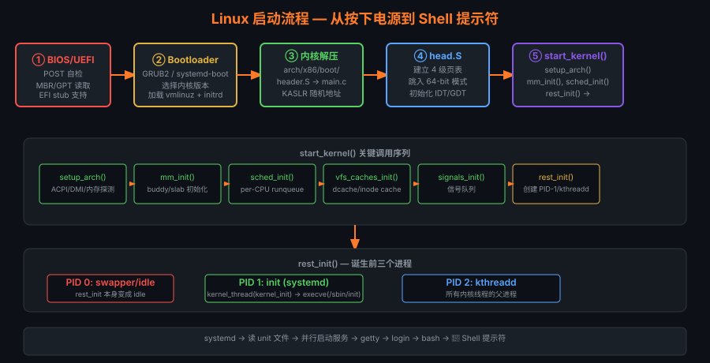

# 14 — 启动流程深入

> **学习目标**：彻底理解从按下电源键到第一个用户进程运行的每个阶段，包括固件初始化、
> 引导加载程序、内核解压、早期初始化、initramfs 和 systemd 启动序列，能够调试各阶段故障。



---

## 目录

| 节 | 主题 |
|----|------|
| 14.1 | BIOS vs UEFI 对比 |
| 14.2 | MBR 传统启动 |
| 14.3 | UEFI 启动链 |
| 14.4 | GRUB2 深入 |
| 14.5 | 内核命令行参数 |
| 14.6 | bzImage 解压流程 |
| 14.7 | arch/x86/boot/main.c |
| 14.8 | head_64.S 初始页表 |
| 14.9 | start_kernel() 调用序列 |
| 14.10 | initramfs / initrd |
| 14.11 | PID 1: systemd |
| 14.12 | KASLR |
| 14.13 | 启动时间优化 |
| 14.14 | 调试启动问题 |

---

## 14.1 BIOS vs UEFI 对比

### 详细对比表

| 特性 | Legacy BIOS | UEFI |
|------|-------------|------|
| 固件接口标准 | IBM PC 1981，非标准 | UEFI 规范 2.x（统一） |
| 寻址空间 | 16 位实模式，1MB 上限 | 64 位保护模式，无上限 |
| 磁盘分区表 | MBR（最大 2TB，4 主分区）| GPT（最大 9.4ZB，128 分区）|
| 安全启动 | 不支持 | Secure Boot（数字签名验证）|
| 网络启动 | PXE（仅 BIOS 阶段）| PXE + HTTP Boot |
| 固件驱动 | 汇编/16位C | EFI 驱动（PE 格式）|
| 启动时间 | 慢（POST 全量检测）| 快（可跳过硬件初始化）|
| 交互界面 | 文本 VGA | 图形 GOP（支持鼠标）|
| 变量存储 | CMOS（256字节）| NVRAM（EFI 变量，任意大小）|
| 兼容性 | CSM 兼容模块提供 | 原生 UEFI 或 CSM 回退 |
| 启动入口 | MBR 第一扇区 (0x7C00) | EFI 系统分区 .efi 文件 |

### UEFI 启动管理器

```bash
# 查看 UEFI 启动条目
efibootmgr -v
# BootOrder: 0001,0000,0002
# Boot0000* ubuntu  HD(...)/EFI/ubuntu/shimx64.efi
# Boot0001* Windows HD(...)/EFI/Microsoft/Boot/bootmgfw.efi

# 添加启动条目
efibootmgr --create \
    --disk /dev/sda \
    --part 1 \
    --label "My Linux" \
    --loader '\EFI\linux\grubx64.efi'

# 设置启动顺序
efibootmgr --bootorder 0000,0001

# 查看 EFI 变量
ls /sys/firmware/efi/efivars/
cat /sys/firmware/efi/fw_platform_size  # 32 或 64
```

---

## 14.2 MBR 传统启动

### MBR 512 字节结构

```
MBR（Master Boot Record）布局
╔══════════════════════════════════════════╗
║  偏移    大小    内容                     ║
╠══════════════════════════════════════════╣
║  0x000   446字节  Bootstrap 代码（Stage1）║
║  0x1BE    16字节  分区表条目 1            ║
║  0x1CE    16字节  分区表条目 2            ║
║  0x1DE    16字节  分区表条目 3            ║
║  0x1EE    16字节  分区表条目 4            ║
║  0x1FE     2字节  魔数 0x55AA            ║
╚══════════════════════════════════════════╝

分区表条目（16字节）：
  [0]    状态（0x80=可启动，0x00=不可启动）
  [1-3]  CHS 起始地址（已过时）
  [4]    分区类型（0x83=Linux，0x82=Swap，0x8E=LVM）
  [5-7]  CHS 结束地址（已过时）
  [8-11] LBA 起始扇区（32位，支持到2TB）
  [12-15]扇区数量
```

### GRUB Legacy 三阶段启动

```
Stage 1  (MBR 446字节)
  ↓  加载 Stage1.5（位于 MBR 之后的扇区，不依赖文件系统）
Stage 1.5 (~32KB，嵌入 MBR 间隙)
  ↓  理解文件系统（ext4/xfs/fat）
  ↓  从文件系统加载 Stage2
Stage 2  (/boot/grub/grub.cfg + 模块)
  ↓  显示菜单，解析配置
  ↓  加载内核 + initramfs
  ↓  传递参数，跳转执行
```

### 查看和备份 MBR

```bash
# 备份 MBR
dd if=/dev/sda of=mbr_backup.bin bs=512 count=1

# 查看分区表
fdisk -l /dev/sda
hexdump -C mbr_backup.bin | head -40

# 恢复 MBR（保留分区表）
dd if=mbr_backup.bin of=/dev/sda bs=446 count=1

# 查看 GRUB 安装信息
grub-install --target=i386-pc --dry-run /dev/sda
```

---

## 14.3 UEFI 启动链

### EFI 系统分区 (ESP)

```
ESP（FAT32 格式，通常 100-512MB）
└── EFI/
    ├── BOOT/
    │   └── BOOTX64.EFI          ← 默认启动（可移动介质）
    ├── ubuntu/
    │   ├── shimx64.efi          ← Shim（处理 Secure Boot）
    │   ├── grubx64.efi          ← GRUB EFI 版本
    │   └── grub.cfg
    ├── Microsoft/
    │   └── Boot/
    │       └── bootmgfw.efi
    └── linux/
        └── vmlinuz.efi          ← EFI stub 直接启动
```

### Secure Boot 信任链

```
UEFI 固件（包含 PK/KEK/db 密钥）
    ↓  验证签名
shimx64.efi（微软签名的 Shim）
    ↓  验证 GRUB 签名（使用 MOK 或发行版密钥）
grubx64.efi（发行版签名的 GRUB）
    ↓  验证内核签名
vmlinuz（发行版签名的内核）
    ↓  内核验证模块签名（MODULES_SIG）
.ko 模块文件

密钥层次：
  PK（平台密钥）→ 设备制造商（OEM）
  KEK（密钥交换密钥）→ 操作系统厂商
  db（签名数据库）→ 允许的启动程序
  dbx（黑名单数据库）→ 禁止的启动程序
```

### EFI Stub 直接启动（无需 GRUB）

```bash
# 内核自带 EFI stub（CONFIG_EFI_STUB=y）
# 可以直接从 UEFI 加载内核

# 查看 EFI stub 支持
grep EFI_STUB /boot/config-$(uname -r)

# 安装内核为 EFI 启动项
efibootmgr --create \
    --disk /dev/nvme0n1 \
    --part 1 \
    --label "Linux EFI Stub" \
    --loader '/vmlinuz-6.1.0' \
    --unicode 'root=/dev/nvme0n1p2 rw console=tty0'

# 查看 ESP 挂载点
cat /proc/mounts | grep vfat
ls /sys/firmware/efi/
```

---

## 14.4 GRUB2 深入

### grub.cfg 语法解析

```bash
# /boot/grub/grub.cfg（自动生成，勿手动修改）
# 手动配置：/etc/grub.d/ + /etc/default/grub

# 菜单项结构
menuentry 'Ubuntu, Linux 6.1.0-generic' {
    # 记录当前启动项
    recordfail
    # 设置图形模式
    gfxmode $linux_gfx_mode

    # 加载模块
    insmod gzio            # gzip 解压支持
    insmod part_gpt        # GPT 分区支持
    insmod ext2            # ext4 文件系统支持

    # 搜索包含指定 UUID 的设备
    search --no-floppy --fs-uuid --set=root abc123...

    # 加载内核
    linux   /boot/vmlinuz-6.1.0 root=UUID=abc123 \
            ro quiet splash $vt_handoff

    # 加载 initramfs
    initrd  /boot/initrd.img-6.1.0
}

# 子菜单
submenu '高级选项 for Ubuntu' $menuentry_id_option ... {
    menuentry 'Ubuntu, Linux 6.1.0 (recovery mode)' {
        linux /boot/vmlinuz-6.1.0 root=UUID=... ro recovery \
              nomodeset dis_ucode_ldr
        initrd /boot/initrd.img-6.1.0
    }
}
```

### 重新生成 grub.cfg

```bash
# Ubuntu/Debian
update-grub
# 或
grub-mkconfig -o /boot/grub/grub.cfg

# RHEL/CentOS（BIOS）
grub2-mkconfig -o /boot/grub2/grub.cfg

# RHEL/CentOS（UEFI）
grub2-mkconfig -o /boot/efi/EFI/redhat/grub.cfg

# /etc/default/grub 关键选项
GRUB_TIMEOUT=5                  # 菜单超时秒数
GRUB_DEFAULT=0                  # 默认启动项
GRUB_CMDLINE_LINUX_DEFAULT="quiet splash"  # 普通启动参数
GRUB_CMDLINE_LINUX=""           # 所有启动（包括 recovery）
GRUB_DISABLE_RECOVERY="false"   # 是否显示恢复模式
GRUB_GFXMODE="1024x768"        # 图形分辨率
```

### GRUB 命令行调试

```bash
# 在 GRUB 菜单按 'c' 进入命令行
grub> ls                         # 列出设备
grub> ls (hd0,gpt2)/             # 列出分区文件
grub> set root=(hd0,gpt2)
grub> linux /boot/vmlinuz root=/dev/sda2 ro debug
grub> initrd /boot/initrd.img
grub> boot

# 常用 GRUB 命令
grub> lsmod                      # 已加载模块
grub> insmod ext2                # 加载模块
grub> cat /boot/grub/grub.cfg   # 查看文件
grub> search --fs-uuid UUID      # 按 UUID 搜索
grub> configfile /boot/grub/grub.cfg  # 加载配置
```

---

## 14.5 内核命令行重要参数

### 完整参数表

| 参数 | 示例值 | 说明 |
|------|--------|------|
| `root` | `/dev/sda2`, `UUID=abc` | 根文件系统设备 |
| `rootfstype` | `ext4`, `xfs` | 根文件系统类型 |
| `rw` / `ro` | — | 根分区读写/只读挂载 |
| `init` | `/sbin/init`, `/bin/bash` | 第一个用户进程 |
| `console` | `tty0`, `ttyS0,115200n8` | 内核控制台 |
| `quiet` | — | 抑制启动消息 |
| `splash` | — | 显示启动动画 |
| `debug` | — | 启用详细调试输出 |
| `loglevel` | `7` (=KERN_DEBUG) | 日志级别 |
| `ignore_loglevel` | — | 输出所有消息 |
| `nokaslr` | — | 禁用内核地址随机化 |
| `noapic` | — | 禁用 APIC |
| `noacpi` | — | 禁用 ACPI |
| `acpi=off` | — | 完全禁用 ACPI |
| `nomodeset` | — | 禁用 KMS 显卡模式设置 |
| `mem` | `4G` | 限制内存使用 |
| `maxcpus` | `4` | 限制 CPU 数量 |
| `isolcpus` | `2-7` | 隔离 CPU |
| `nohz_full` | `2-7` | NOHZ full CPU |
| `rcu_nocbs` | `2-7` | RCU 卸载 CPU |
| `intel_idle.max_cstate` | `1` | 最大 C-state |
| `crashkernel` | `256M` | kdump 预留内存 |
| `nosmt` | — | 禁用超线程 |
| `mitigations` | `off` | 禁用 CPU 漏洞缓解 |
| `selinux` | `0` | 禁用 SELinux |
| `enforcing` | `0` | SELinux 宽容模式 |
| `rd.break` | — | 在 initramfs 中断 |
| `single` / `1` | — | 单用户模式 |
| `systemd.unit` | `rescue.target` | systemd 目标 |
| `earlycon` | — | 早期串口控制台 |
| `earlyprintk` | `vga`, `serial` | 早期 printk 输出 |
| `panic` | `10` | Panic 后自动重启秒数 |

### 运行时查看和修改

```bash
# 查看当前命令行
cat /proc/cmdline
# BOOT_IMAGE=/boot/vmlinuz-6.1.0 root=UUID=... ro quiet splash

# 查看所有已知参数
/sbin/modinfo -p  # 模块参数
# 内核参数文档
man 7 bootparam
ls /sys/module/*/parameters/   # 已加载模块参数
```

---

## 14.6 解压流程

### bzImage 结构

```
bzImage（压缩内核）文件布局
┌──────────────────────────────────────────────┐
│  bootsector  (512字节)  — 实模式引导扇区       │
│    偏移 0x1F1: setup_sects（setup 扇区数）     │
│    偏移 0x202: magic "HdrS"                   │
│    偏移 0x20C: kernel_version 字符串          │
│    偏移 0x214: code32_start（保护模式入口）    │
│    偏移 0x218: ramdisk_image（initrd 地址）   │
├──────────────────────────────────────────────┤
│  setup.bin (setup_sects × 512字节)            │
│    — 实模式内核初始化代码                      │
│    — 收集 BIOS 信息（内存图/VBE/APM）         │
├──────────────────────────────────────────────┤
│  vmlinux.bin.gz（或 .xz / .lzo / .zst）      │
│    — 压缩的 ELF 内核镜像                      │
│    — 包含解压代码（arch/x86/boot/compressed/）│
└──────────────────────────────────────────────┘
```

### 解压执行流程

```
GRUB 加载 bzImage → 内存 0x100000（1MB）
    ↓
实模式 setup 代码运行（arch/x86/boot/main.c）
    ↓  BIOS 探测：内存/APM/EDD/视频
    ↓  设置堆，验证 CPU 类型
    ↓  进入保护模式（go_to_protected_mode()）
保护模式解压代码（arch/x86/boot/compressed/head_64.S）
    ↓  建立临时页表（5级/4级分页）
    ↓  extract_kernel() → 调用 decompress_kernel()
    ↓  从压缩段解压出真正的 vmlinux ELF
    ↓  KASLR：随机选择加载地址
    ↓  跳入解压后内核入口
arch/x86/kernel/head_64.S
    ↓  建立正式初始页表（init_top_pgt）
    ↓  设置 GDT/IDT
    ↓  进入 64 位长模式
    ↓  调用 x86_64_start_kernel()
    ↓  → start_kernel()
```

### 查看 vmlinux 信息

```bash
# 查看内核版本和配置
file /boot/vmlinuz-$(uname -r)
# Linux kernel x86 boot executable bzImage, version 6.1.0...

# 提取解压后的内核（用于调试）
/usr/src/linux-headers-$(uname -r)/scripts/extract-vmlinux \
    /boot/vmlinuz-$(uname -r) > vmlinux

# 查看 ELF 段
readelf -S vmlinux | grep -E "Name|\.text|\.data|\.bss"

# 查看内核符号
nm vmlinux | grep " T " | sort | head -20
```

---

## 14.7 arch/x86/boot/main.c

### 实模式初始化序列

```c
/* arch/x86/boot/main.c — 实模式 C 代码入口 */
void main(void)
{
    /* 首先：复制引导参数到 zeropage */
    copy_boot_params();

    /* 初始化早期串口（earlycon）*/
    console_init();
    if (cmdline_find_option_bool("debug"))
        puts("early console in setup code\n");

    /* 初始化堆 */
    init_heap();

    /* 验证 CPU 是否满足最低要求 */
    if (validate_cpu()) {
        puts("Unable to boot - please use a kernel appropriate "
             "for your CPU.\n");
        die();
    }

    /* 检查此版本 BIOS 是否支持我们需要的调用 */
    check_cpu_support();

    /* 探测内存（E820 内存图）*/
    detect_memory();

    /* 键盘初始化 */
    keyboard_init();

    /* 查询 Intel SpeedStep 信息 */
    query_ist();

    /* 查询 APM（高级电源管理）*/
#if defined(CONFIG_APM) || defined(CONFIG_APM_MODULE)
    query_apm_bios();
#endif

    /* 查询 EDD（增强磁盘驱动）*/
#if defined(CONFIG_EDD) || defined(CONFIG_EDD_MODULE)
    query_edd();
#endif

    /* 设置视频模式 */
    set_video();

    /* 进入保护模式（不会返回）*/
    go_to_protected_mode();
}
```

### E820 内存图探测

```bash
# 查看 BIOS 提供的物理内存映射
dmesg | grep -A100 "BIOS-provided" | grep "BIOS-e820"
# BIOS-e820: [mem 0x0000000000000000-0x000000000009fbff] usable
# BIOS-e820: [mem 0x000000000009fc00-0x000000000009ffff] reserved
# BIOS-e820: [mem 0x00000000000f0000-0x00000000000fffff] reserved
# BIOS-e820: [mem 0x0000000000100000-0x00000000bffdffff] usable
# BIOS-e820: [mem 0x00000000bffe0000-0x00000000bfffffff] reserved（ACPI）
# BIOS-e820: [mem 0x00000000fec00000-0x00000000fec00fff] reserved（IO-APIC）
# BIOS-e820: [mem 0x0000000100000000-0x000000013fffffff] usable（4GB以上）

# 完整内存信息
cat /proc/iomem | head -30
```

---

## 14.8 arch/x86/kernel/head_64.S

### 建立初始页表

```asm
/* arch/x86/kernel/head_64.S（简化）*/

    .code64
    .section ".head.text","ax"

ENTRY(startup_64)
    /*
     * 此时处于保护模式，来自 GRUB 或解压代码
     * 需要建立 64 位模式的页表
     */

    /* 清零 BSS 段 */
    xorl    %eax, %eax
    leaq    _bss(%rip), %rdi
    leaq    _ebss(%rip), %rcx
    subq    %rdi, %rcx
    shrq    $3, %rcx
    rep stosq

    /* 建立初始页表（身份映射 + 内核高地址映射）*/
    /* PGD (Page Global Directory) → 512 GB 每项 */
    leaq    init_top_pgt(%rip), %rax
    movq    %rax, %cr3            /* 加载页表基址 */

    /* 启用 PAE, 设置 CR4 */
    movl    %cr4, %eax
    orl     $X86_CR4_PAE, %eax
    movl    %eax, %cr4

    /* 设置 EFER（Extended Feature Enable Register）*/
    /* 启用长模式位 LME */
    movl    $MSR_EFER, %ecx
    rdmsr
    orl     $EFER_LME, %eax
    wrmsr

    /* 启用分页（CR0.PG=1），进入 64 位模式 */
    movl    %cr0, %eax
    orl     $X86_CR0_PG, %eax
    movl    %eax, %cr0

    /* 跳入 64 位 C 代码 */
    pushq   $__KERNEL_CS
    leaq    x86_64_start_kernel(%rip), %rax
    pushq   %rax
    lretq

/* 初始页全局目录（静态分配）*/
NEXT_PAGE(init_top_pgt)
    /* 4 级分页：PML4 → PDPT → PD → PT → 物理页 */
    .quad   level3_ident_pgt - __START_KERNEL_map + _KERNPG_TABLE_NOENC
    .fill   511, 8, 0    /* 其余 511 项清零 */
    .quad   level3_kernel_pgt - __START_KERNEL_map + _PAGE_TABLE_NOENC
```

### 内核虚拟地址空间布局（x86-64）

```
虚拟地址空间（x86-64，4级分页，48位）
┌─────────────────────────────────────────────────┐
│ 0xFFFFFFFF80000000 ~ 0xFFFFFFFFFFFFFFFF（2GB）  │
│   内核代码/数据（vmlinux）                       │
│   .text .data .bss                              │
├─────────────────────────────────────────────────┤
│ 0xFFFF888000000000 ~ （物理内存直接映射）         │
│   physmem[0..N] 的完整映射                       │
├─────────────────────────────────────────────────┤
│ 0xFFFF000000000000 ~ （vmalloc/ioremap 区域）    │
├─────────────────────────────────────────────────┤
│ 0x0000000000000000 ~ 0x00007FFFFFFFFFFF（128TB） │
│   用户空间                                       │
└─────────────────────────────────────────────────┘

查看实际布局：
  cat /proc/kallsyms | grep -E " _text| _etext| _data| _end$"
  cat /proc/vmallocinfo | head -20
```

---

## 14.9 start_kernel() 完整调用序列

```c
/* init/main.c — start_kernel()，约 150 行初始化调用 */
asmlinkage __visible void __init __no_sanitize_address start_kernel(void)
{
    char *command_line;
    char *after_dashes;

    /* ① 基础数据结构 */
    set_task_stack_end_magic(&init_task);     /* 设置 init 进程栈哨兵 */
    smp_setup_processor_id();                 /* 设置 boot CPU ID */
    debug_objects_early_init();               /* 调试对象系统早期初始化 */

    /* ② 内核地址空间初始化 */
    cgroup_init_early();                      /* cgroup 早期初始化 */
    local_irq_disable();                      /* 关中断 */
    early_boot_irqs_disabled = true;

    /* ③ 硬件探测 */
    boot_cpu_init();                          /* 激活 boot CPU */
    page_address_init();                      /* 高端内存页地址哈希表 */
    pr_notice("%s", linux_banner);            /* 打印内核版本横幅 */
    early_security_init();                    /* LSM 早期初始化 */
    setup_arch(&command_line);                /* 体系结构相关初始化 */
                                              /*   x86: ACPI/APIC/内存探测 */
    setup_boot_config();                      /* 解析 bootconfig */
    setup_command_line(command_line);         /* 保存命令行 */
    setup_nr_cpu_ids();                       /* 确定 CPU 数量 */
    setup_per_cpu_areas();                    /* 分配 per-CPU 区域 */
    smp_prepare_boot_cpu();                   /* 准备 boot CPU SMP */
    boot_cpu_hotplug_init();

    /* ④ 内存管理 */
    build_all_zonelists(NULL);                /* 建立内存区域链表 */
    page_alloc_init();                        /* 页分配器初始化 */
    pr_notice("Kernel command line: %s\n", saved_command_line);
    parse_early_param();                      /* 解析 early_param */
    after_dashes = parse_args("Booting kernel", ...);
    jump_label_init();                        /* 静态键初始化 */
    setup_log_buf(0);                         /* 设置 printk 缓冲区 */
    vfs_caches_init_early();                  /* VFS 早期缓存 */
    sort_main_extable();                      /* 排序异常表 */
    trap_init();                              /* 初始化 IDT 陷阱 */
    mm_init();                                /* 内存管理子系统 */
                                              /*   mem_init(): 释放 bootmem */
                                              /*   kmem_cache_init(): slub */
                                              /*   vmalloc_init()          */

    /* ⑤ 调度器 */
    ftrace_init();                            /* ftrace 初始化 */
    early_trace_init();
    sched_init();                             /* 调度器初始化（CFS/RT/DL）*/
    preempt_disable();                        /* 禁止抢占（还没 per-CPU 区域）*/

    /* ⑥ 中断系统 */
    radix_tree_init();                        /* 基数树初始化 */
    maple_tree_init();
    housekeeping_init();
    workqueue_init_early();                   /* workqueue 早期初始化 */
    rcu_init();                               /* RCU 子系统初始化 */
    trace_init();                             /* tracepoint 初始化 */
    initcall_debug_enable();
    context_tracking_init();
    early_irq_init();                         /* 早期中断初始化 */
    init_IRQ();                               /* 架构相关 IRQ 初始化 */
    tick_init();                              /* tick 子系统 */
    rcu_init_nohz();
    init_timers();                            /* 低精度定时器初始化 */
    srcu_init();
    hrtimers_init();                          /* 高精度定时器初始化 */
    softirq_init();                           /* softirq 初始化 */
    timekeeping_init();                       /* 时间记录初始化 */
    time_init();                              /* 体系结构时间初始化 */
    random_init();                            /* 随机数生成器 */
    kfence_init();                            /* KFENCE 初始化 */

    /* ⑦ 控制台与显示 */
    console_init();                           /* 初始化控制台驱动 */
    if (panic_later)
        panic("Too many boot %s vars at `%s'", panic_later, ...);
    lockdep_init();                           /* 死锁检测初始化 */

    /* ⑧ 系统调用 / 安全 */
    lsm_early_init();
    perf_event_init();                        /* perf 事件初始化 */
    profile_init();                           /* 性能剖析初始化 */
    call_function_init();                     /* SMP 调用函数初始化 */
    WARN(!irqs_disabled(), "...irqs enabled early");
    early_boot_irqs_disabled = false;
    local_irq_enable();                       /* 开中断！ */

    /* ⑨ kmem / 安全 */
    kmem_cache_init_late();
    console_init();                           /* 再次初始化（flush 缓冲）*/
    lockdep_after_bootmem();
    kmemleak_init();                          /* 内存泄漏检测 */
    pgtable_init();
    debug_objects_mem_init();
    numa_policy_init();                       /* NUMA 策略初始化 */
    acpi_early_init();
    late_time_init();
    calibrate_delay();                        /* 校准 udelay 循环计数 */
    pid_idr_init();                           /* PID 分配器 */
    anon_vma_init();                          /* 匿名 VMA 初始化 */
    thread_stack_cache_init();
    cred_init();                              /* 证书子系统 */
    fork_init();                              /* fork 初始化 */
    proc_caches_init();                       /* proc slab 缓存 */
    uts_ns_init();                            /* UTS 命名空间 */
    key_init();                               /* 密钥管理 */
    security_init();                          /* 安全框架完整初始化 */
    dbg_late_init();
    net_ns_init();                            /* 网络命名空间 */
    vfs_caches_init();                        /* VFS 缓存完整初始化 */
    pagecache_init();                         /* 页缓存 */
    signals_init();                           /* 信号处理 */
    seq_file_init();                          /* seq_file */
    proc_root_init();                         /* /proc 初始化 */
    nsfs_init();
    cpuset_init();                            /* cpuset 初始化 */
    cgroup_init();                            /* cgroup 完整初始化 */
    taskstats_init_early();
    delayacct_init();

    /* ⑩ 检查和最后步骤 */
    poking_init();
    check_bugs();                             /* 体系结构 bug 检查/修复 */
    acpi_subsystem_init();
    arch_post_acpi_subsys_init();
    kcsan_init();

    /* 启动第一个内核线程：kernel_init */
    arch_call_rest_init();                    /* → rest_init() */
}

/* rest_init()：创建 init 和 kthreadd */
static noinline void __ref rest_init(void)
{
    pid_t pid;
    rcu_scheduler_starting();

    /* 创建 PID 1 线程（将exec为/sbin/init）*/
    pid = kernel_thread(kernel_init, NULL, CLONE_FS);

    /* 创建 PID 2：kthreadd（内核线程守护进程）*/
    pid = kernel_thread(kthreadd, NULL, CLONE_FS | CLONE_FILES);
    kthreadd_task = find_task_by_pid_ns(pid, &init_pid_ns);

    /* boot CPU 变成 idle 线程 */
    cpu_startup_entry(CPUHP_ONLINE);
}
```

---

## 14.10 initramfs / initrd

### initramfs 格式

```
initramfs = cpio 归档（可能 gzip 压缩）
解压后的目录结构：
├── bin -> usr/bin
├── dev/
│   ├── console
│   └── null
├── etc/
│   └── ld.so.conf
├── init                   ← 第一个执行的脚本/程序
├── lib -> usr/lib
├── lib64 -> usr/lib64
├── proc/
├── run/
├── sbin -> usr/sbin
├── sys/
├── tmp/
└── usr/
    ├── bin/
    │   ├── busybox        ← 静态编译，提供基本命令
    │   ├── mount
    │   └── udevadm
    ├── lib/
    │   └── modules/6.1.0/  ← 关键驱动模块（磁盘/文件系统）
    └── sbin/
        ├── fsck.ext4
        └── switch_root    ← 切换根文件系统
```

### switch_root vs pivot_root

```bash
# switch_root（现代 initramfs 使用）
# 1. 挂载真实根文件系统到 /newroot
mount /dev/sda2 /newroot

# 2. 切换根目录（删除 initramfs，释放内存）
exec switch_root /newroot /sbin/init

# switch_root 内部操作：
# - chdir("/newroot")
# - mount(".", "/", NULL, MS_MOVE)  移动挂载点
# - chroot(".")
# - exec(argv[1])                   执行 /sbin/init
# - 所有 initramfs 内存被释放

# pivot_root（容器/特殊用途）
# 保留旧根（不释放内存），用于容器切换 namespace
mkdir /newroot/oldroot
pivot_root /newroot /newroot/oldroot
cd /
umount /oldroot
exec /sbin/init
```

### 查看和修改 initramfs

```bash
# 查看 initramfs 内容
lsinitramfs /boot/initrd.img-$(uname -r) | head -30
# 或
mkdir /tmp/initrd_extract
cd /tmp/initrd_extract
zcat /boot/initrd.img-$(uname -r) | cpio -idmv

# 重新打包
find . | cpio -H newc -o | gzip > /boot/initrd.img.new

# Ubuntu: 重新生成 initramfs
update-initramfs -u -k $(uname -r)

# RHEL: 重新生成 initramfs
dracut --force /boot/initramfs-$(uname -r).img $(uname -r)

# 查看 initramfs 中包含的模块
lsinitramfs /boot/initrd.img-$(uname -r) | grep "\.ko"
```

---

## 14.11 PID 1: systemd 启动

### systemd 初始化序列

```
kernel_init()
    ↓
run_init_process("/sbin/init")  → systemd 接管
    ↓
systemd PID 1 启动
    ↓
加载 /etc/systemd/system.conf
    ↓
挂载 /proc /sys /dev /run（核心文件系统）
    ↓
解析 default.target（通常 = multi-user.target 或 graphical.target）
    ↓
构建依赖图（Before/After/Requires/Wants）
    ↓
并行启动 unit（无依赖关系的 unit 同时启动）
    ↓
激活 basic.target
    → sysinit.target（文件系统挂载、udev、内核参数）
    → sockets.target（套接字激活）
    → timers.target
    ↓
multi-user.target
    → network.target → NetworkManager.service
    → sshd.service
    → cron.service
    → ...（其他服务）
    ↓
graphical.target（可选）
    → display-manager.service（GDM/SDDM）
```

### Unit 文件格式

```ini
# /etc/systemd/system/myapp.service
[Unit]
Description=My Application
Documentation=https://example.com/docs
After=network.target postgresql.service
Requires=postgresql.service
Wants=redis.service

[Service]
Type=notify                    # simple/forking/oneshot/notify/idle
User=myapp
Group=myapp
WorkingDirectory=/opt/myapp
ExecStartPre=/opt/myapp/check-config.sh
ExecStart=/opt/myapp/bin/server --config /etc/myapp/config.yaml
ExecReload=/bin/kill -HUP $MAINPID
ExecStop=/bin/kill -TERM $MAINPID
Restart=on-failure
RestartSec=5s
TimeoutStartSec=30
LimitNOFILE=65536
MemoryMax=2G
CPUQuota=50%
PrivateTmp=true                # 安全隔离
NoNewPrivileges=true
ProtectSystem=strict

[Install]
WantedBy=multi-user.target
```

### systemd 诊断命令

```bash
# 查看启动状态
systemctl is-system-running    # running/degraded/maintenance

# 查看失败的服务
systemctl --failed

# 查看服务依赖图
systemctl list-dependencies --all multi-user.target | head -30

# 查看 unit 详情
systemctl status sshd.service -l

# 查看 journal 日志（PID 1 之前的内核日志）
journalctl -k --boot=0         # 本次启动的内核消息
journalctl --boot=-1           # 上次启动的日志
journalctl -u sshd --since "1 hour ago"

# 并行启动顺序分析
systemd-analyze plot > boot.svg
systemctl list-jobs            # 当前正在进行的 job
```

---

## 14.12 KASLR

### 地址空间布局随机化

```
KASLR（Kernel Address Space Layout Randomization）
Linux 3.14+ 启用（CONFIG_RANDOMIZE_BASE=y）

x86-64 随机化范围（4级分页）：
  内核镜像：在 512MB 窗口内随机偏移（以 2MB 对齐）
  物理地址：在 64GB 范围内随机选择加载地址
  模块区域：在内核附近 1GB 内随机分配

随机化过程（arch/x86/boot/compressed/kaslr.c）：
  1. 熵来源（多源混合）：
     - EFI Random Protocol（UEFI 固件提供）
     - RDRAND/RDSEED 指令（Intel/AMD 硬件随机数）
     - TSC（时间戳计数器，作为补充熵）
  2. 解压代码（kaslr.c: choose_random_location()）选择随机偏移
  3. 重定位内核到随机物理地址
  4. 更新页表映射，跳入随机化后的内核地址
```

### KASLR 与调试

```bash
# 禁用 KASLR（调试/漏洞研究）
# 内核命令行添加：nokaslr

# 查看内核加载地址
sudo cat /proc/kallsyms | grep " _text"
# ffffffff81000000 T _text    （固定地址 = nokaslr）
# ffffffff95800000 T _text    （随机地址 = kaslr 启用）

# 查看内核基址（需要 root）
cat /sys/kernel/kexec_load_disabled
hexdump -n8 /sys/kernel/debug/boot_params/data 2>/dev/null

# KASLR 对 /proc/kallsyms 的影响
# 非 root：所有地址显示为 0
# root：显示真实（随机化后的）地址
sudo cat /proc/kallsyms | grep "sys_read"

# 检查 KASLR 是否启用
dmesg | grep -i kaslr
# [    0.000000] KASLR enabled
```

---

## 14.13 启动时间优化

### 测量启动时间

```bash
# systemd-analyze 基本分析
systemd-analyze                # 总启动时间
# Startup finished in 1.234s (firmware) + 2.345s (loader) + 3.456s (kernel) + 12.345s (userspace) = 19.380s

# 显示各服务时间
systemd-analyze blame | head -20
# 12.345s NetworkManager-wait-online.service
#  8.234s cloud-init.service
#  5.123s plymouth-quit-wait.service

# 关键路径分析
systemd-analyze critical-chain
# The time when unit became active or started is printed after the "@" character.
# The time the unit took to start is printed after the "+" character.

# 可视化
systemd-analyze plot > /tmp/boot.svg

# bootchart（更详细的内核到用户空间）
apt install bootchart2
# 或内核参数：initcall_debug log_buf_len=16M
```

### 优化建议

```bash
# 1. 禁用不需要的服务
systemctl disable bluetooth.service
systemctl disable cups.service
systemctl mask lvm2-monitor.service

# 2. 网络等待优化（最常见的慢点）
systemctl disable NetworkManager-wait-online.service
# 或：仅在需要网络的服务上添加 After=network-online.target

# 3. 内核参数优化
# /etc/default/grub 中添加：
# quiet splash loglevel=3      # 减少输出
# fastboot                     # 跳过 fsck
# noplymouth                   # 禁用 Plymouth

# 4. 文件系统挂载优化
# /etc/fstab 中添加 noatime,nodiratime
# ext4 挂载选项：data=writeback

# 5. 减少 initramfs 大小
# /etc/dracut.conf 或 /etc/initramfs-tools/conf.d/
# 仅包含必要模块
update-initramfs -u

# 6. 启用 systemd-readahead（预读取）
systemctl enable systemd-readahead-collect.service
systemctl enable systemd-readahead-replay.service
```

### 内核初始化时间测量

```bash
# 打印所有 initcall 耗时
# 内核参数：initcall_debug

# 结合 dmesg 时间戳分析
dmesg -T | grep "\[" | awk '{
    match($0, /\[([0-9.]+)\]/, a);
    if(a[1]+0 < 5) print
}' | tail -50

# 使用 ftrace 追踪 initcall
echo function > /sys/kernel/tracing/current_tracer
echo 'do_one_initcall' > /sys/kernel/tracing/set_ftrace_filter
echo 1 > /sys/kernel/tracing/tracing_on
```

---

## 14.14 调试启动问题

### 早期控制台（earlycon）

```bash
# 内核命令行参数：
earlycon                          # 自动检测（UART/MMIO）
earlycon=uart8250,io,0x3f8        # 传统 COM1 串口
earlycon=pl011,mmio,0x09000000    # ARM PL011 UART
console=ttyS0,115200n8            # 后期串口控制台
earlyprintk=vga                   # VGA 文本模式输出
earlyprintk=serial,ttyS0,115200   # 串口早期输出

# 启用所有日志
debug ignore_loglevel
```

### kdump 配置与使用

```bash
# 1. 安装 kdump
apt install kdump-tools crash
# 或
yum install kexec-tools crash

# 2. 内核命令行预留内存
# /etc/default/grub:
GRUB_CMDLINE_LINUX="crashkernel=256M"
# 或自动：crashkernel=auto

# 3. 配置 kdump
cat /etc/kdump.conf
# path /var/crash
# core_collector makedumpfile -l --message-level 1 -d 31

# 4. 启用 kdump 服务
systemctl enable kdump
systemctl start kdump

# 5. 测试触发崩溃
# ⚠️  危险操作：以下命令会**立即强制崩溃系统**，生产环境绝对禁用！
# 仅在专用测试机/虚拟机中执行，确认已正确配置 kdump 后再操作
echo c > /proc/sysrq-trigger  # 强制 kernel panic → 触发 kdump 捕获

# 6. 分析 crash dump
crash /usr/lib/debug/boot/vmlinux-6.1.0 \
      /var/crash/$(date +%Y-%m-%d)/dump.202*

# crash 命令：
crash> bt           # 回溯调用栈
crash> bt -a        # 所有 CPU 的调用栈
crash> ps          # 进程列表
crash> vm          # 虚拟内存信息
crash> log         # 内核消息缓冲区
crash> files       # 打开文件
crash> kmem -i     # 内存信息
crash> dis -l panic # 反汇编 panic 函数
```

### 常见启动问题排查

```bash
# 问题1：内核无法找到根文件系统
# 症状：VFS: Unable to mount root fs
# 解决：检查 root= 参数，确保 initramfs 包含对应文件系统驱动
# rd.break 进入 initramfs 调试：
# 内核参数添加：rd.break

# 进入 initramfs shell 后：
ls /dev/disk/by-uuid/    # 确认设备存在
blkid                    # 查看 UUID
mount -o rw,remount /    # 重新以读写挂载
exit                     # 继续启动

# 问题2：systemd 循环重启
journalctl --boot -p err  # 查看错误日志
systemctl --failed         # 查看失败单元

# 问题3：内核 Oops/Panic 解析
# dmesg 中的 Oops 包含：
# - 错误类型（general protection fault / NULL pointer dereference）
# - RIP：崩溃时的指令地址
# - 调用栈（Call Trace）

# 使用 addr2line 解析地址
addr2line -e vmlinux -i ffffffff81234567
# 或使用 gdb
echo "list *0xffffffff81234567" | \
    gdb --batch -ex "file vmlinux" /dev/stdin
```

---

## 参考资料

| 资源 | 位置 |
|------|------|
| 内核文档 | `Documentation/x86/boot.rst` |
| UEFI 规范 | `https://uefi.org/specifications` |
| start_kernel 源码 | `init/main.c` |
| GRUB2 手册 | `info grub` |
| systemd 文档 | `man systemd.unit`, `man systemd-analyze` |
| kdump 指南 | `Documentation/admin-guide/kdump/kdump.rst` |

```bash
# 快速诊断命令汇总
dmesg -T | grep -E "error|fail|warn" -i | head -30  # 启动错误
journalctl -k -b 0 | tail -50                         # 本次内核日志
systemd-analyze blame | head -10                       # 慢启动服务
cat /proc/cmdline                                       # 当前命令行
ls -la /boot/                                          # 启动文件
efibootmgr -v                                          # UEFI 启动项
```
